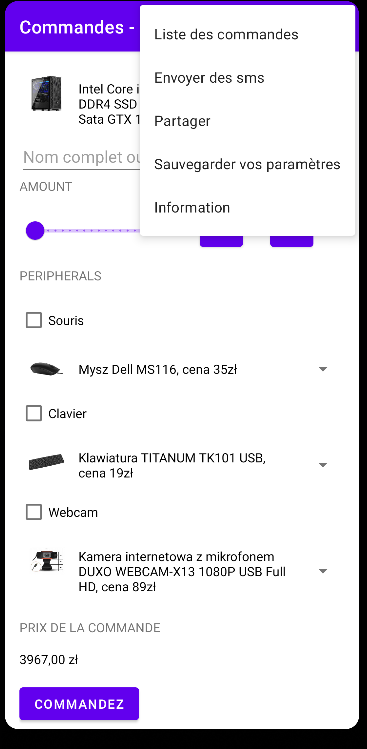

Widok po prawej to tylko propozycja.
Pomocnicze ćwiczenia do realizacji to
ćwiczenia 16 i 21, które będą realizowane na zajęciach.
Napisz aplikację, która:
1\) Zapisze zamówienie użytkownika w bazie SQLite, dla zestawu
komputerowego, użytkownik może wybrać spośród 3 pozycji dla:
a\) komputera ( opis + zdjęcie)
b\) klawiatury ( opis + zdjęcie)
c\) myszki ( opis + zdjęcie)
d\) camery internetowej lub monitora ( opis + zdjęcie)
2\) Wyśle emaila z treścią zamówienia lub/i wyśle sms z treścią
zamówienia.
2')Zamówienie powinno obejmować powyższe, a dodatkowo:
a\) cenę
b\) datę zamówienia (format data i czas)
c\) nazwę firmy lub imię i nazwisko zamawiającego ( nie może być puste)
3\) Pozwoli odczytać zamówienia z pomocą ListView,
3') Dodaj ikonę aplikacji.
3") Należy zerować po zapisie cenę dla nowego zamówienia
4\) Posiada menu z pozycjami na obsługę:
a\) listy zamówień
b\) zapisania ustawień (koszyka)
c\) informacje o autorze programu
d\) udostępnienie zawartości koszyka
e\) wysłanie smsa
5\) Zadania na ocenę bardzo dobrą ( powyższe zadania oraz ):
a\) wersja dwujęzyczna PL/En (domyślnie polski)
b\) wysłanie smsa z zamówieniem
c\) zapisanie stanu zamówienia i odtworzenie (SharedPreferences,
onRestoreInstanceState)
d\) skróty dynamiczne ( minimum 2, najlepiej 4)
6\) Zadania na ocenę celującą ( powyższe zadania oraz ):
a\) logowanie do aplikacji z rejestracją
b\) zapisanie zdjęcia w bazie w postaci Stringa i jego poprawny odczyt
c\) udostępnienie zamówienia z menu, aplikacja do wyboru
d\) wysłanie maila w tle

