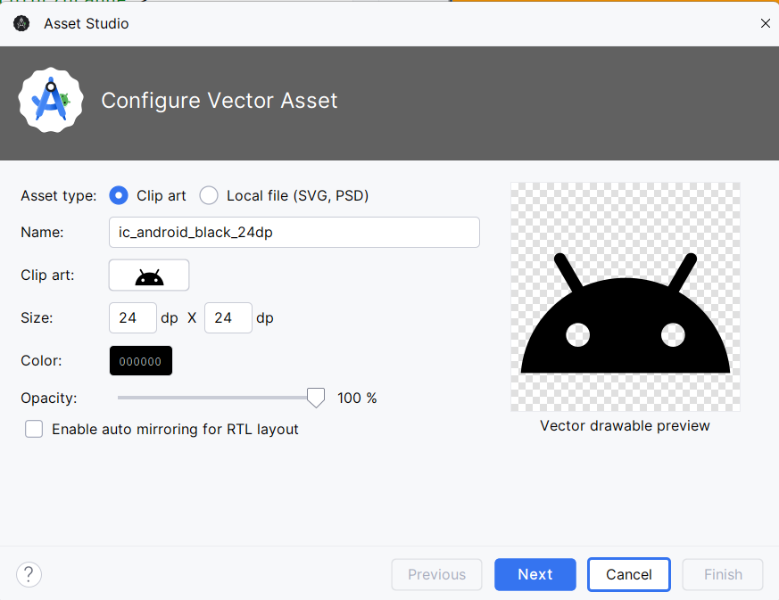
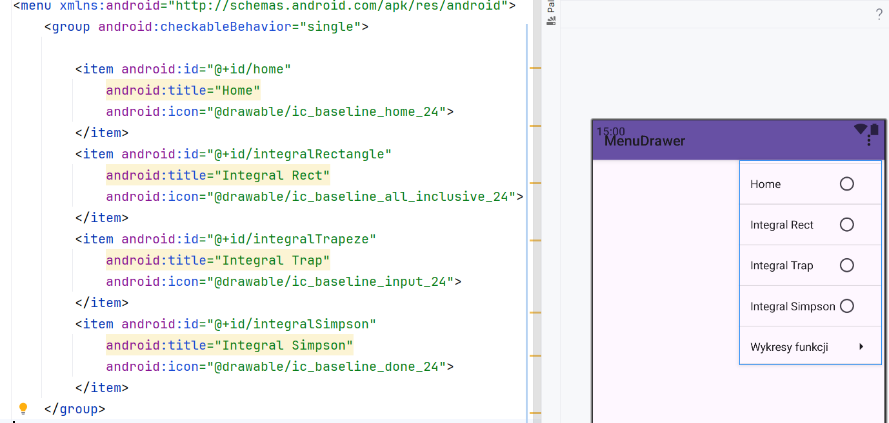
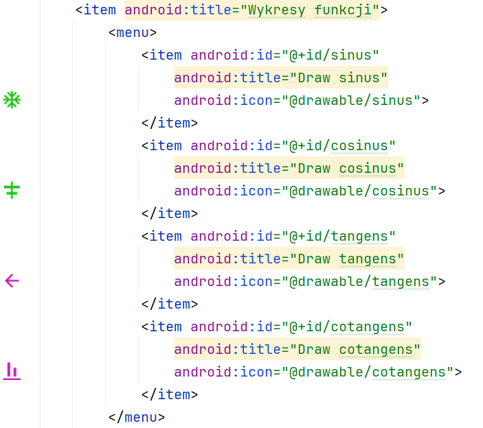
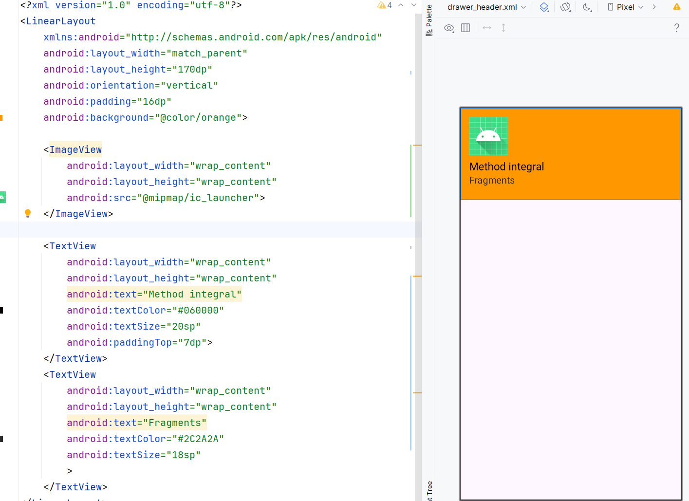
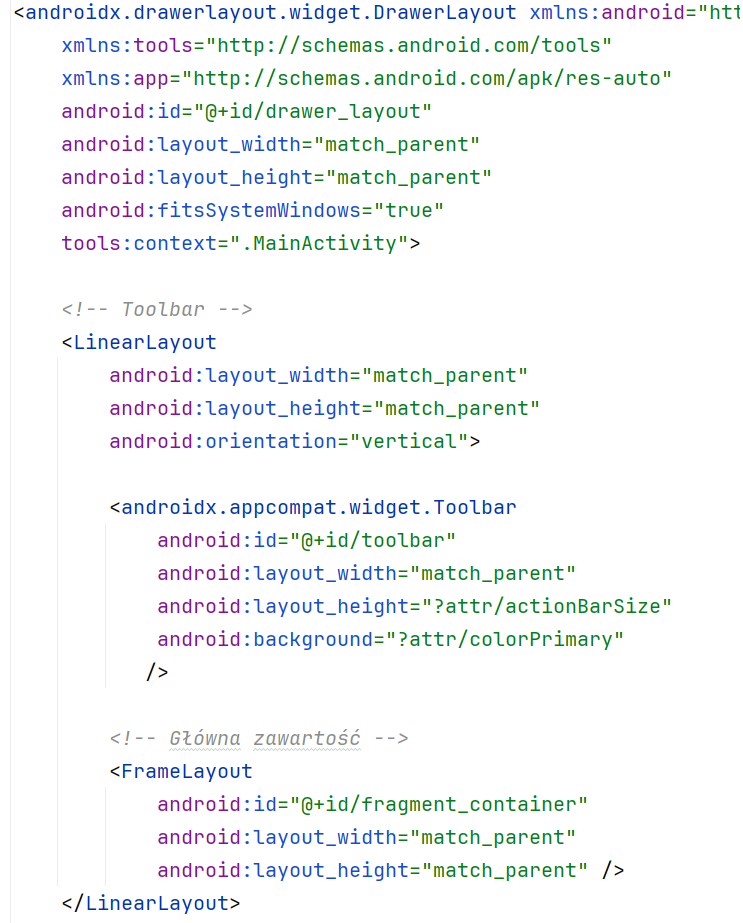
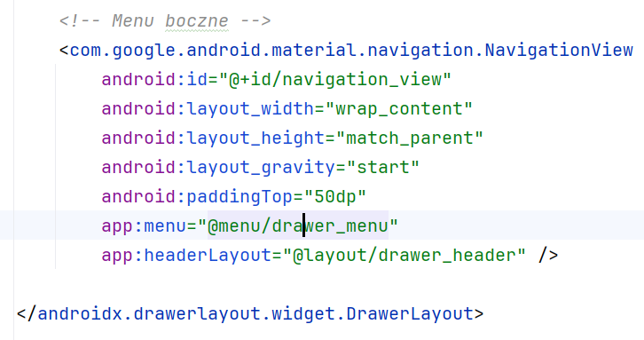
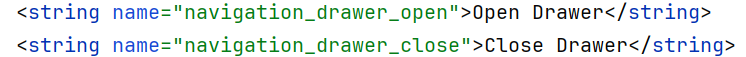
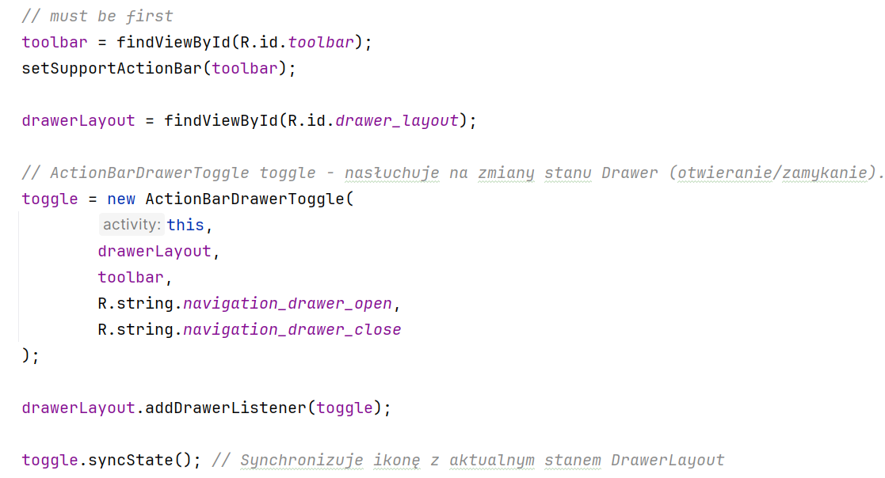
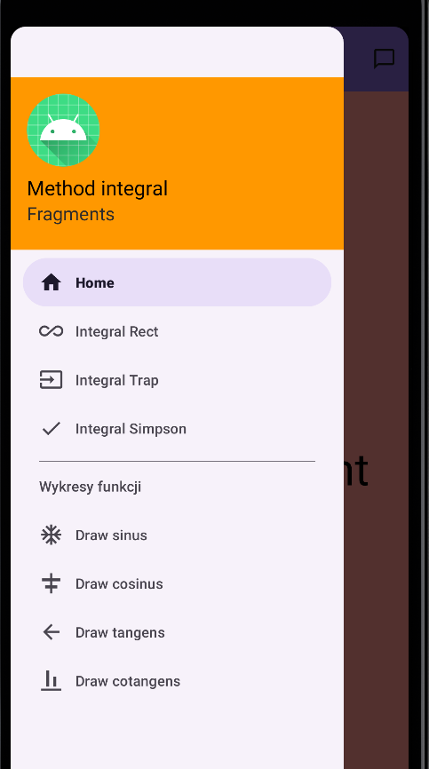

# Ćwiczenia 10 -- Android studio -- Navigation Drawer

💡 Na koniec zajęć prześlij pliki źródłowe (.xml, .java)+ obrazek do zasobu
w teams.
1.  Utwórz nowy projekt o nazwie MyNavigationDrawer na podstawie Empty
    Activity (dobrać odpowiednie API ).
2.  Otworzyć dokumentację:
> <https://developer.android.com/guide/navigation/navigation-ui>
>
> <https://developer.android.com/reference/androidx/drawerlayout/widget/DrawerLayout>
3.  Przejdź do właściwości projektu: Shift+Ctrl+Alt+S. Zamknij okno.
4.  Dodać 8 ikon dla pozycji menu
    drawable -\> New -\> Vector assets

5.  Utwórz plik menu: res-\> Android Resource File (file name:
    drawer_menu, resource type: menu)
6.  Dodaj \<group android:checkableBehavior=\"single\"\>
7.  Dodaj cztery itemy
8.  Dodaj po group nowy item

<item android:title="Wykresy funkcji"\>
with    
<menu\>
<item></item>   
<item\></item\>   
<item\></item\>   
<item\></item\>   
</menu\>
9.  Powinieneś uzyskać:

10. Dodaj layout -\> Layout Resource File (file name: **drawer_header**
11. Powinieneś uzyskać:

12. W activity_main.xml zmień layout na DrawerLayout

13. Dodaj w strings.xml:
> 
14. W MainActivity.java w metodzie onCreate dodaj:

15. Uruchom aplikację i przetestuj:
    
16. KONIEC, część 2 w ćwiczeniach 11.
