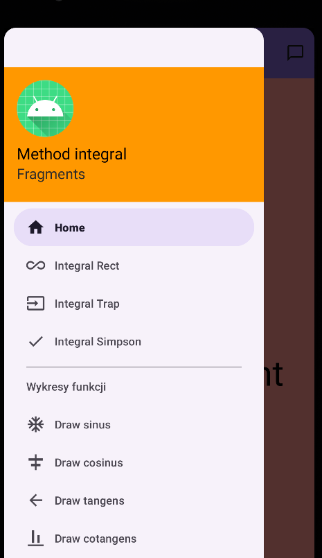
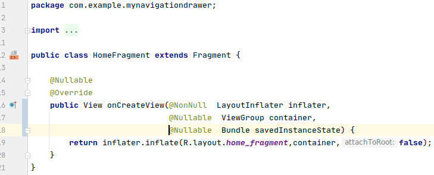
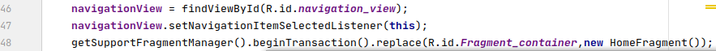
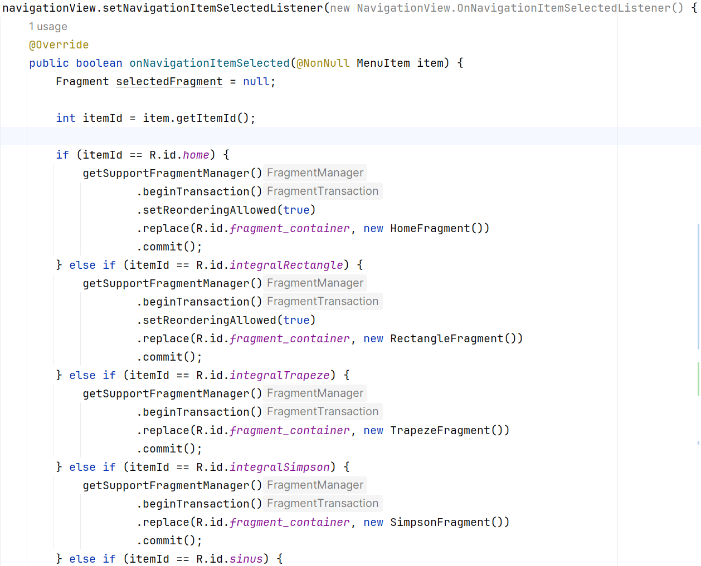
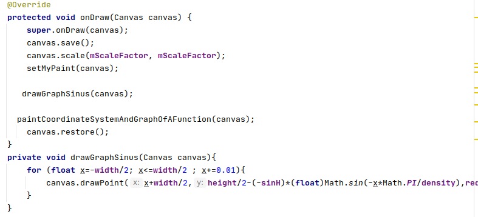
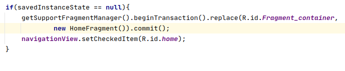
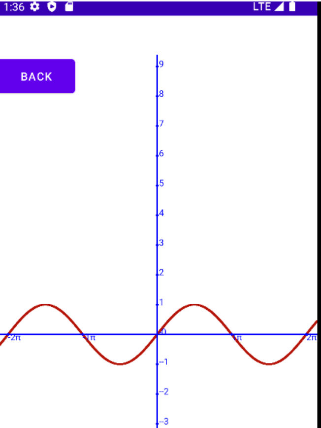
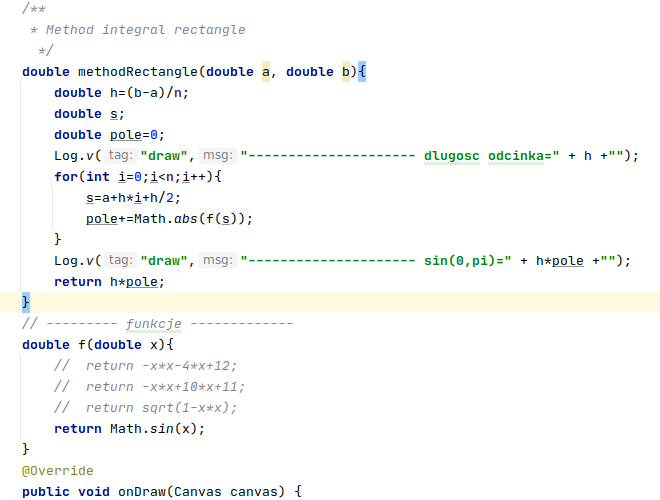
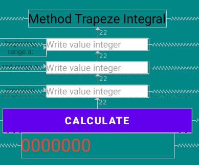
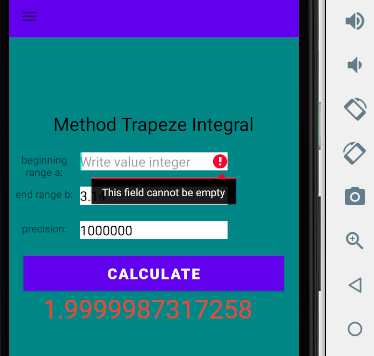

# Ćwiczenia 11 -- Android studio -- Navigation Drawer, Canvas, add
fragment
Na koniec zajęć prześlij pliki źródłowe (.xml, .java)+ obrazek do zasobu
w teams.
1.  Otwórz projekt z ćwiczeń 10 o nazwie MyNavigationDrawer.
   2.  Otworzyć dokumentację:
   <https://developer.android.com/guide/fragments?gclid=CjwKCAiAhreNBhAYEiwAFGGKPB_HJINJ1lKxOEHCh_a6-J-qbiBDX5-uWjgNClL3gnSVj57fsaa8ihoCvmsQAvD_BwE&gclsrc=aw.ds>    
   <https://developer.android.com/guide/fragments/create>    
   <https://developer.android.com/guide/fragments/fragmentmanager>    
3.  Uruchom aplikację:
> 
4.  Dodaj fragmenty i aktywności:
5.  Dodaj layout layout -\> Layout Resource File (file name:
    home_fragment
change costraint to relative , add
android:background=\"@color/teal_200\"
6.  Dodaj textview:  
```xml
<TextView  
android:layout_width="wrap_content"    
android:layout_height="wrap_content"    
android:layout_centerInParent="true"  
android:textSize="25sp"  
android:text="Home fragment"  
android:textColor="@color/white">  
</TextView>  
```

7.  Skopiuj home_fragment i wklej -\> i zmień nazwę na:
rectangle_fragment,
trapeze_fragment
simpson fragment
8.  Dodaj klasę New -\> Java Class add class HomeFragment extend
    Fragment
9.  <kbd>Ctrl</kbd>+<kbd>o</kbd> lub `Alt`+`Insert` lub prawy myszy Generate\... i dodać metodę
    override :
public View onCreateView(\...)
10. Zmień return na: 
```java
return    inflater.inflate(R.layout.home_fragment,container,false);
```
11. zaimportuj: **import** androidx.fragment.app.Fragment;

12. Skopiuj HomeFragment.java i wklej, zmień nazwę na:
RectangleFragment,
TrapezeFragment
SimpsonFragment
13. Dodaj pustą aktywność Empty Activity, o nazwie DrawSinus
14. W aktywności activity_draw_sinus.xml zmień layout na RelativeLayout
15. Dodaj textview:  
```xml
<TextView  
android:layout_width="wrap_content"  
android:layout_height="wrap_content"  
android:text="here draw function sinus"  
android:textSize="35sp"  
android:layout_centerInParent="true">  
</TextView>  
```
16. Dodaj w MainActivity.java  
```java
NavigationView navigationView = findViewById(R.id.navigation_view);
navigationView.setNavigationItemSelectedListener(this);
```

17. 🏮(czerwona żarówa) i 
```java
public class MainActivity extends
    AppCompatActivity implements
    NavigationView.OnNavigationItemSelectedListener
```
18. Dodaj również 
```java
@Override
public boolean onNavigationItemSelected(@NonNull MenuItem item)
return false;
```
19. Zamień return false na return true;
20. Dodaj
```java
    getSupportFragmentManager().beginTransaction().replace(R.id.Fragment_container,new
    HomeFragment());
```
21. W metodzie public boolean onNavigationItemSelected(@NonNull MenuItem
    item) and dodaj:
```java
switch (item.getItemId())
case R.id.home:
getSupportFragmentManager().beginTransaction().replace(R.id.Fragment_container,
new HomeFragment()).commit();
break;
```
22. Dodaj następne pozycje case dla id z pliku drawer_menu.xml
23. Dodaj case R.id.sinus:
```java
Intent intent = new Intent(getApplicationContext(),DrawSinus.class);
startActivity(intent);
break;
```
24. Powinieneś uzyskać:

25. Dodaj przed return true w powyższym drawerLayout.closeDrawers();
26. Dodaj klasę MyViewDrawSinus extends View
27. Dodaj metodę onDraw(Canvas canvas)

28. W klasie DrawSinus create object MyViewDrawSinus
29. Dodaj w MainActivity.java
```java
if(savedInstanceState == null)
getSupportFragmentManager().beginTransaction().replace(R.id.Fragment_container,new
HomeFragment()).commit();
navigationView.setCheckedItem(R.id.home);
```

30. Sprawdź rysowanie poszczególnych funkcji, np.: sinus
> 
31. Dodaj obsługę fragmentów dla całkowania numerycznego, np.:

32. Dodaj potrzebne EditText, TextView do realizacji powyższej metody i
    dwóch pozostałych, do fragmentu w xml.( Dodaj podpowiedź do pola
    EditText, hint), np.:

33. Dodatkowo:  

    a)  zaprojektuj obsługę ostrzegania użytkownika o nie wpisaniu
        danych do któregoś z pól.

  

b)  dodaj obsługę ostrzegania użytkownika o podaniu niepoprawnego
    formatu danych  

c)  przeprowadź debugowanie dla pętli
<!-- -->
34. Przygotuj klasę z metodami:
```java
/**
 * /**
 * Klasa Integrator dostarcza metody do numerycznego całkowania funkcji
 * za pomocą różnych algorytmów: metody prostokątów, metody trapezów i metody Simpsona.
 */
public class Integrator {

    /**
     * Oblicza całkę oznaczoną funkcji numerycznie za pomocą metody prostokątów (reguła punktu środkowego).
     * @param f Funkcja do całkowania, reprezentowana przez DoubleFunction<Double>.
     * @param a Dolna granica całkowania.
     * @param b Górna granica całkowania.
     * @param n Liczba podprzedziałów (prostokątów).
     * @return Wynik całkowania.
     */
    public double integrateRectangular(DoubleFunction<Double> f, double a, double b, int n) {
        double h = (b - a) / n;
        double sum = 0.0;

        for (int i = 0; i < n; i++) {
            // x_i środkowy
            double x_mid = a + i * h + h / 2.0;
            sum += f.apply(x_mid);
        }

        return sum * h;
    }
```
35. Dodaj testy dla metod całkowania numerycznego
  Na nazwie klasy `Ctrl`+`Shift`+`t` Create new test
```java
import org.junit.jupiter.api.AfterEach;
import org.junit.jupiter.api.BeforeEach;
import org.junit.jupiter.api.Test;

import java.util.function.DoubleFunction;

import static org.junit.jupiter.api.Assertions.*;

class IntegratorTest {
    // Funkcja do testowania: f(x) = sin(x)
    private DoubleFunction<Double> f;
    private Integrator integrator;
    private final double a = 0.0;
    private final double b = Math.PI;
    private final int n = 100_000;
    private final double expected = 2.0;
    private final double delta = 0.000_000_001;

    @BeforeEach
    void setUp() {
        integrator = new Integrator();
        f = Math::sin;
    }

    @Test
    void shouldCalculateIntegralByRectangularMethod() {

        double result = integrator.integrateRectangular(f, a, b, n);

        /**
         * static boolean doublesAreEqual(double value1, double value2, double delta) {
         *         assertValidDelta(delta);
         *         return doublesAreEqual(value1, value2) || Math.abs(value1 - value2) <= delta;
         *     }
         *     assert to sprawdzenie z pewnym marginesem błędu
         */
        assertEquals(expected, result, delta, "Metoda prostokątów powinna zwrócić wynik bliski 2.0");
    }
```
35. KONIEC.
