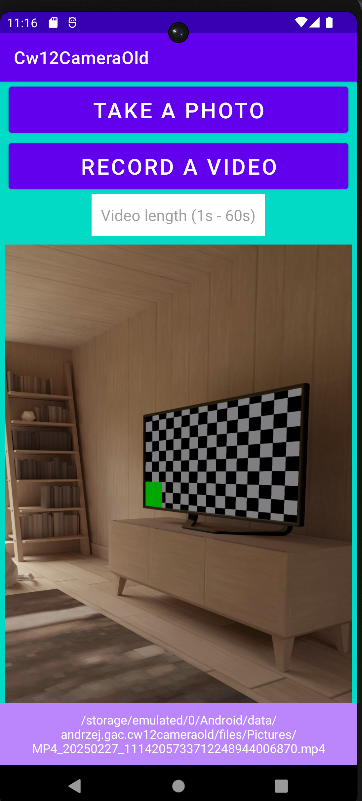
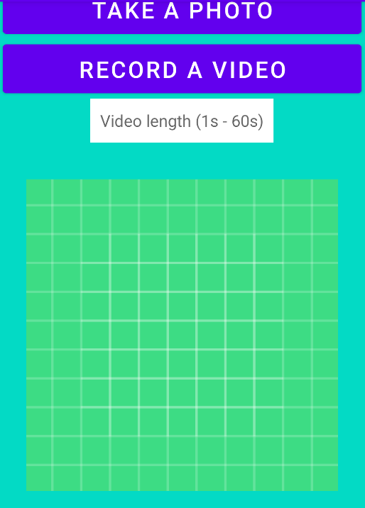
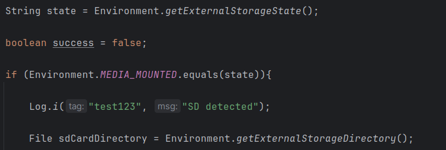
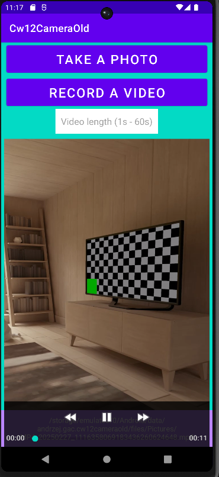

# Ćwiczenia 12 -- Android studio -- Camera

💡_*Na koniec zajęć prześlij pliki źródłowe (.xml, .java)+ obrazek do zasobu
w teams.*_
1.  Utwórz projekt o nazwie Camera, dobierz odpowiednie API.
2.  Otworzyć dokumentację:  

    https://developer.android.com/training/camera-deprecated  
    https://developer.android.com/reference/androidx/core/content/FileProvider  
    https://developer.android.com/training/data-storage  
    https://developer.android.com/reference/android/provider/MediaStore#summary  
    https://developer.android.com/reference/android/os/Environment  
    https://developer.android.com/training/data-storage/app-specific?hl=en#java


3. Końcowy efekt



4. Dodaj w xml Button, ImageView i TextView w dowolnym layout, np.

      



4.  Dodaj metodę on ActivityResult po <kbd>Ctrl</kbd>+<kbd>o</kbd>:  

      

5.  Dodaj kolejną metodę po Ctrl+o:

      

6.  Dodaj do pliku AndroidManifest.xml

        

7.  Dodaj plik w res/xml/file_paths.xml

    

8.  Reszta z dokumentacji dla klasy Camera.

9.  Sprawdź na urządzeniu, czy zdjęcie zapisuje się w pamięci wew.
```text
    →Android -> data -> twoja aplikacja->files->Pictures
```
10. Sprawdź w android studio, czy zdjęcie zapisuje się 
```text
    View->Tool Windows->Device Explorer->data -> data -> twoja aplikacja ->files->Pictures
```
11. Dodaj zdjęcie do galerii.
12. Dodatkowe zadania  
    a)  dodaj obsługę zapisu na kartę SD  

    b)  przeprowadź zapis video do pliku mp4  
    ```xml
    <VideoView
                    android:id="@+id/videoView"
                    android:layout_width="match_parent"
                    android:layout_height="wrap_content"
                    android:visibility="invisible"
                    android:padding="30dp">

                </VideoView>
    ```

    c)  odtwórz film w aplikacji  

13. KONIEC.🔚
