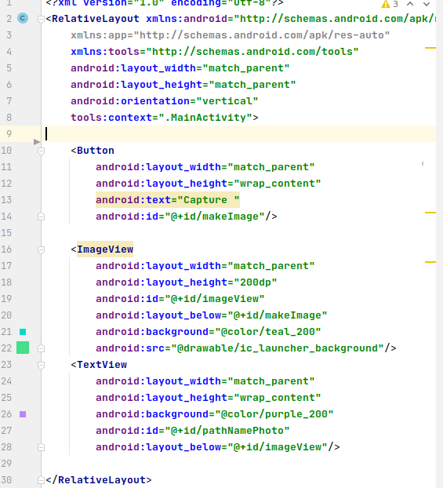
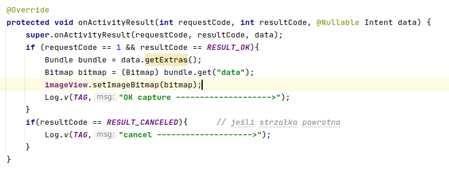
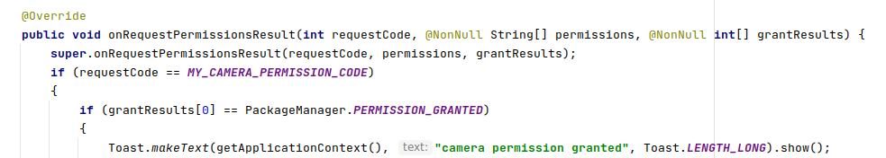
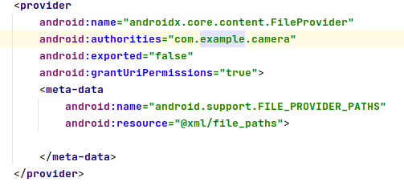

Ćwiczenia 12 -- Android studio -- Camera
Na koniec zajęć prześlij pliki źródłowe (.xml, .java)+ obrazek do zasobu
w teams.
1.  Utwórz projekt o nazwie Camera, dobierz odpowiednie API.
2.  Otworzyć dokumentację:
    <https://developer.android.com/training/camera-deprecated>
    <https://developer.android.com/reference/androidx/core/content/FileProvider>
    <https://developer.android.com/training/data-storage>
    <https://developer.android.com/reference/android/provider/MediaStore#summary>
    <https://developer.android.com/reference/android/os/Environment>
3.  Dodaj w xml Button, ImageView i TextView w dowolnym layout, np.
    
4.  Dodaj metodę on ActivityResult po Ctrl+o:
    
5.  Dodaj kolejną metodę po Ctrl+o:
    
6.  Dodaj do pliku AndroidManifest.xml
    
7.  Dodaj plik w res/xml/file_paths.xml
    
8.  Reszta z dokumentacji dla klasy Camera:
9.  Sprawdź, czy zdjęcie zapisuje się w pamięci wew.→Android→data→ twoja
    aplikacja-\>files-\>Pictures
10. Dodaj zdjęcie do galerii.
11. Dodatkowe zadania
    a)  dodaj obsługę zapisu na kartę SD
    b)  przeprowadź zapis video do pliku mp4
    c)  odtwórz film w aplikacji
12. KONIEC.
