# Ćwiczenia 13 -- Android studio -- CameraX + zapis na sd + zapis do galerii + video

💡_*Na koniec zajęć prześlij pliki źródłowe (.xml, .java)+ obrazek do zasobu
w teams.*_
1.  Wzorujemy się na labie:  
    https://developer.android.com/codelabs/camerax-getting-started#0

2.  Utwórz projekt o nazwie CameraX na podstawie Empty Activity, dobierz
    odpowiednie API ( ).
3.  Otworzyć dokumentację:

    https://developer.android.com/training/camerax  
    https://developer.android.com/training/data-storage  
    https://developer.android.com/reference/android/provider/MediaStore#summary  
    https://developer.android.com/reference/android/os/Environment  

4.  Efekt końcowy:

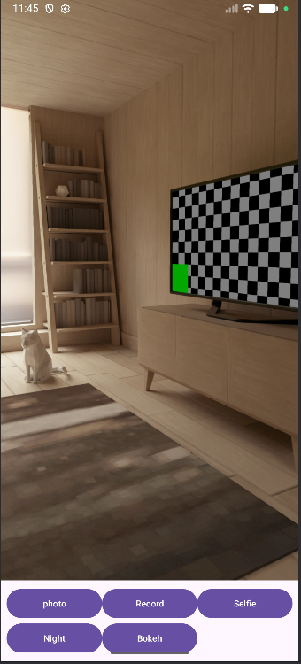

5. Dodaj zależności w build.gradle(Module: CameraX.app)

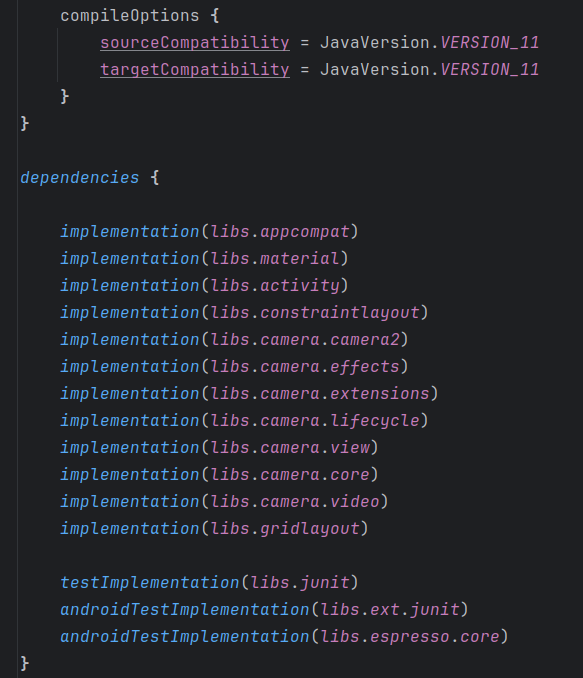

5.  Dodaj w xml Button, PreviewView w dowolnym layout, np.
```xml
<androidx.constraintlayout.widget.ConstraintLayout
        xmlns:android="http://schemas.android.com/apk/res/android"
        xmlns:app="http://schemas.android.com/apk/res-auto"
        android:id="@+id/container"
        android:layout_width="match_parent"
        android:layout_height="match_parent">

    <androidx.camera.view.PreviewView
            android:id="@+id/previewView"
            android:layout_width="0dp"
            android:layout_height="0dp"
            app:layout_constraintTop_toTopOf="parent"
            app:layout_constraintBottom_toTopOf="@+id/buttonLayout"
            app:layout_constraintStart_toStartOf="parent"
            app:layout_constraintEnd_toEndOf="parent" />

    <androidx.gridlayout.widget.GridLayout
            android:id="@+id/buttonLayout"
            android:layout_width="match_parent"
            android:layout_height="wrap_content"
            android:padding="8dp"
            app:alignmentMode="alignMargins"
            app:columnCount="3"
            app:rowCount="2"
            app:layout_constraintBottom_toBottomOf="parent"
            app:layout_constraintStart_toStartOf="parent"
            app:layout_constraintEnd_toEndOf="parent">

        <Button
                android:id="@+id/captureButton"
                android:layout_width="0dp"
                android:layout_height="wrap_content"
                app:layout_columnWeight="1"
                app:layout_gravity="fill"
                android:text="@string/capture_photo"
                android:textSize="12sp" />
```

    
6.  Uzupełnij MainActivity.java:
    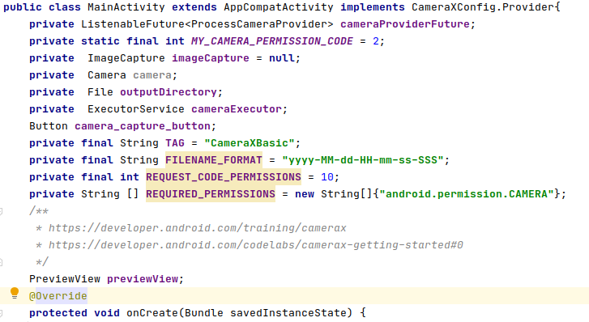
7.  Dalej, szkielet dla onCreate():
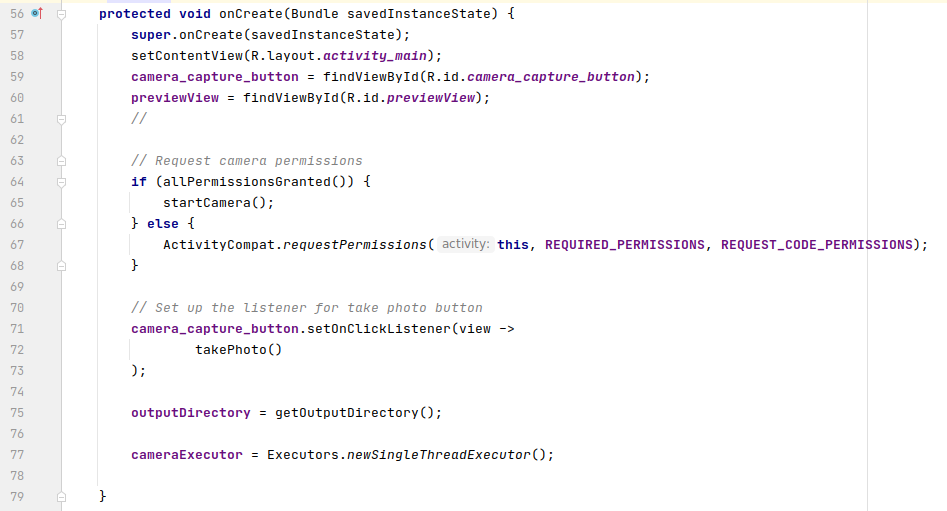
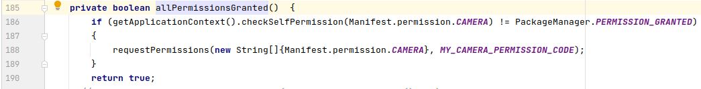
8.  Dodaj i uzupełnij metodę getOutputDirectory() - rozbuduj ją :
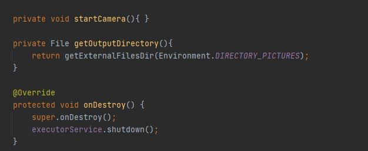
9.  Dodaj do AndroidManifest.xml

    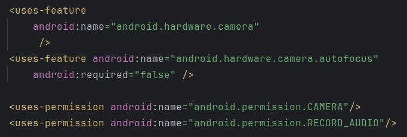

10. Dodaj kolejną metodę po Ctrl+o:

    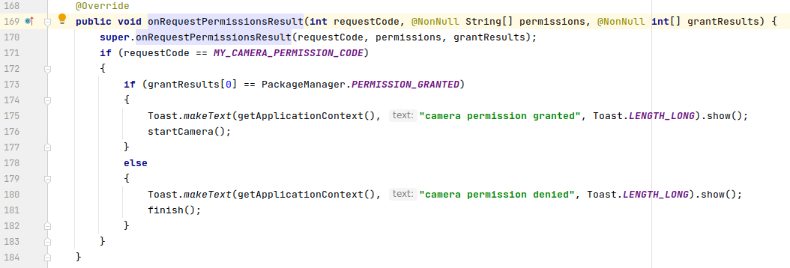

11. Dodaj metodę startCamera:

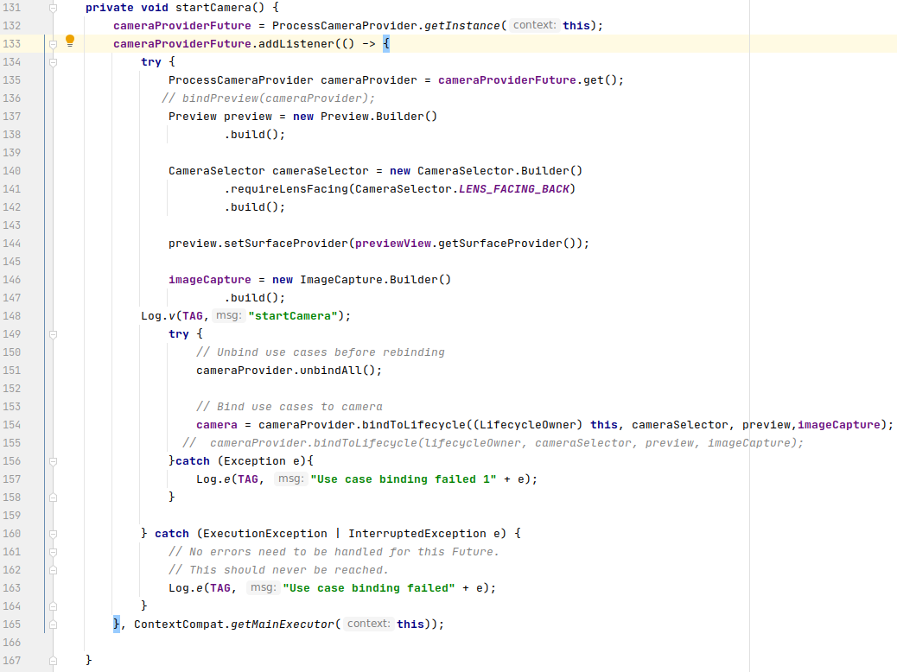

12. Dodaj zawartość takePhoto():

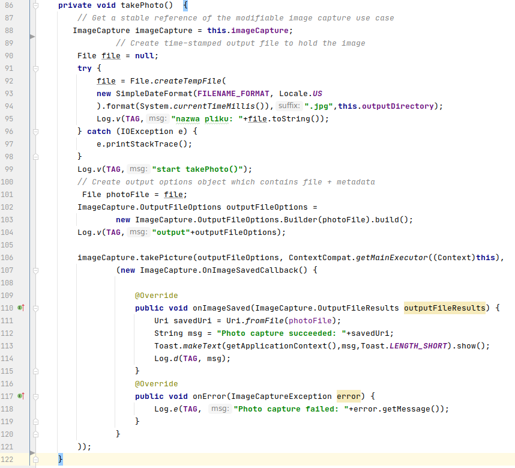

13. Reszta z dokumentacji dla klasy CameraX :

    https://developer.android.com/codelabs/camerax-getting-started#4

14. Sprawdź, czy zdjęcie zapisuje się w pamięci wew.→Android→data→
    com.example.CameraX-\>files-\>Pictures
15. Dodaj zdjęcie do galerii.

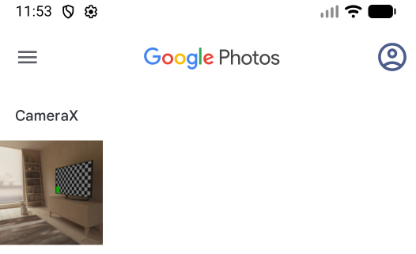

16. Dodatkowo wykonaj zadania:

    a)  dodaj obsługę zapisu na kartę SD

    b)  przeprowadź zapis video do pliku mp4

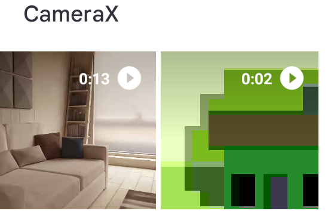  
    c)  dodaj obsługę bokeh, night,:

        https://developer.android.com/training/camerax/vendor-extensions

  ```java
   if (bokehModeEnabled && extensionsManager.isExtensionAvailable(selector, ExtensionMode.BOKEH)) {
selector = extensionsManager.getExtensionEnabledCameraSelector(selector, ExtensionMode.BOKEH);
                            Log.d("CameraX1111", "Tryb BOKEH włączony");
                        } else {
                                Log.d("CameraX1111", "Tryb BOKEH niedostępny lub wyłączony");
                        }
  ```

17. KONIEC.
