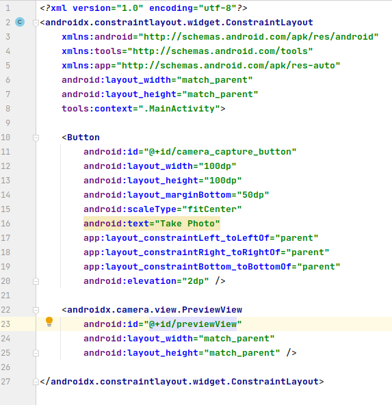
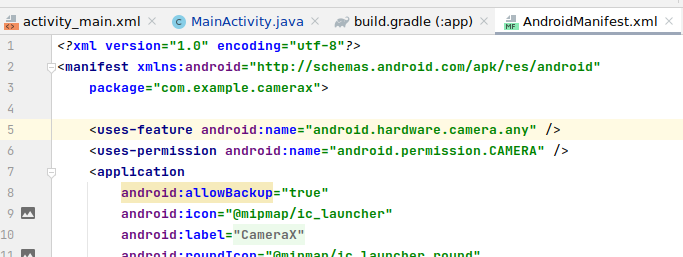

Ćwiczenia 13 -- Android studio -- CameraX + zapis na sd + zapis do
galerii + video
Na koniec zajęć prześlij pliki źródłowe (.xml, .java)+ obrazek do zasobu
w teams.
1.  Wzorujemy się na labie:
    <https://developer.android.com/codelabs/camerax-getting-started#0>
2.  Utwórz projekt o nazwie CameraX na podstawie Empty Activity, dobierz
    odpowiednie API ( ).
3.  Otworzyć dokumentację:
    <https://developer.android.com/training/camerax>
    <https://developer.android.com/training/data-storage>
    <https://developer.android.com/reference/android/provider/MediaStore#summary>
    <https://developer.android.com/reference/android/os/Environment>
4.  Dodaj zależności w build.gradle(Module: CameraX.app)

5.  Dodaj w xml Button, PreviewView w dowolnym layout, np.
    
6.  Uzupełnij MainActivity.java:
    
7.  Dalej, szkielet dla onCreate():

8.  Dodaj i uzupełnij metodę getOutputDirectory() - rozbuduj ją :

9.  Dodaj do AndroidManifest.xml
    
10. Dodaj kolejną metodę po Ctrl+o:
    
11. Dodaj metodę startCamera:

12. Dodaj zawartość takePhoto():

13. Reszta z dokumentacji dla klasy CameraX i:
    <https://developer.android.com/codelabs/camerax-getting-started#4>
14. Sprawdź, czy zdjęcie zapisuje się w pamięci wew.→Android→data→
    com.example.CameraX-\>files-\>Pictures
15. Dodaj zdjęcie do galerii.
16. Dodatkowe zadania
    a)  dodaj obsługę zapisu na kartę SD
    b)  przeprowadź zapis video do pliku mp4
    c)  dodaj obsługę bokeh, night,:
        <https://developer.android.com/training/camerax/vendor-extensions>
17. KONIEC.
