Ćwiczenia 14 -- Android studio -- SimpleAdapter, ListView
Na koniec zajęć prześlij pliki źródłowe (.xml, .java)+ obrazek do zasobu
w teams.
1.  Utwórz projekt o nazwie SimpleAdapter na podstawie Empty Activity,
    dobierz odpowiednie API.
2.  Otworzyć dokumentację:
> [https://developer.android.com/reference/android/widget/SimpleAdapter](https://developer.android.com/reference/android/widget/SimpleAdapter)
<https://developer.android.com/reference/android/widget/ListView#summary>
> <https://developer.android.com/reference/android/widget/AdapterView.OnItemClickListener>
<https://developer.android.com/guide/topics/resources/string-resource>
> <https://developer.android.com/guide/topics/ui/dialogs>

3.  Dodaj zależności.
4.  Docelowo chcemy uzyskać coś na kształt, wybierz tematykę:
5.  Dodaj w activity_main.xml listę
> 
6.  Dodaj pliki zdjęć do res ... .

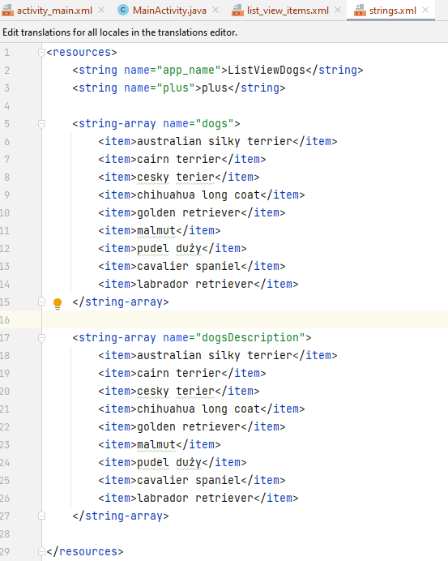
7.  Nazwy umieść w string-array:
8.  Uzupełnij MainActivity.java:

9.  Uzupełnij :
> 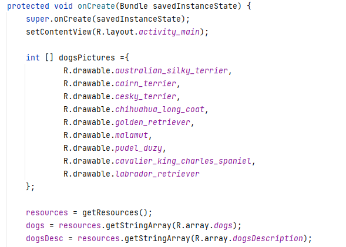
10. Dodaj elementy do hashMap (metoda put), następnie do listy (metoda
    add), kod w pętli for możesz zamknąć w metodę, która przyda się przy
    dodawaniu nowych produktów
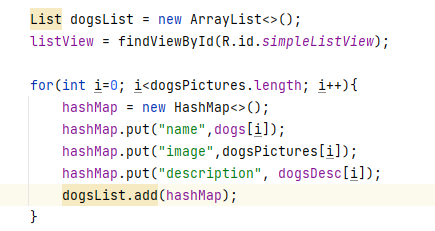
11. Utwórz plik list_view_items.xml:
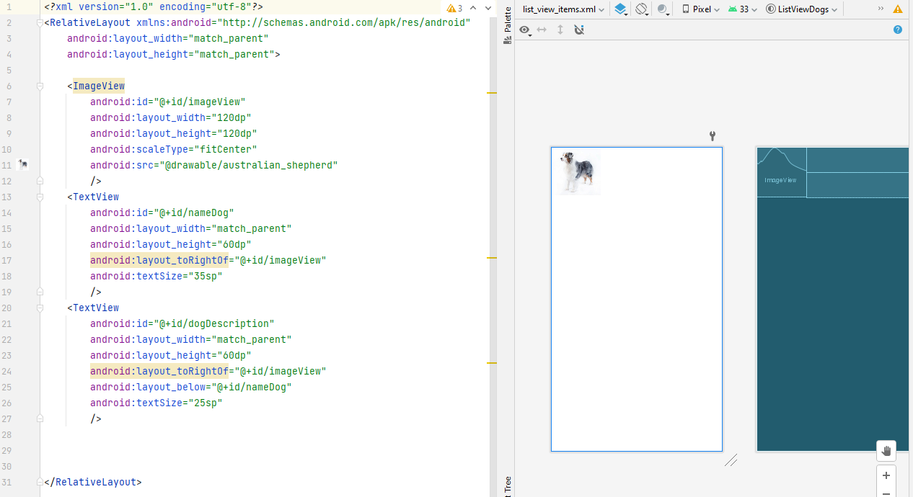
12. Dodaj do onCreate() elementy \[ from \] i \[ to \]
13. Na przykład:

14. Stwórz obiekt SimpleAdapter:

15. Ustaw adapter zgodnie z dokumentacją:
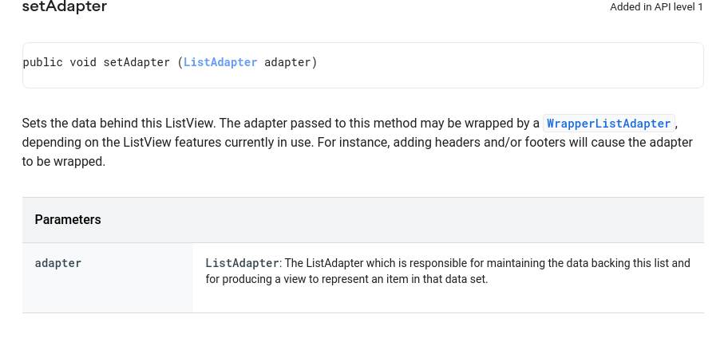
16. Na przykład:

17. Wykonaj zadania
    a)  dodaj obsługę kliknięcia w item listView, wyświetl toast
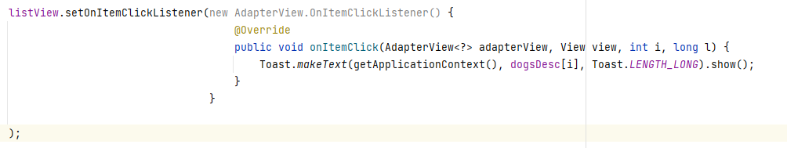
b)  dodaj obsługę kliknięcia w item ListView, nowa aktywność z opisem
    pozycji i obrazkiem, zapewnić powrót
> Zmień deklarację na
> 
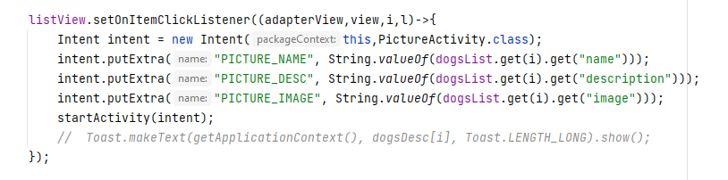
> 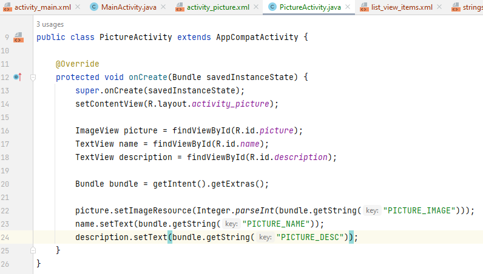
>
> 
c)  dodaj opcję dodania nowej pozycji listy poprzez przycisk w kształcie
    (+)
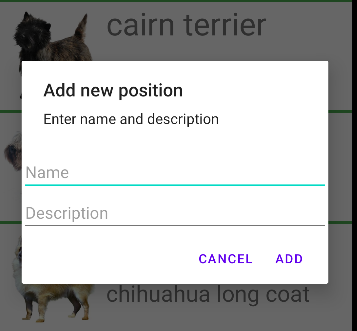
[https://developer.android.com/guide/topics/ui/dialogs](https://developer.android.com/guide/topics/ui/dialogs)

Kształt dla przycisku:

oraz
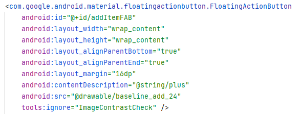
d)  dodaj spiner dla wyboru nazwy obrazka:
> 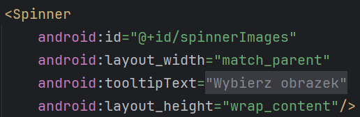
>
> 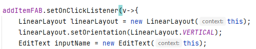
>
> 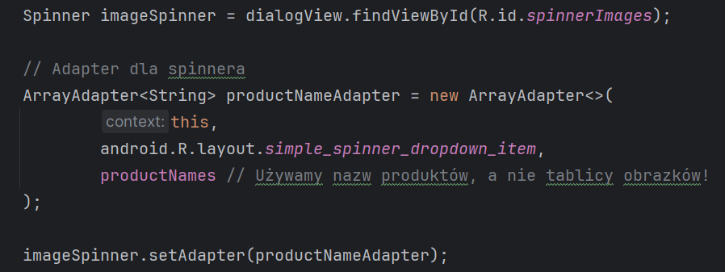
e)  dodaj przycisk usuwający zaznaczony element listy.
> 
>
> Oraz dodaj metodę na kształt:
>
> 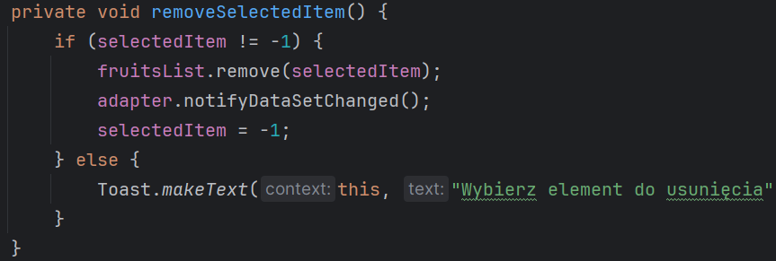
f)  zadbaj o to, aby nowo dodany element był na liście po obrocie
    urządzenia o 90 stopni (ShredPreferences)
> <https://developer.android.com/training/data-storage/shared-preferences>
>
> <https://developer.android.com/reference/android/content/SharedPreferences>
>
> <https://developer.android.com/develop/ui/views/components/settings/use-saved-values>
18. KONIEC.
