# Ćwiczenia 14 -- Android studio -- SimpleAdapter, ListView

💡 Na koniec zajęć prześlij pliki źródłowe (.xml, .java)+ obrazek do zasobu
w teams.

1. Utwórz projekt o nazwie SimpleAdapter na podstawie Empty Activity,
    dobierz odpowiednie API.
1. Otworzyć dokumentację:

   <[https://developer.android.com/reference/android/widget/SimpleAdapter](https://developer.android.com/reference/android/widget/SimpleAdapter)
   <https://developer.android.com/reference/android/widget/ListView#summary>
   <https://developer.android.com/reference/android/widget/AdapterView.OnItemClickListener>
   <https://developer.android.com/guide/topics/resources/string-resource>
   <https://developer.android.com/guide/topics/ui/dialogs>

1. Efekt końcowy:

   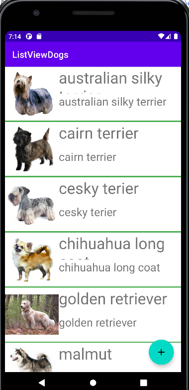

1. Dodaj zależności.

   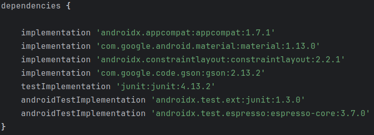

1. Docelowo chcemy uzyskać coś na kształt, wybierz tematykę:
1. Dodaj w activity_main.xml listę

   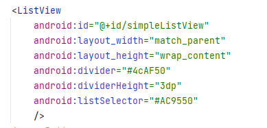

1. Dodaj pliki zdjęć do res ... .

  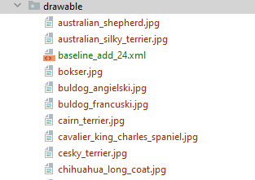

1. Nazwy umieść w string-array:

   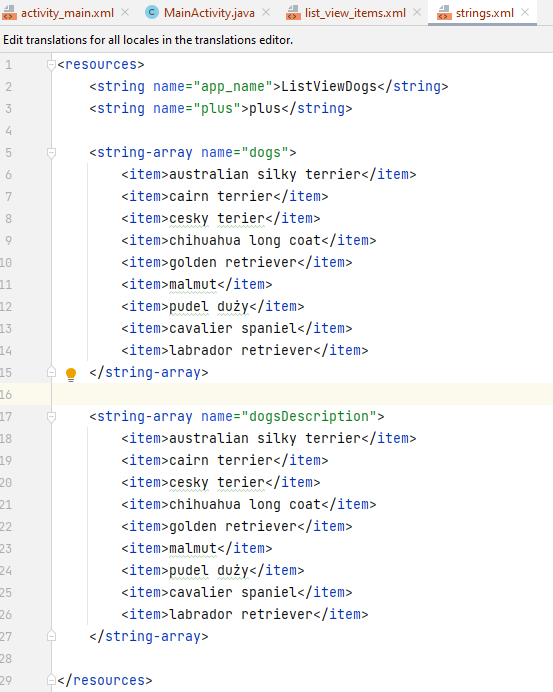

   ```xml
   <string-array name="dogsDescription">
        <item>Mały, energiczny pies o jedwabistej sierści. Choć wyglądem przypomina psa kanapowego, zachowuje instynkt i odwagę prawdziwego teriera.</item>
        <item>Wytrzymały i pojętny pies o szorstkiej sierści. Znany z radosnego usposobienia, dużej pewności siebie oraz zamiłowania do kopania i zabaw.</item>
        <item>Spokojniejszy od innych terierów, o charakterystycznej sylwetce i jedwabistej szacie. Jest lojalny, łagodny wobec dzieci i łatwy w prowadzeniu.</item>
        <item>Długowłosa odmiana najmniejszego psa świata. Bardzo przywiązany do właściciela, odważny i czujny, o wielkiej osobowości w małym ciele.</item>
        <item>Jeden z najpopularniejszych psów rodzinnych. Wyjątkowo łagodny, inteligentny i cierpliwy. Uwielbia aportowanie, wodę i kontakt z ludźmi.</item>
        <item>Potężny pies zaprzęgowy o gęstej sierści. Niezależny, bardzo wytrzymały i przyjacielski, ale wymagający dużo ruchu i konsekwentnego wychowania.</item>
        <item>Wysoce inteligentny i elegancki pies o kędzierzawej sierści. Szybko się uczy, jest aktywny i świetnie sprawdza się w psich sportach oraz jako pies towarzyszący.</item>
        <item>Cavalier King Charles Spaniel to pies o wyjątkowo łagodnym i radosnym usposobieniu. Uwielbia towarzystwo ludzi, jest cierpliwy i bardzo wrażliwy.</item>
        <item>Wszechstronny pies o przyjaznej naturze. Znany z doskonałego węchu, inteligencji i chęci do pracy. Idealny towarzysz rodziny i oddany pomocnik.</item>
    </string-array>
   ```

1. Uzupełnij MainActivity.java:

   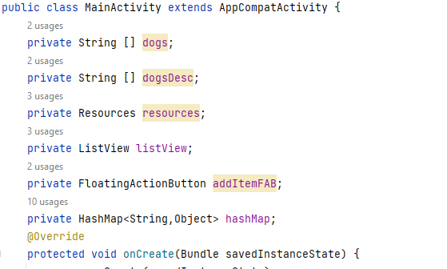

1. Uzupełnij :

   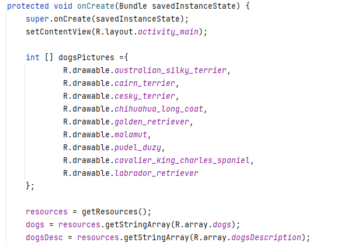

1. Dodaj elementy do hashMap (metoda put), następnie do listy (metoda
    add), kod w pętli for możesz zamknąć w metodę, która przyda się przy
    dodawaniu nowych produktów

   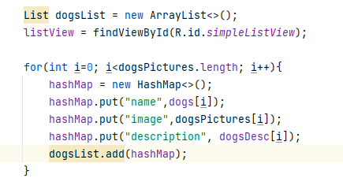

1. Utwórz plik list_view_items.xml:

   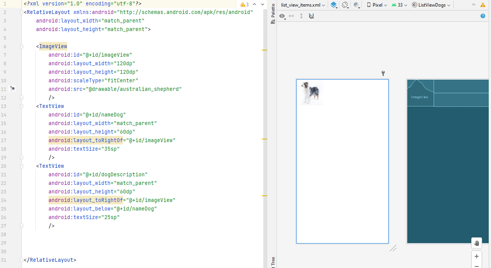

1. Dodaj do onCreate() elementy from i to

1. Na przykład:

   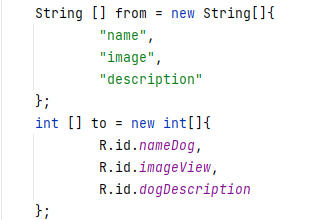

1. Stwórz obiekt SimpleAdapter:

   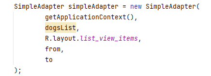

1. Ustaw adapter zgodnie z dokumentacją:

   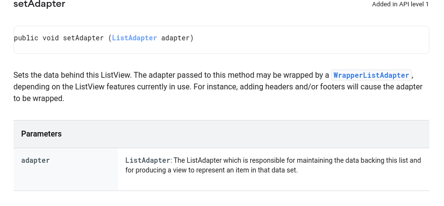

1. Na przykład:

   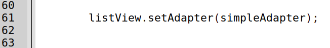

1. Wykonaj zadania:

   a)  dodaj obsługę kliknięcia w item listView, wyświetl toast

   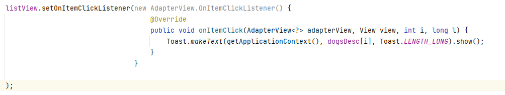

   b)  dodaj obsługę kliknięcia w item ListView, nowa aktywność z opisem
        pozycji i obrazkiem, zapewnić powrót

   Zmień deklarację na

   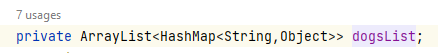

   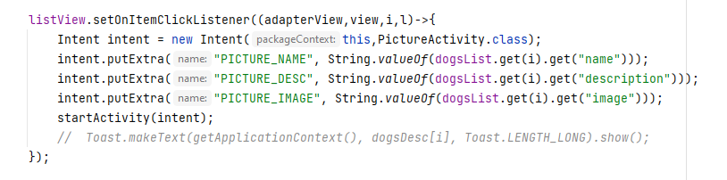

   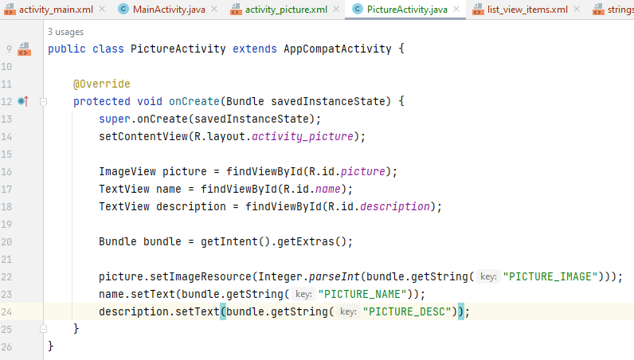

   

c)  dodaj opcję dodania nowej pozycji listy poprzez przycisk w kształcie
    (+)

   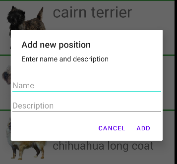

   [https://developer.android.com/guide/topics/ui/dialogs](https://developer.android.com/guide/topics/ui/dialogs)

   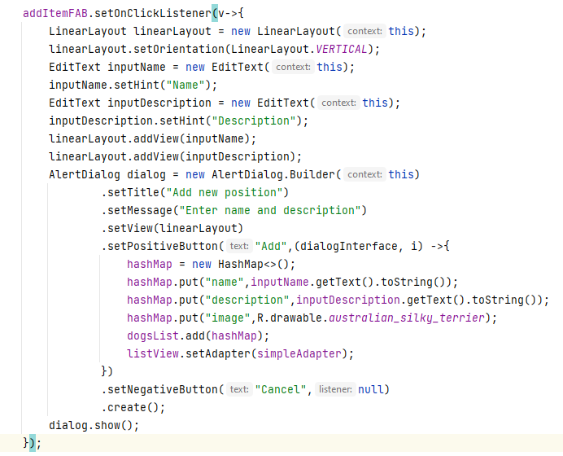

   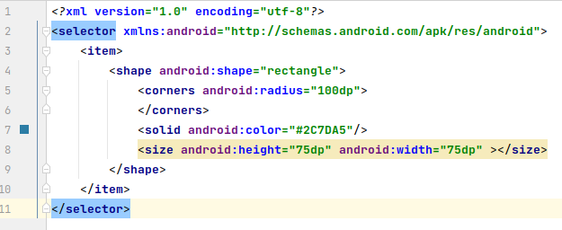

   Kształt dla przycisku:

   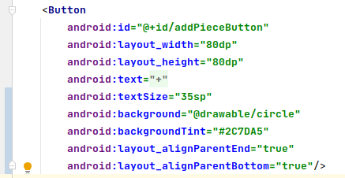

   oraz

   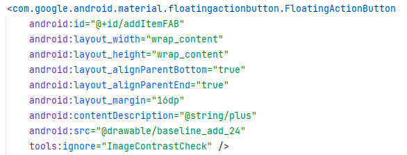

   d)  dodaj spiner dla wyboru nazwy obrazka:

   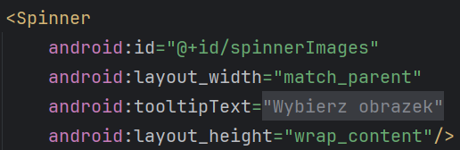

   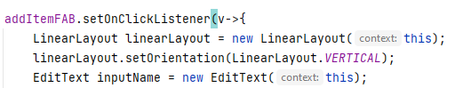

   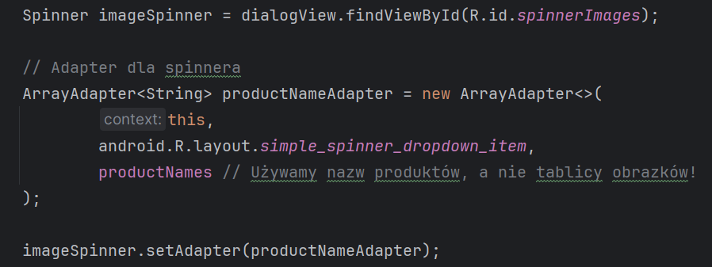

   e)  dodaj przycisk usuwający zaznaczony element listy.

   

   Oraz dodaj metodę na kształt:

   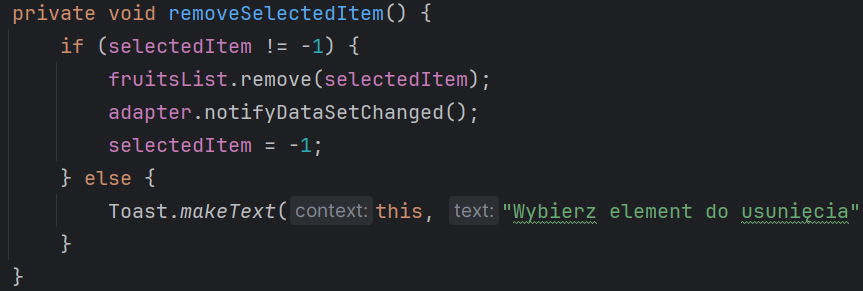

   f)  zadbaj o to, aby nowo dodany element był na liście po obrocie
       urządzenia o 90 stopni (ShredPreferences)

    <https://developer.android.com/training/data-storage/shared-preferences>
   
    <https://developer.android.com/reference/android/content/SharedPreferences>

    <https://developer.android.com/develop/ui/views/components/settings/use-saved-values>

1. KONIEC.🔚
