Ćwiczenia 15 -- Android studio -- BaseAdapter, Spinner
Na koniec zajęć prześlij pliki źródłowe (.xml, .java)+ obrazek do zasobu
w teams.
1.  Utwórz projekt o nazwie ArrayAdapter na podstawie Empty Activity,
    dobierz odpowiednie API ( min. 26).
2.  Otworzyć dokumentację:
<https://developer.android.com/guide/topics/ui/controls/spinner>
<https://developer.android.com/guide/topics/resources/string-resource#java>
3.  Docelowo chcemy uzyskać :
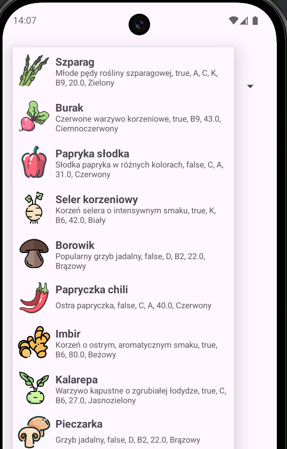
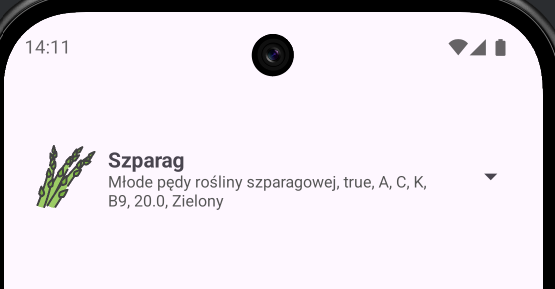
4.  Dodaj w activity_main.xml
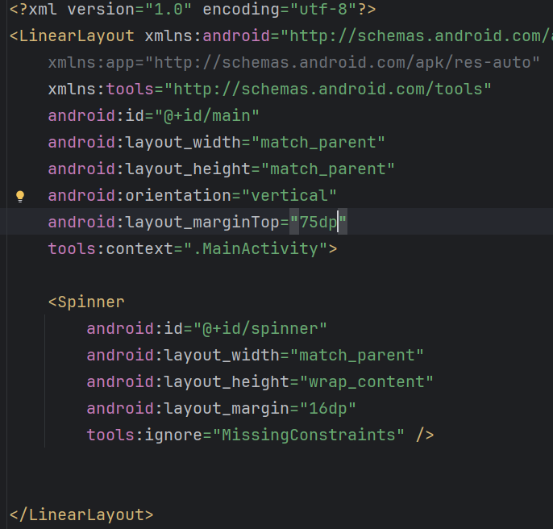
5.  W raw umieść plik z danymi:
> 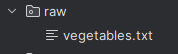
6.  Uzupełnij MainActivity.java:
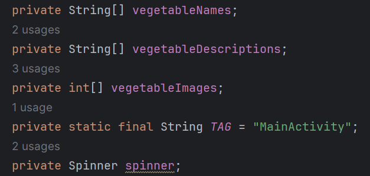
7.  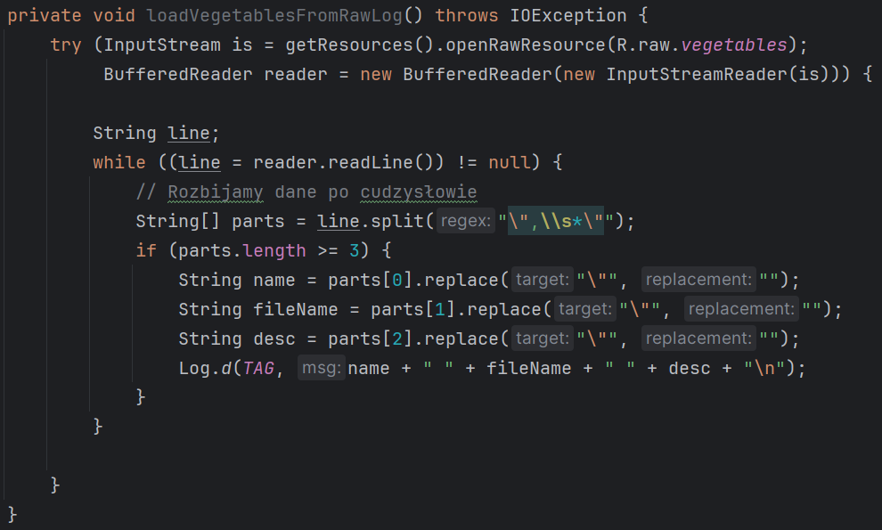
    Sprawdź czy poprawnie wczytujesz dane, np.:
8.  Przetestuj aplikację, uruchom na urządzeniu.
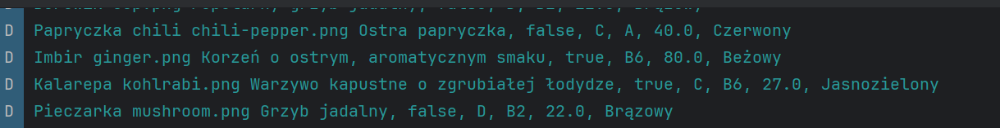
9.  Dodaj pliki png do drawable
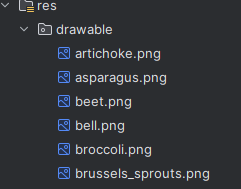
10. Utwórz tablicę dla plików:
> 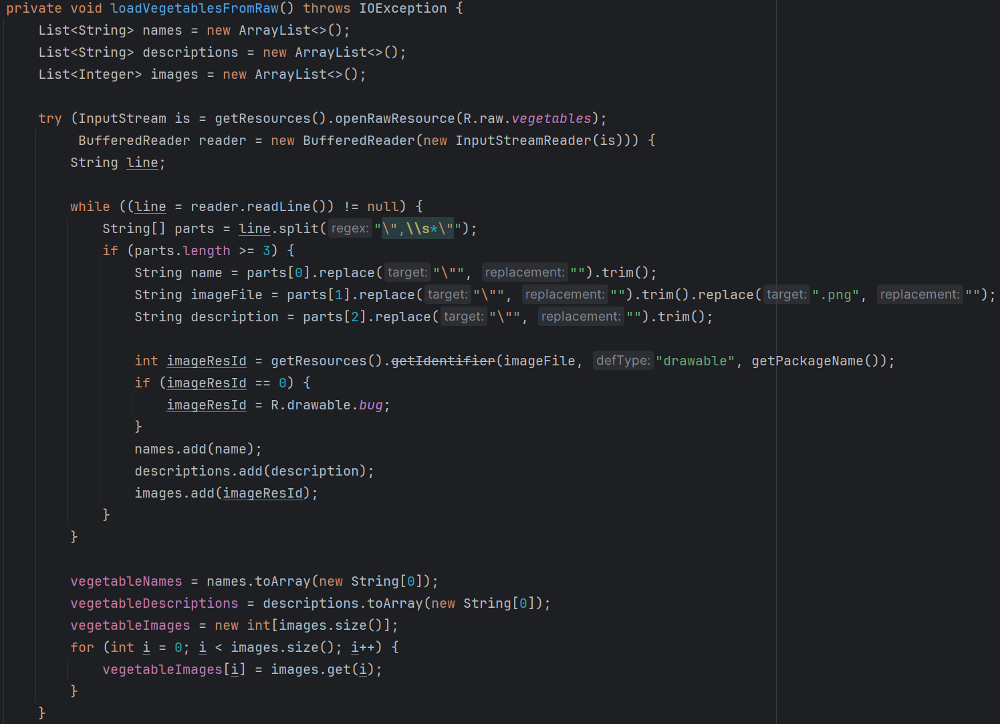
11. Dalej, szkielet dla onCreate():
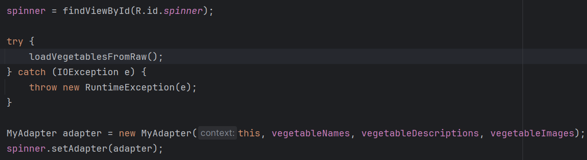
12. Utwórz plik spinner_item.xml:
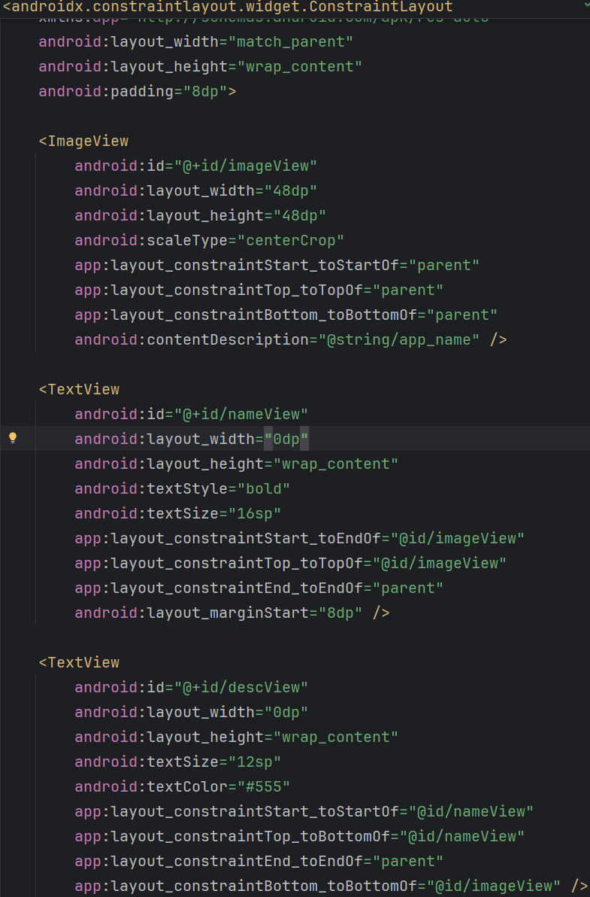
13. Utwórz klasę MyAdapter.java, rozrzesz ją o BaseAdapter:
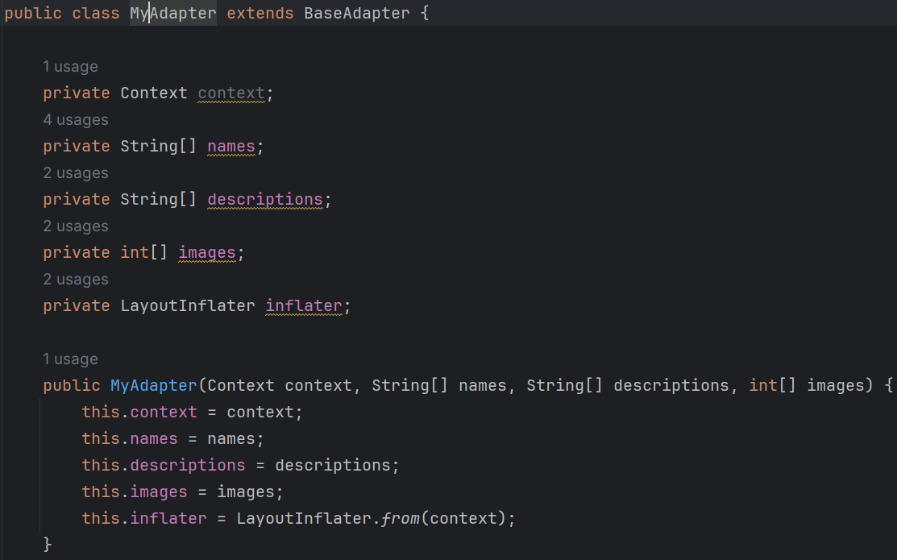
14. Sprawdź wbudowane metody:
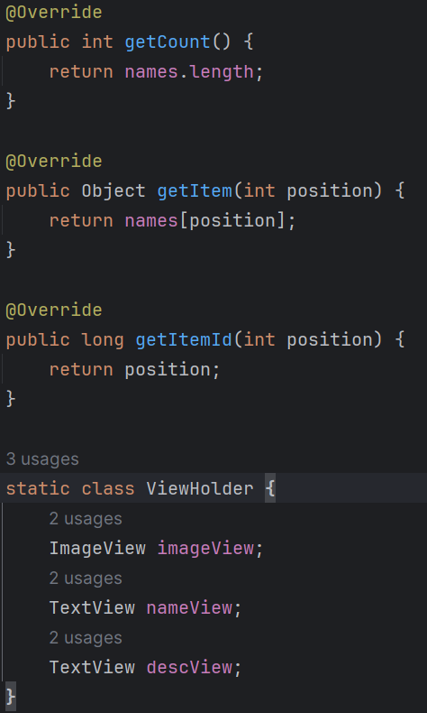
15. Ostatnia metoda:
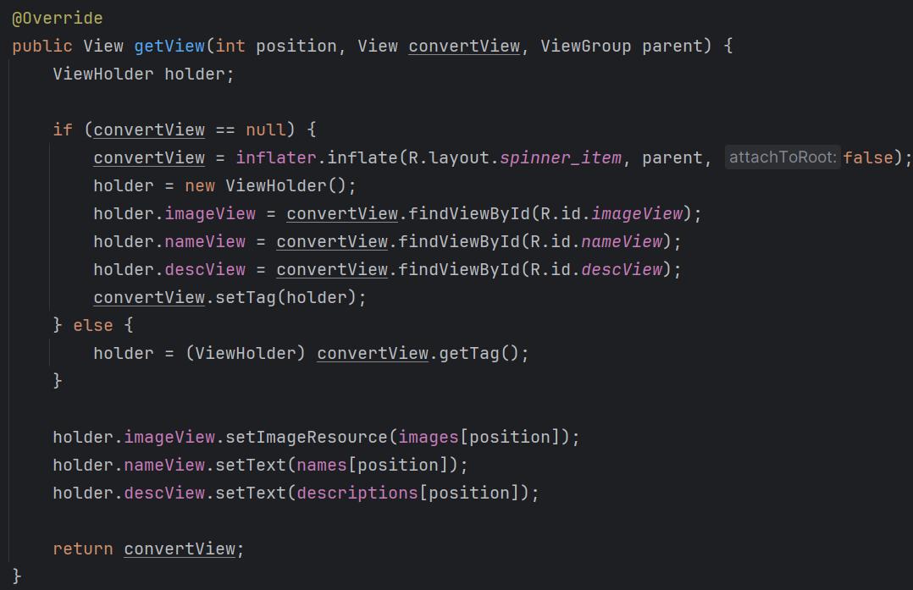
16. Wykonaj zadania:
    a)  dodaj obsługę kliknięcia w item, wyświetl toast
> 
> 
>
> 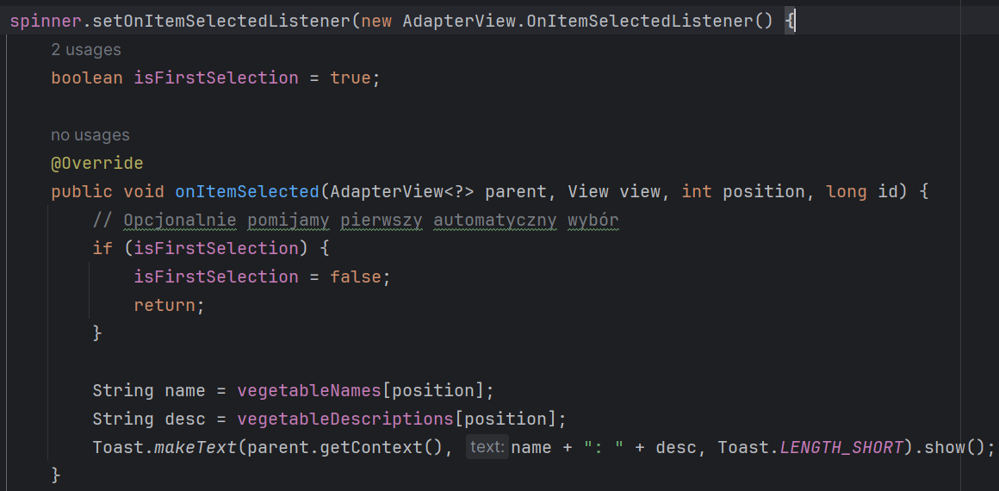
b)  utwórz przycisk dodający nowy element do listy
c)  zachowaj całą listę w ShredPreferences, sprawdź stan linty po
    rotacji urządzenia
d)  przebuduj projekt tworząc klasę i listę, utwórz stosowny adapter
    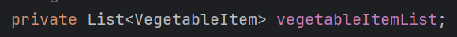
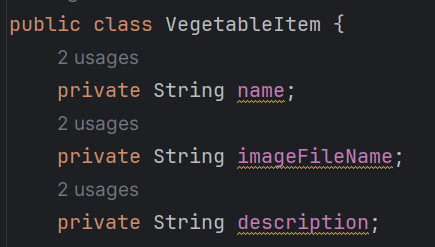
> 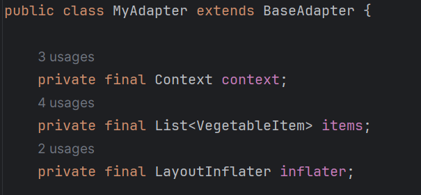
>
> Obsługa dla listenera:
>
> 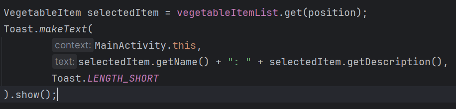
>
> Metoda czytająca dane:
>
> 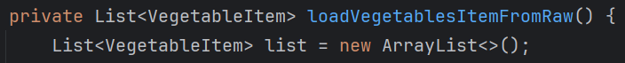
17. KONIEC.
