# Ćwiczenia 15 -- Android studio -- BaseAdapter, Spinner

💡Na koniec zajęć prześlij pliki źródłowe (.xml, .java) + screeny do zasobu
w teams.

1. Utwórz projekt o nazwie ArrayAdapter na podstawie Empty Activity,
    dobierz odpowiednie API.

1. Otworzyć dokumentację:

   <https://developer.android.com/guide/topics/ui/controls/spinner>

   <https://developer.android.com/guide/topics/resources/string-resource#java>

   <https://developer.android.com/reference/android/widget/BaseAdapter>

1. Docelowo chcemy uzyskać :

   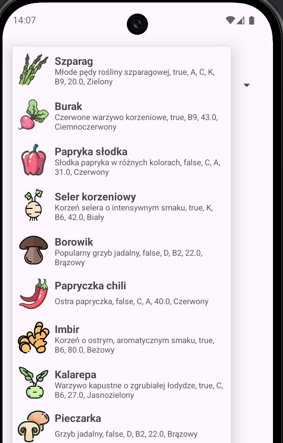

   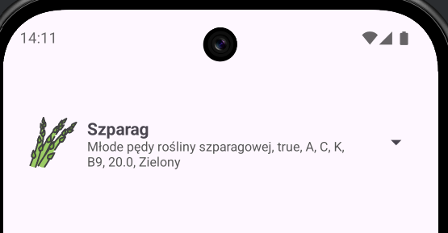

1. Dodaj w activity_main.xml

   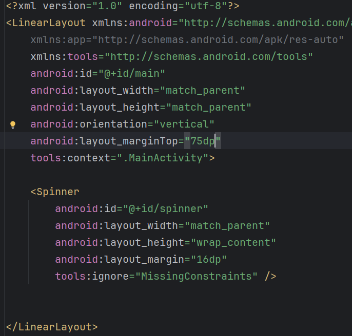

1. W raw umieść plik z danymi:

   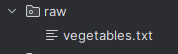

1. Uzupełnij MainActivity.java:

   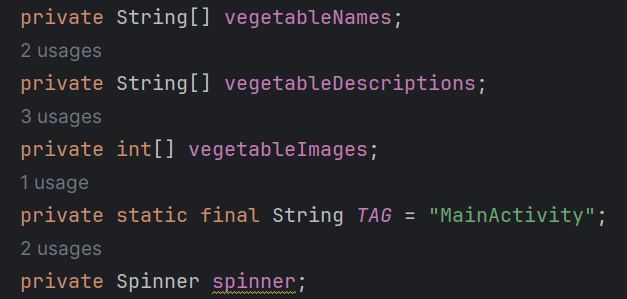

1. Sprawdź czy poprawnie wczytujesz dane, np.:

   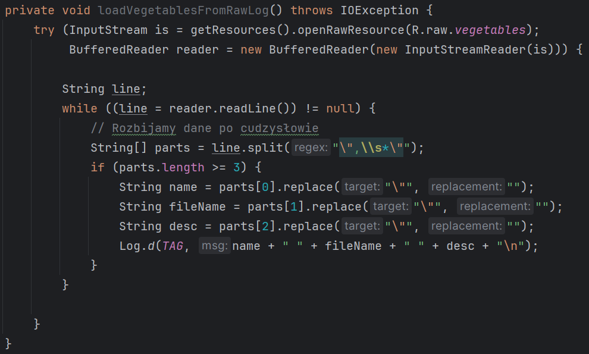

1. Przetestuj aplikację, uruchom na urządzeniu.

   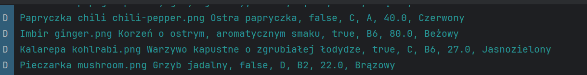

1. Dodaj pliki png do drawable

   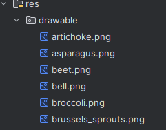

1. Utwórz tablicę dla plików:

   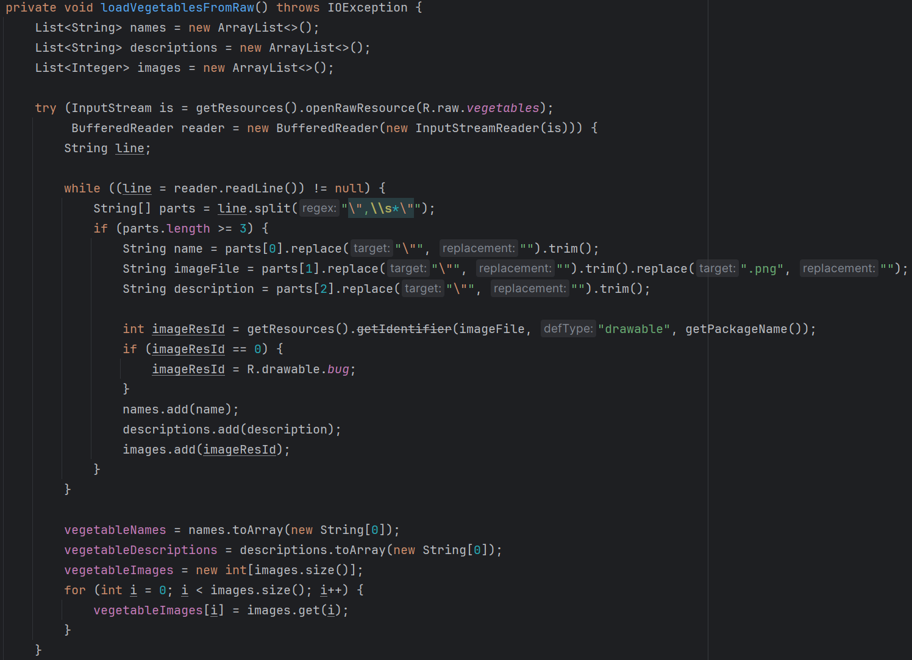

1. Dalej, szkielet dla onCreate():

   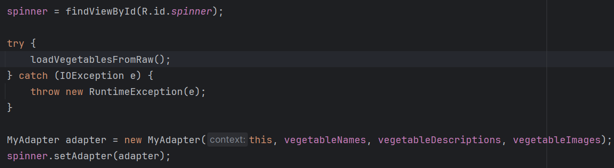

1. Utwórz plik spinner_item.xml:

   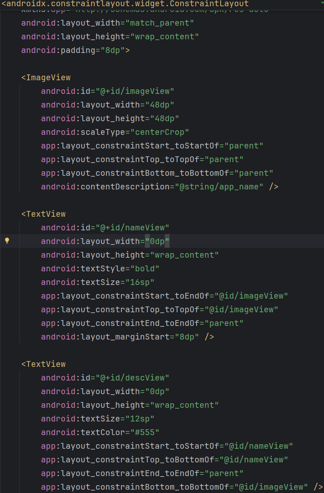

1. Utwórz klasę MyAdapter.java, rozrzesz ją o BaseAdapter:

   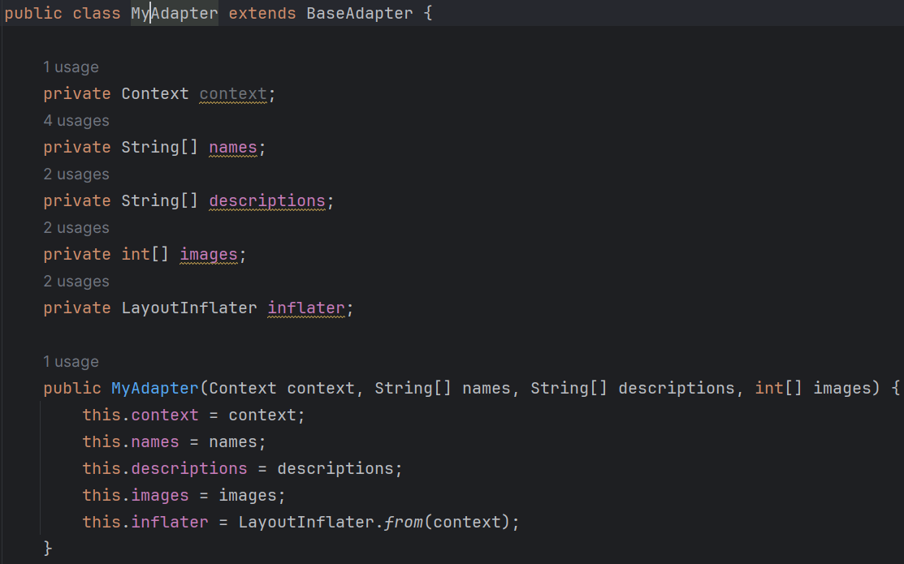

1. Sprawdź czy posiadasz wbudowane metody:

   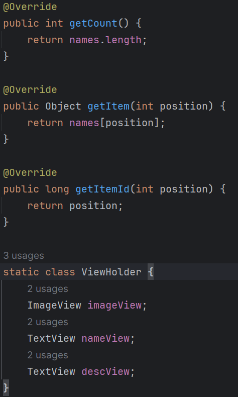

1. Ostatnia metoda:

   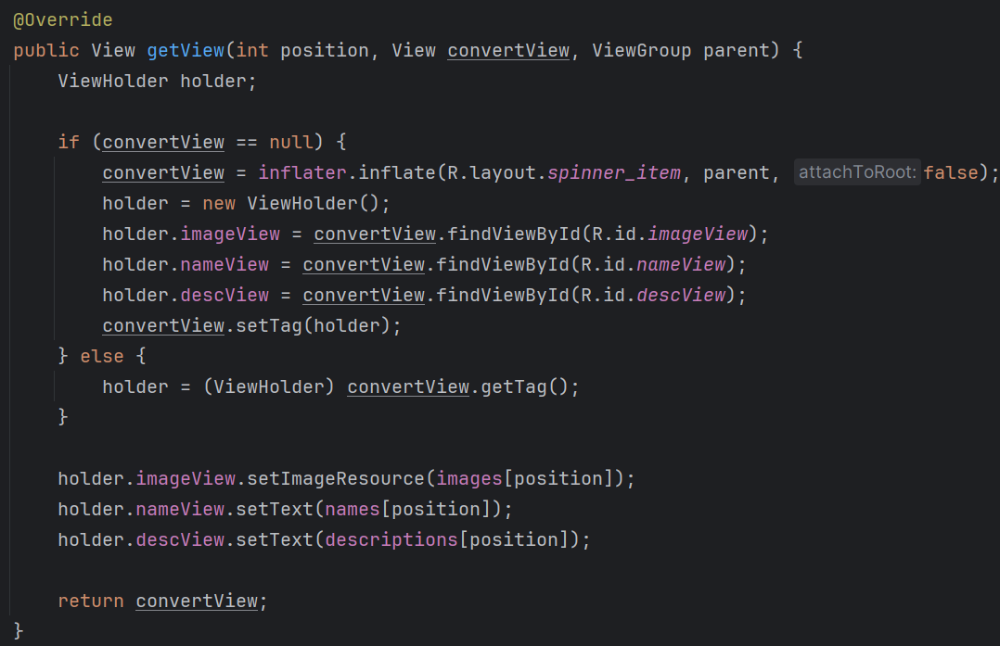

1. Wykonaj zadania:

   - dodaj obsługę kliknięcia w item, wyświetl toast

   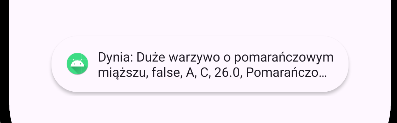

   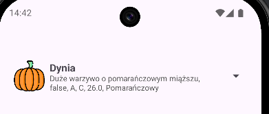

   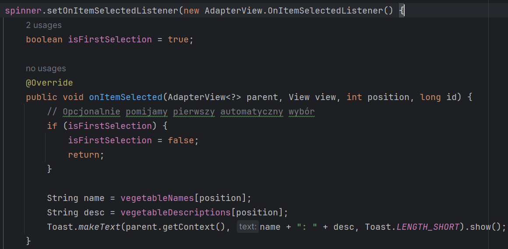

   - utwórz przycisk dodający nowy element do listy

   - zachowaj całą listę w ShredPreferences, sprawdź stan listy po
     rotacji urządzenia

   - przebuduj projekt tworząc klasę i listę, utwórz stosowny adapter

     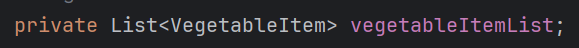

     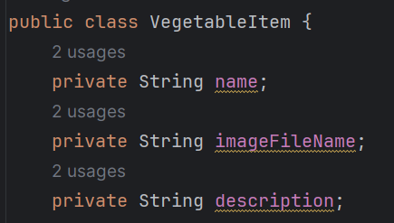

     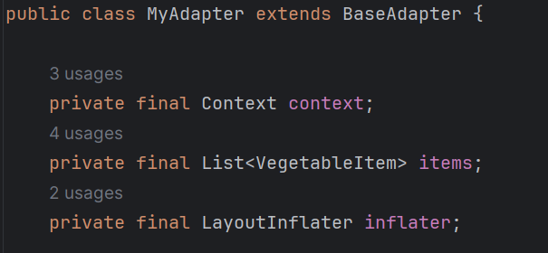

     Obsługa dla listenera:

     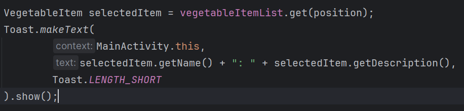

     Metoda czytająca dane:

     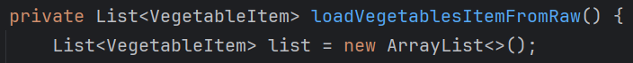

1. KONIEC.🔚
