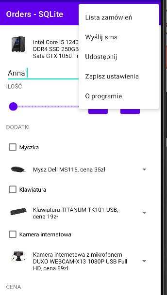
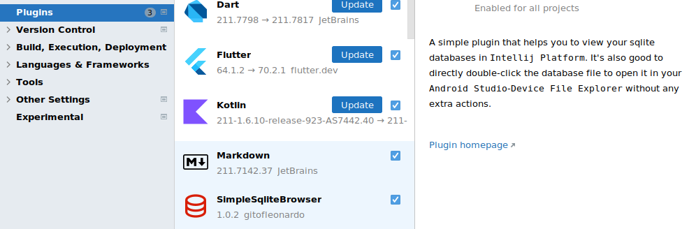
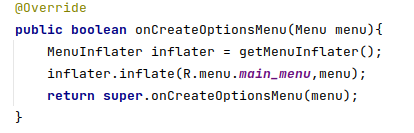
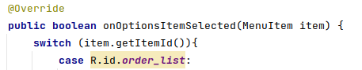

Ćwiczenia 16 -- Android studio -- SQLite, ArrayAdapter, SimpleAdapter,
ListView, Spinner
Na koniec zajęć prześlij pliki źródłowe (.xml, .java)+ obrazek do zasobu
w teams.
1.  Utwórz projekt o nazwie SQLite na podstawie Empty Activity, dobierz
    odpowiednie API ( min. 28).
2.  Otworzyć dokumentację:
<https://developer.android.com/reference/android/database/sqlite/SQLiteDatabase>
<https://developer.android.com/reference/android/database/sqlite/SQLiteOpenHelper>
<https://developer.android.com/reference/android/database/Cursor>
<https://developer.android.com/reference/android/content/ContentValues>
a.  metody:
    <https://developer.android.com/reference/android/database/sqlite/SQLiteOpenHelper#getWritableDatabase>()
    <https://developer.android.com/reference/android/database/sqlite/SQLiteOpenHelper#getReadableDatabase>()
    <https://developer.android.com/reference/android/database/sqlite/SQLiteDatabase#execSQL(java.lang.String>)
    <https://developer.android.com/reference/android/database/sqlite/SQLiteDatabase#rawQuery(java.lang.String,%20java.lang.String>\[\])
    <https://developer.android.com/reference/android/database/sqlite/SQLiteDatabase#insert(java.lang.String,%20java.lang.String,%20android.content.ContentValues>)
<!-- -->
3.  Dodaj zależności ( jeśli są potrzebne)
4.  Docelowo chcemy uzyskać coś na kształt, tematykę możesz dobrać pod
    swój projekt:

5.  Wykorzystaj do zbudowania interfejsu użytkownika ćwiczenia 15.
    <https://developer.android.com/guide/topics/ui/controls/spinner>
    <https://developer.android.com/guide/topics/resources/string-resource#java>
    <https://developer.android.com/reference/android/widget/ListView#setAdapter(android.widget.ListAdapter>)
6.  Stwórz podstawowe struktury dla bazy oraz ją utwórz:
    <https://developer.android.com/training/data-storage/sqlite>
7.  Sprawdź, czy baza powstała View → Tool Windows → Device File
    Explorer
    /data/data/com.example.twoja_nazwa/databases/nowa.db
8.  Dodaj plugin:
    
9.  Visual Code:
    Uwaga: bazę można podejrzeć w visual code po dodaniu rozszerzenia
    vscode-sqlite lub w programie DB browser SQLite
10. Utwórz menu, ćwiczenia 4:
    
    
11. Tworzenie emaila, odrębne ćwiczenia:
    <https://developer.android.com/guide/components/intents-common#ComposeEmail>
    <https://developer.android.com/reference/android/content/Intent#EXTRA_TEXT>
    <https://developer.android.com/reference/android/content/Intent#EXTRA_EMAIL>
    <https://developer.android.com/reference/android/content/Intent#ACTION_SENDTO>
Upewnij się, że istnieje program do wysyłania maili oraz jest
skonfigurowane konto poczty!!!
12. Tworzenie smsa i jego wysłanie, odrębne ćwiczenia:
    <https://developer.android.com/reference/android/content/Intent#developer-guides>
    <https://developer.android.com/reference/android/telephony/SmsManager>
13. Przetestuj aplikację, uruchom na urządzeniu.
14. Dodaj metody onPause() i onSaveInstanceState(Bundle bundle)
15. Obsługa dwóch języków i nie tylko:
    <https://developer.android.com/guide/topics/resources/localization>
16. Dodaj niezbędne klasy, adaptery i dane.
17. Dodatkowe zadania
    a)  logowanie do aplikacji z rejestracją
    b)  zapisanie zdjęć w bazie w postaci Stringów i ich poprawny odczyt
    c)  udostępnienie zamówienia z menu, aplikacja do wyboru
        <https://developer.android.com/training/sharing/send>
18. KONIEC.
