Ćwiczenia 17 -- Android studio -- GPS, Open Street Maps
Na koniec zajęć prześlij pliki źródłowe (.xml, .java)+ obrazek do zasobu
w teams.
1.  Utwórz projekt o nazwie GpsMaps na podstawie Empty Activity, dobierz
    odpowiednie API ( min. 26).
2.  Otworzyć dokumentację:
<https://developer.android.com/training/location/permissions>
<https://developer.android.com/reference/kotlin/android/location/LocationManager?hl=en>
<https://developer.android.com/training/location/request-updates>
<https://developer.android.com/reference/android/location/Location>
3.  Dodaj zależności ( aktualna wersja na
    <https://github.com/osmdroid/osmdroid>):
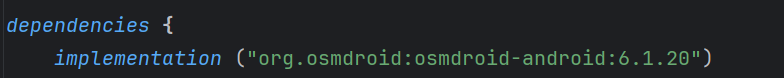
4.  Docelowo chcemy uzyskać coś na kształt( marker ustawić na
    czerwony!!!):
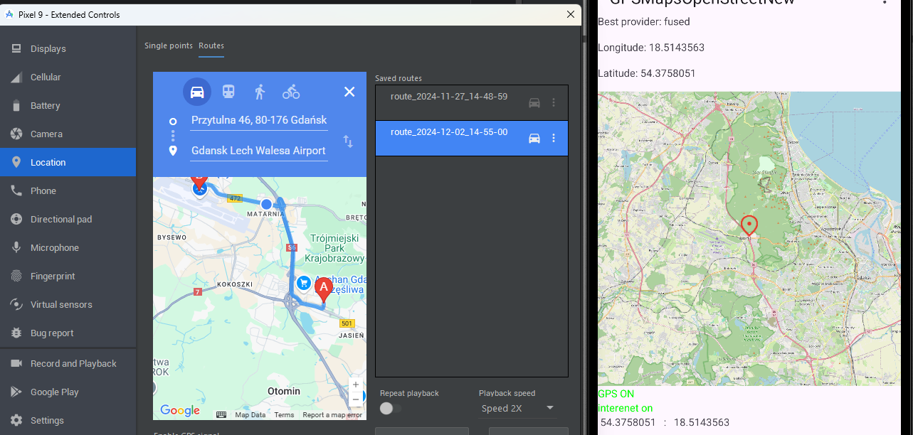
5.  Stwórz podstawowe struktury np.:
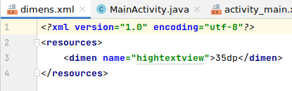
6.  Stwórz layout dla aplikacji jak poniżej lub podobny:
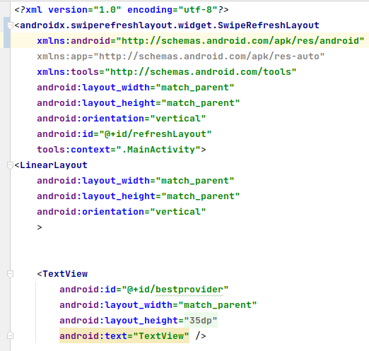
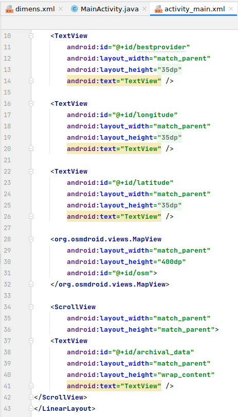
7.  Dodaj listener dla layoutu SwipeRefreshLayout:
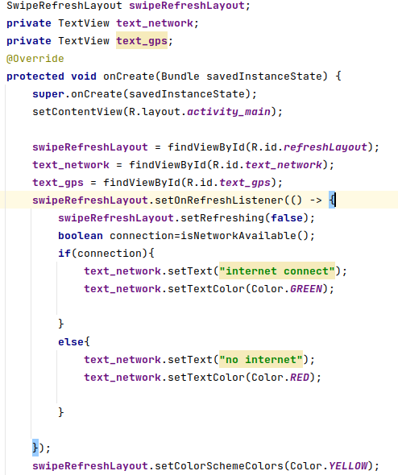
8.  Zadeklaruj w MainActivity.java:
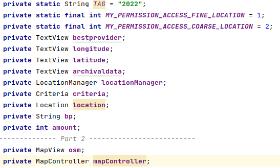
9.  W onCreate() dodaj:
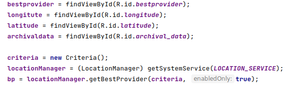
10. Dodaj ( ważne: zwróć uwagę na kolejne dwa punkty!!! ):
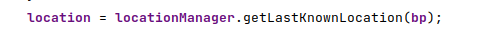
11. W AndroidManifest.xml sprawdź czy masz uprawnienia:
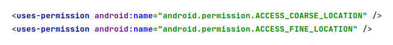
12. Add permission check ( if z checkSelfPermission doda się
    automatycznie po wybraniu tej opcji)
> W trakcie realizacji ćwiczeń należy dodać stosone inne, wymagane
> uprawnienia!!!
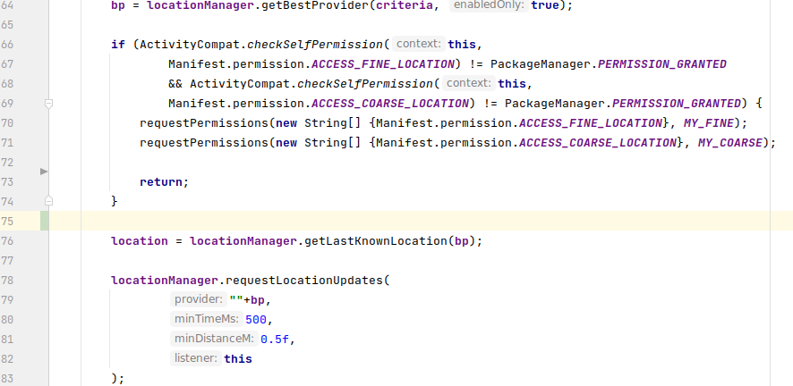
13. 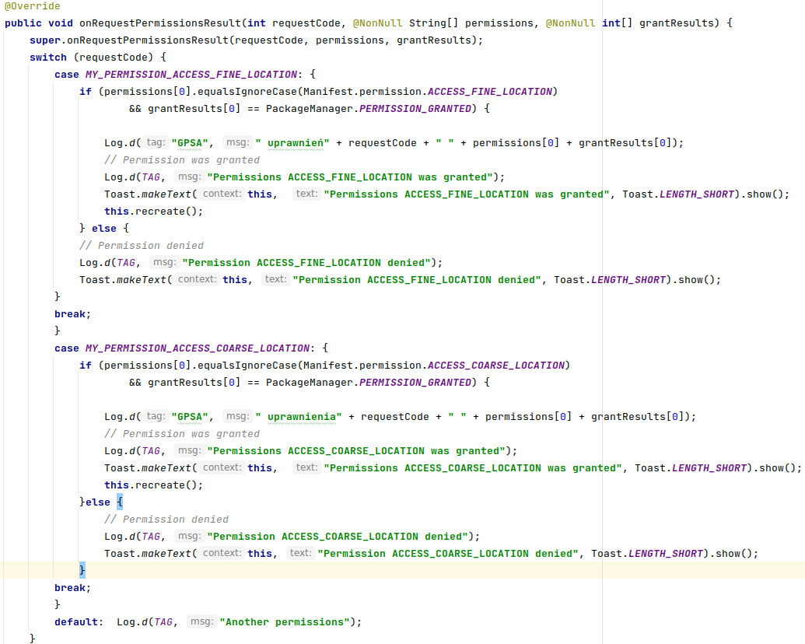
    Sprawdź czy zaimplementowałeś/aś metodę
    onRequestPermissionResult, np.:
14. Sprawdź czy wypisujesz odczyty:
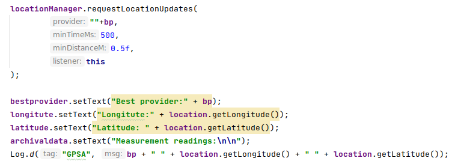
15. Zaimplementuj LocationListener z potrzebnymi metodami:
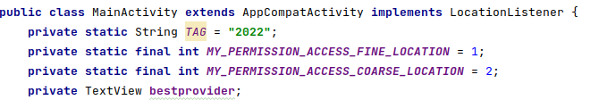
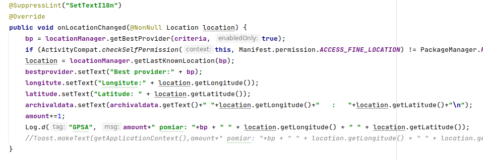
16. Przetestuj aplikację, uruchom na urządzeniu. Przemieść się .
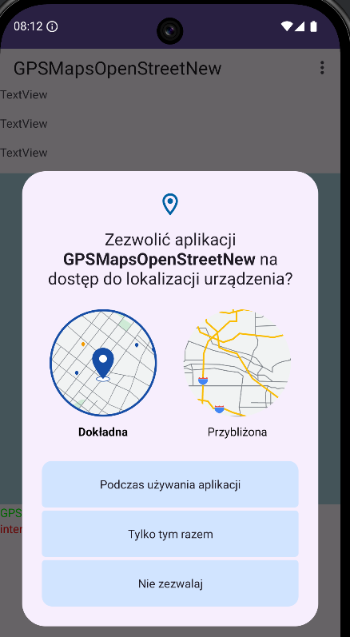
17. Część druga -- dodanie mapy

18. Parametry:
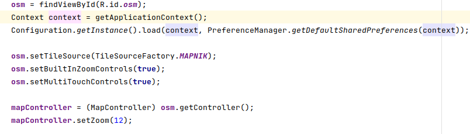
19. Dodanie punktu:
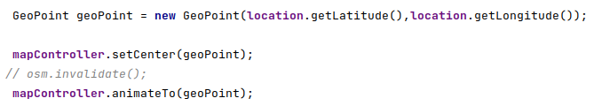
20. Dodanie markera i setMapListenera ( nie obligatoryjne ) :
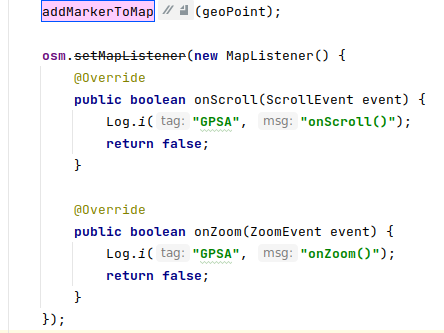
21. Dodaj iconę markera, najlepiej plik.png itp:

22. Marker:
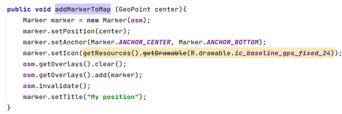
23. Dodaj obligatoryjnie menu górne:( opis i objaśnienie w punkcie 25)
> 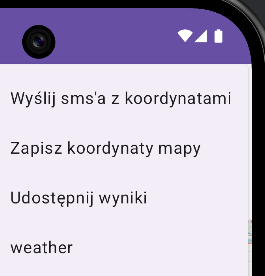
24. Dodaj metodę sprawdzającą dostęp do GPS i internetu (colory czerwony
    i zielony na TextView)
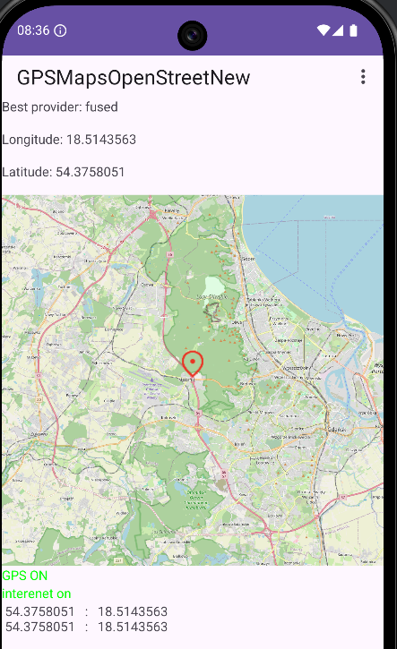
25. Wykonaj zadania
    a)  wysłanie sms-em koordynat
> 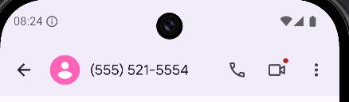
>
> 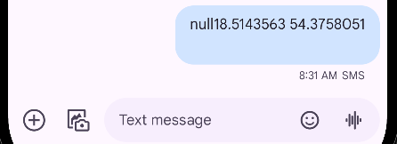
b)  zapisanie zdjęć mapy na karcie
> 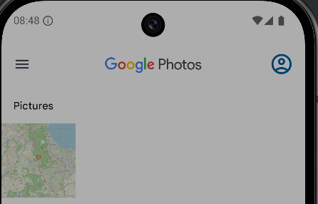
c)  udostępnienie wyników
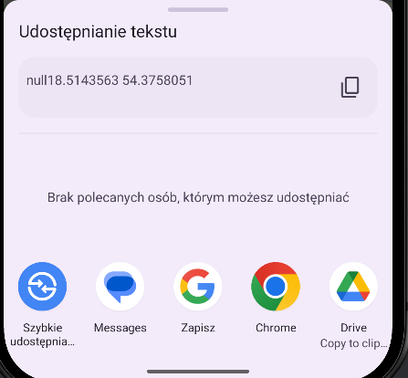
26. 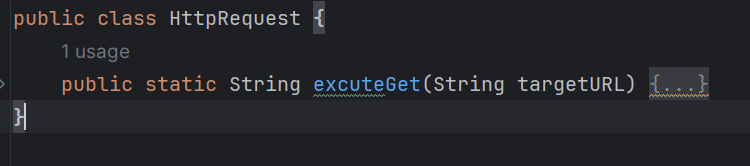
    Dodatkowe zadanie: wczytaj dane
    pogodowe dla obecnej lokalizacji:
> 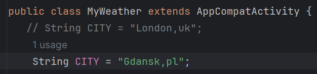
>
> 
>
> 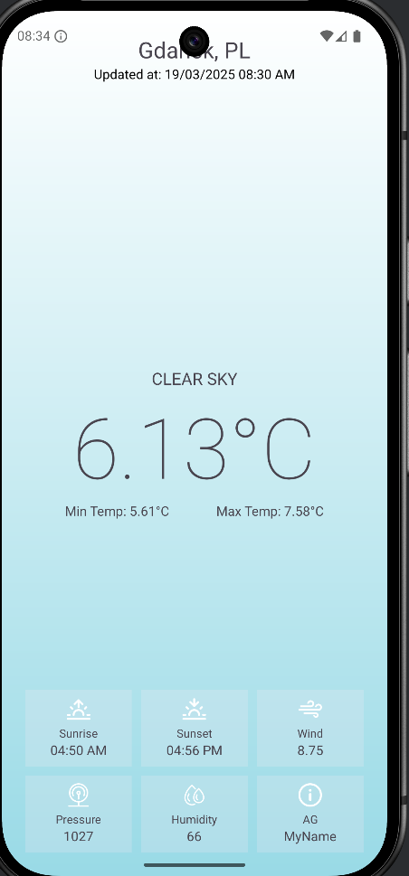
27. KONIEC.
