Ćwiczenia 18 -- Android studio -- Sensors
Na koniec zajęć prześlij pliki źródłowe (.xml, .java)+ obrazek do zasobu
w teams.
1.  Utwórz projekt o nazwie WorkWithSensors na podstawie Empty Activity,
    dobierz odpowiednie API .
2.  Otworzyć dokumentację:
    <https://developer.android.com/guide/topics/sensors>
    <https://developer.android.com/guide/topics/sensors/sensors_overview>
    <https://developer.android.com/reference/android/hardware/Sensor>
    <https://developer.android.com/reference/android/hardware/SensorManager>
    <https://developer.android.com/reference/android/hardware/SensorEvent>
    <https://developer.android.com/reference/android/hardware/SensorEventListener>
3.  Przykładowa realizacja:
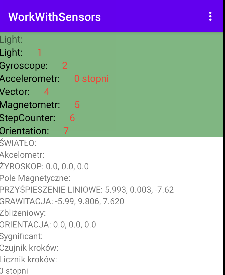
4.  Zidentyfikuj czujniki znajdujące się na urządzeniu.
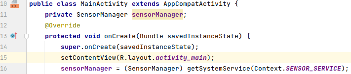
5.  Uzyskaj listę wszystkich czujników na urządzeniu.
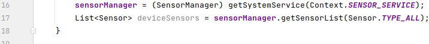
6.  Wyświetl nazwy czujników w listView, skorzystaj z
    ArrayAdapter\<String\> oraz w LogCat:
    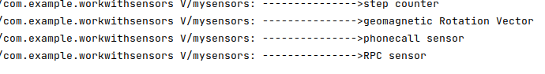
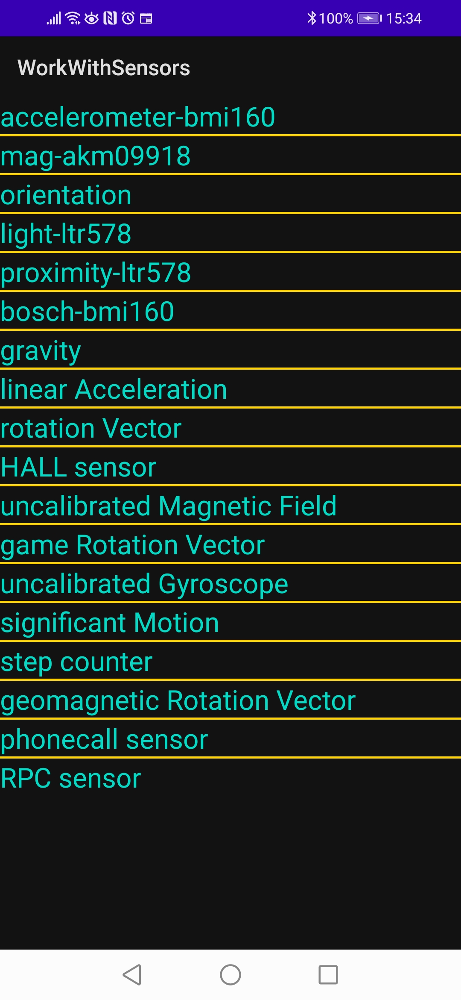
7.  Sprawdź wybrany czujnik domyślny i wyświetl szczegółowe dane, np.:
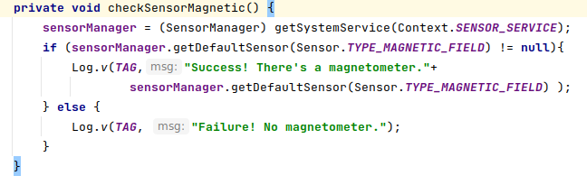
8.  Znajdź i wypisz wszystkie czujniki grawitacji.
    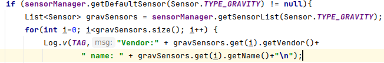
9.  Zaimplementuj klasę SensorEventListener oraz dodaj metody:
    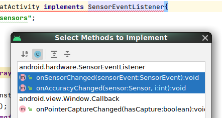
10. Rejestruj i wyrejestruj detektor zdarzeń czujnika w metodach
    onResume() i onPause().
    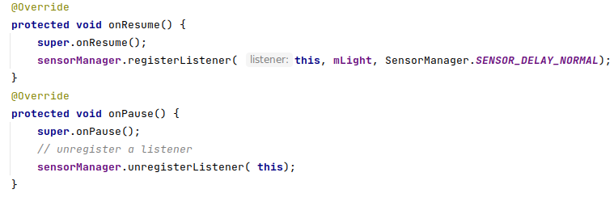
11. Wykorzystaj powyższe cztery metody do monitorowania danych z
    czujnika światła.
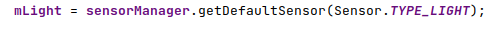
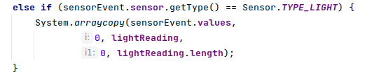
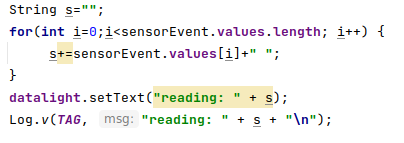
12. Przetestuj aplikację, uruchom na urządzeniu.
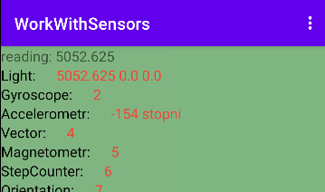
13. Przetestuj aplikację na urządzeniu wirtualnym
    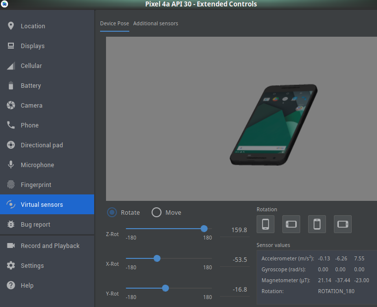
14. Szablon dla pozostałych czujników, zastąp nazwę szablon nazwą
    czujnika
    import android.content.Context;\
    import android.hardware.Sensor;\
    import android.hardware.SensorEvent;\
    import android.hardware.SensorEventListener;\
    import android.hardware.SensorManager;\
    import android.os.Bundle;\
    import android.util.Log;\
    import android.view.WindowManager;\
    import android.widget.TextView;\
    \
    import androidx.appcompat.app.AppCompatActivity;\
    \
    public class Szablon extends AppCompatActivity implements
    SensorEventListener \
    \
    TextView text_name;\
    TextView text_readings;\
    private SensorManager sensorManager;\
    private Sensor mSensor;\
    boolean isSensorPresent;\
    \@Override\
    protected void onCreate(Bundle savedInstanceState) \
    super.onCreate(savedInstanceState);\
    setContentView(R.layout.*activity_szablon*);\
    getWindow().addFlags(WindowManager.LayoutParams.*FLAG_KEEP_SCREEN_ON*);\
    text_name = findViewById(R.id.*text_name*);\
    text_readings = findViewById(R.id.*text_readings*);\
    \
    sensorManager = (SensorManager)
    getSystemService(Context.*SENSOR_SERVICE*);\
    \
    if (sensorManager.getDefaultSensor(Sensor.*TYPE_GRAVITY*) != null
    )\
    mSensor = sensorManager.getDefaultSensor(Sensor.*TYPE_GRAVITY*);\
    isSensorPresent = true;\
    Log.*v*(Config.*TAG*,\"detect \... sensor\");\
     else \
    text_name.setText(\"Sensor is not present\");\
    isSensorPresent = false;\
    \
    \
    \
    \@Override\
    public void onSensorChanged(SensorEvent sensorEvent) \
    text_readings.setText((int) sensorEvent.values\[0\]);\
    \
    \
    \@Override\
    public void onAccuracyChanged(Sensor sensor, int i) \
    \
    \
    \@Override\
    protected void onResume() \
    super.onResume();\
    Log.*v*(Config.*TAG*,\"\-\-\-\-\-\-\-\-\-\-\-\-\-\--\>
    onResume()\");\
    \
    if (mSensor != null) \
    sensorManager.registerListener(this, mSensor,\
    SensorManager.*SENSOR_DELAY_NORMAL*);\
    Log.*v*(Config.*TAG*,\"\-\-\-\-\-\-\-\-\-\-\-\-\-\--\> OK sensor
    registerListener\");\
    \
    \
    \
    \
    \@Override\
    protected void onPause() \
    super.onPause();\
    // unregister a listener. Don\'t receive any more updates from
    either sensor\
    if (mSensor != null) \
    sensorManager.unregisterListener(this, mSensor);\
    \
    Log.*v*(Config.*TAG*,\"\-\-\-\-\-\-\-\-\-\-\-\-\-\--\>
    onPause()\");\
    \
15. Layout do szablonu:
\<?xml version=\"1.0\" encoding=\"utf-8\"?\>\
\<LinearLayout
xmlns:android=\"http://schemas.android.com/apk/res/android\"\
xmlns:app=\"http://schemas.android.com/apk/res-auto\"\
xmlns:tools=\"http://schemas.android.com/tools\"\
android:layout_width=\"match_parent\"\
android:layout_height=\"match_parent\"\
android:orientation=\"vertical\"\
tools:context=\".Gravity\"\>\
\
\<TextView\
android:id=\"@+id/text_name\"\
android:text=\"Name of sensor\"\
android:textSize=\"35sp\"\
android:textAlignment=\"center\"\
android:layout_width=\"match_parent\"\
android:layout_height=\"75dp\"\>\
\</TextView\>\
\<TextView\
android:id=\"@+id/text_readings\"\
android:text=\"0\"\
android:textSize=\"35sp\"\
android:textAlignment=\"center\"\
android:layout_width=\"match_parent\"\
android:layout_height=\"75dp\"\>\
\</TextView\>\
\</LinearLayout\>
16. W AndroidManifest.xml sprawdź:
    
17. Część druga -- inne czujniki. Dostępne na urządzeniu.
<https://developer.android.com/guide/topics/sensors/sensors_motion>
18. Przetestuj czujnik położenia, orientacji ( orientation ) ( poziomica
    ). Do określenia orientacji urządzenia można wykorzystać odczyty z
    akcelerometru urządzenia i czujnika pola geomagnetycznego.
    <https://developer.android.com/guide/topics/sensors/sensors_position>
    <https://developer.android.com/guide/topics/sensors/sensors_position#sensors-pos-orient>
19. Przetestuj czujnik przyspieszenia ( accelerometr)
<https://developer.android.com/guide/topics/sensors/sensors_motion#sensors-motion-accel>
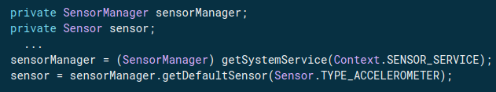
20. Przetestuj czujnik grawitacji ( gravity)
    <https://developer.android.com/guide/topics/sensors/sensors_motion#sensors-motion-grav>
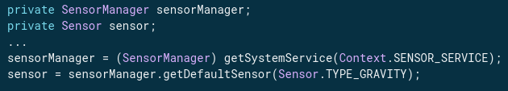
21. Przetestuj żyroskop ( gyroscope )
    <https://developer.android.com/guide/topics/sensors/sensors_motion#sensors-motion-gyro>
    
22. Przetestuj czujnik pola geomagnetycznego ( geomagnetic )
    <https://developer.android.com/guide/topics/sensors/sensors_position#sensors-pos-mag>
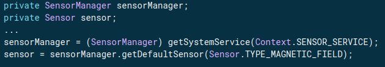
23. Przetestuj czujnik przyspieszenia liniowego ( linear accelerometr)
    <https://developer.android.com/guide/topics/sensors/sensors_motion#sensors-motion-linear>
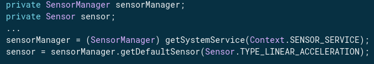
24. Dodatkowe zadania
    a)  przetestuj działanie czujnika zbliżeniowego
        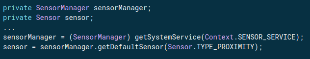
    b)  przetestuj działanie czujnika wykrywania kroków
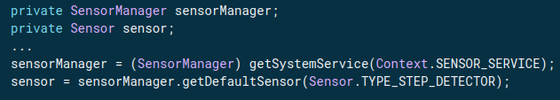
c)  sygnificant motion sensor
    <https://developer.android.com/reference/android/hardware/TriggerEventListener>
    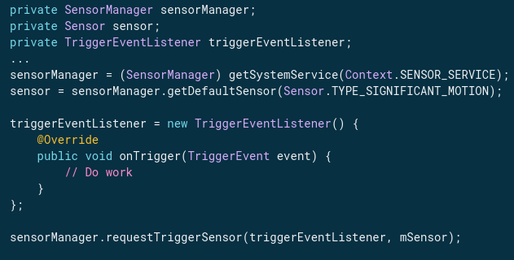
    d\) stwórz kompas akcelerometru oraz pola magnetycznego
    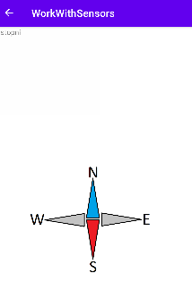
<!-- -->
25. KONIEC.
