Ćwiczenia 19 -- Android studio -- bluetooth
Na koniec zajęć prześlij pliki źródłowe (.xml, .java)+ obrazek do zasobu
w teams.
1.  Utwórz projekt o nazwie BlueTooth na podstawie Empty Activity,
    dobierz odpowiednie API ( 28 -- Android 9).
2.  Otwórz dokumentację:
<https://developer.android.com/guide/topics/permissions/overview>
<https://developer.android.com/guide/topics/connectivity/bluetooth/permissions>
<https://developer.android.com/guide/topics/connectivity/bluetooth>
<https://developer.android.com/guide/topics/connectivity/bluetooth/setup>
<https://developer.android.com/guide/topics/connectivity/bluetooth/find-bluetooth-devices>
<https://developer.android.com/guide/topics/connectivity/bluetooth/transfer-data>
3.  Zadeklaruj potrzebne stałe, np.:
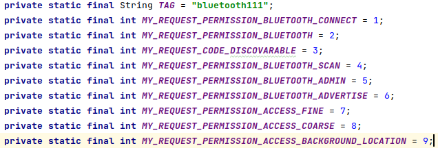
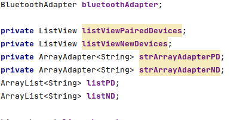
4.  AndroidManifest.xml:
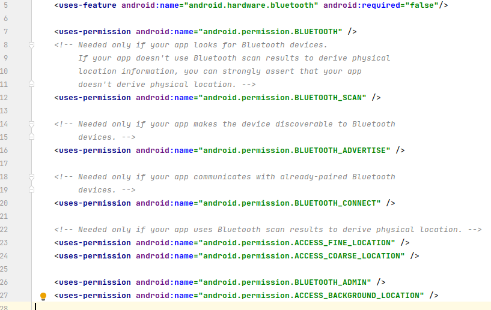
5.  Przygotuj w activity_main.xml:
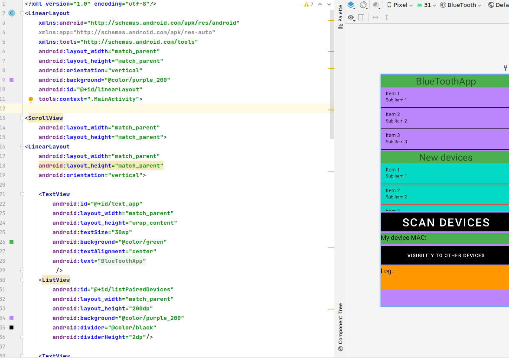
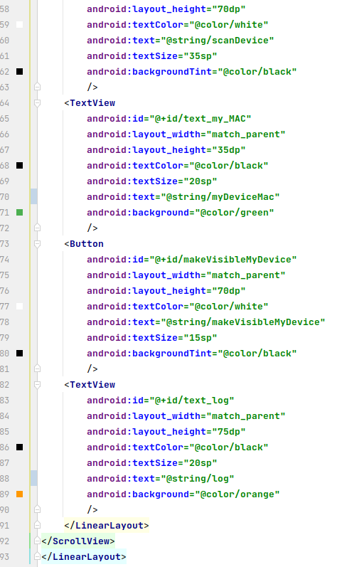
6.  Utwórz nowy layout o nazwie list_view_items.xml
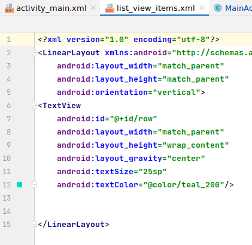
7.  Dokończ tworzenie list dla sparowanych urządzeń i nowych urządzeń,
    np.:
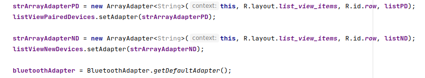
8.  Jeśli bluetooth na urządzeniu jest wyłączony ustaw kolor czerwony na
    wybranych komponentach,
a kolor zielony jeśli bluetooth jest włączony, np.:
poniższy fragment wywołuje również okno z ustawieniami do włączenia
przez użytkownika!!!
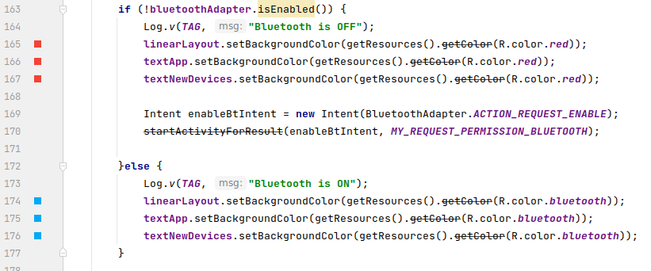
9.  Napisz metodę sprawdzającą dostępność bluetooth na urządzeniu,
    fragment poniżej:
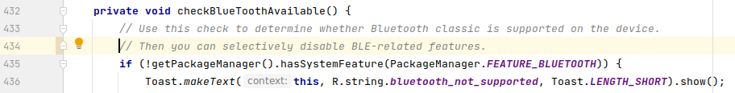
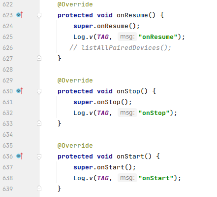
10. Zaimplementuj metody onResume(), onPause() itd.:.
11. Zaimplementuj także metodę onDestroy(), np.:
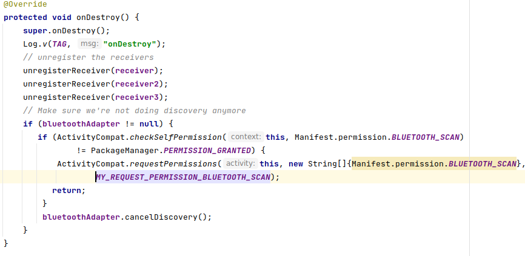
12. Utwórz listę sparowanych urządzeń:
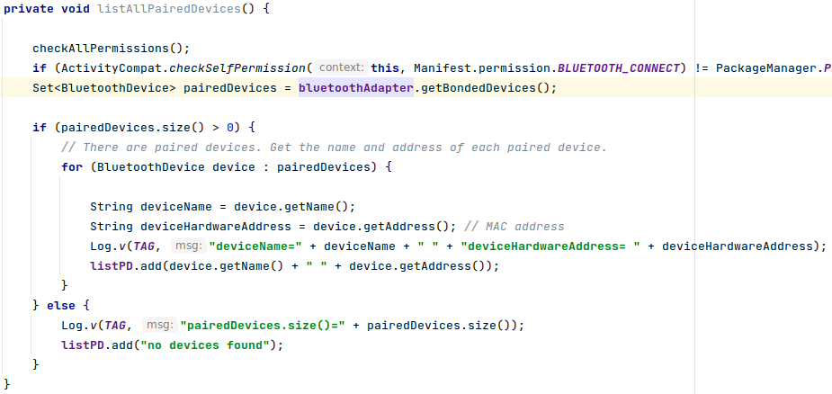
13. Przetestuj aplikację, uruchom na urządzeniu. Wyświetl listę
    sparowanych urządzeń.
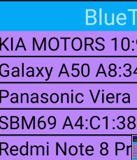
14. Stwórz metodę wyszukującą nowe urządzenia, poniżej przykładowy
    szkielet (patrz następny punkt):
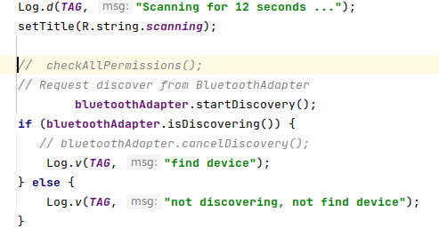
15. Zarejestruj receiver:
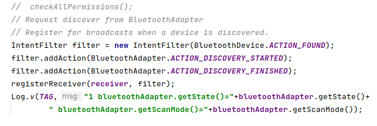
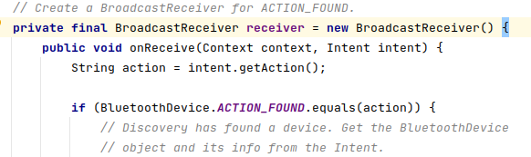
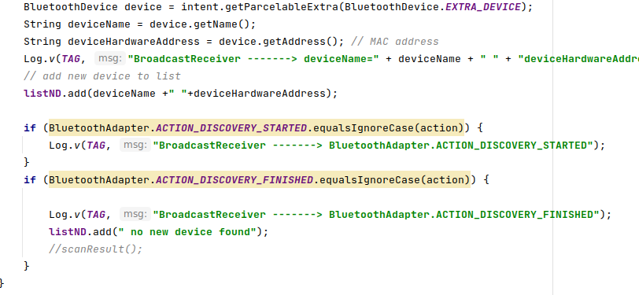
16. Przetestuj wykrywalność nowych urządzeń:
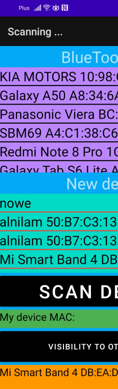
17. Widoczność urządzenia dla innych urządzeń:
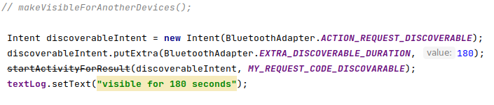
18. Dodaj receiver podający stany:

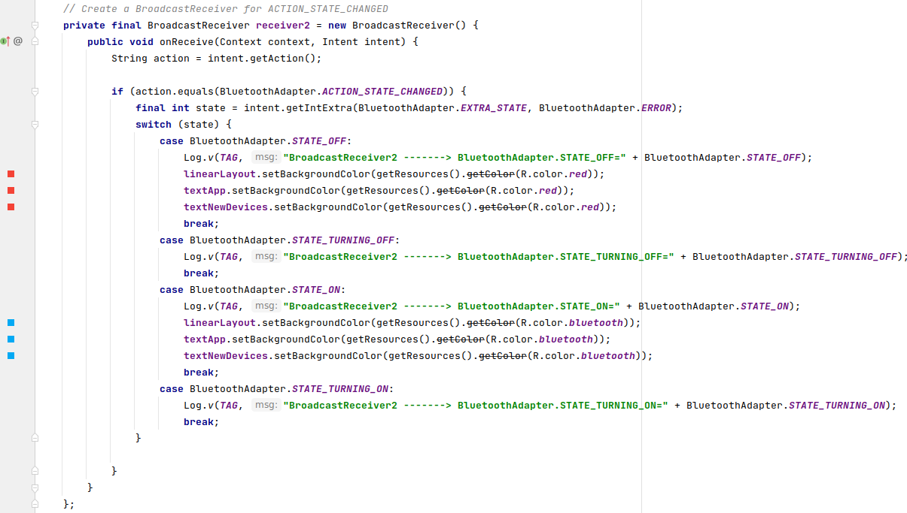
19. Dodaj receiver dla zmiany stanu skanowania:
IntentFilter:
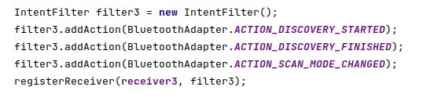
Receiver:

20. Część druga: napisanie komunikatora tekstowego po bluetooth.
<https://developer.android.com/guide/topics/connectivity/bluetooth/connect-bluetooth-devices>
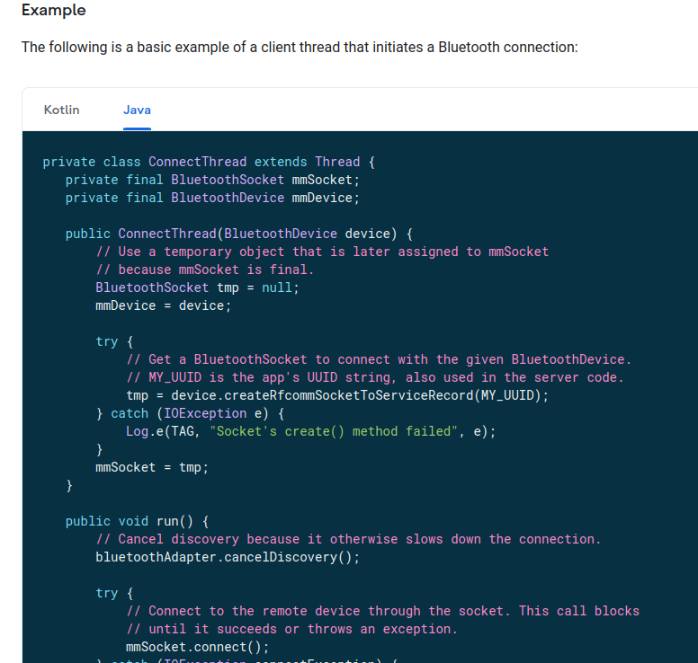
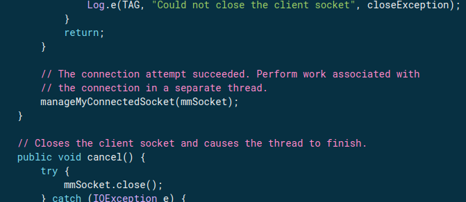
<https://developer.android.com/guide/topics/connectivity/bluetooth/transfer-data>
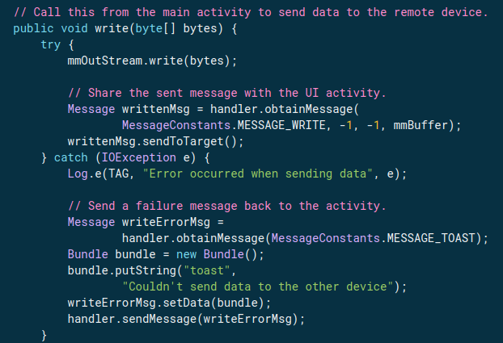
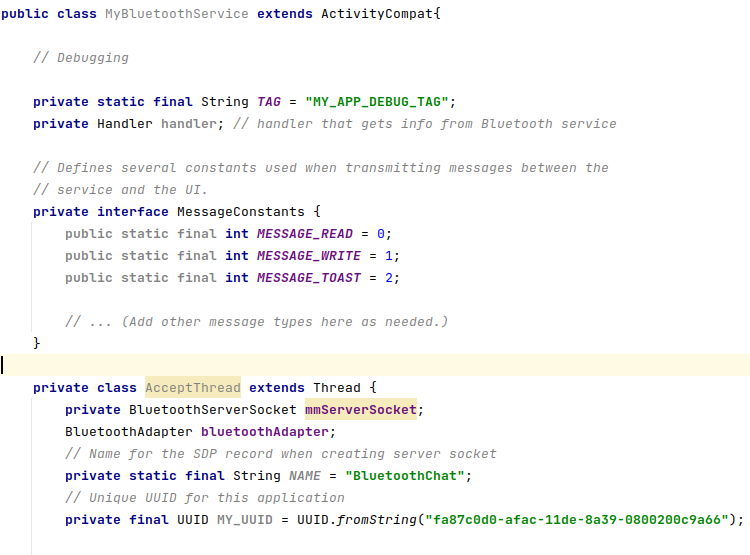
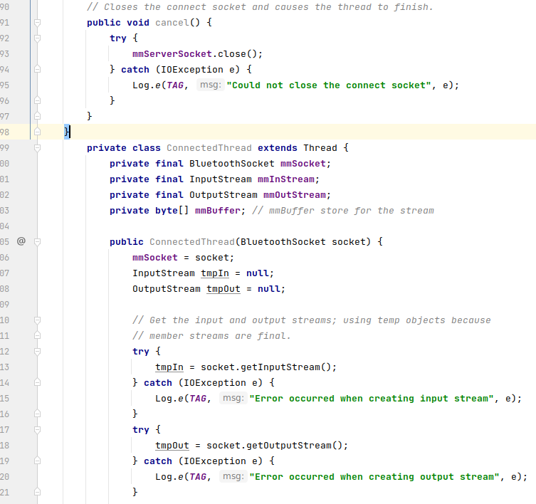
21. Wykonaj zadania
    a)  parowanie urządzeń towarzyszących:
<https://developer.android.com/guide/topics/connectivity/companion-device-pairing>
b)  przetestuj działanie komunikatora
c)  wybierz zadanie
<!-- -->
22. KONIEC.
