# Ćwiczenia 19 -- Android studio -- bluetooth

💡Na koniec zajęć prześlij pliki źródłowe (.xml, .java)+ obrazek do zasobu
w teams.

1. Utwórz projekt o nazwie BlueTooth na podstawie Empty Activity,
    dobierz odpowiednie API.

1. Otwórz dokumentację:

    <https://developer.android.com/guide/topics/permissions/overview>
    <https://developer.android.com/guide/topics/connectivity/bluetooth/permissions>
    <https://developer.android.com/guide/topics/connectivity/bluetooth>
    <https://developer.android.com/guide/topics/connectivity/bluetooth/setup>
    <https://developer.android.com/guide/topics/connectivity/bluetooth/find-bluetooth-devices>
    <https://developer.android.com/guide/topics/connectivity/bluetooth/transfer-data>

1. Zadeklaruj potrzebne stałe, np.:

   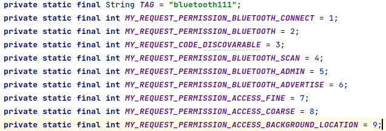

   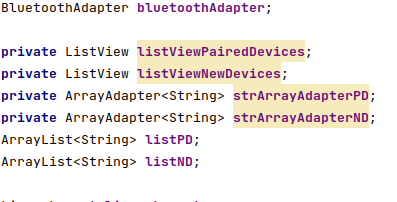

1. AndroidManifest.xml:
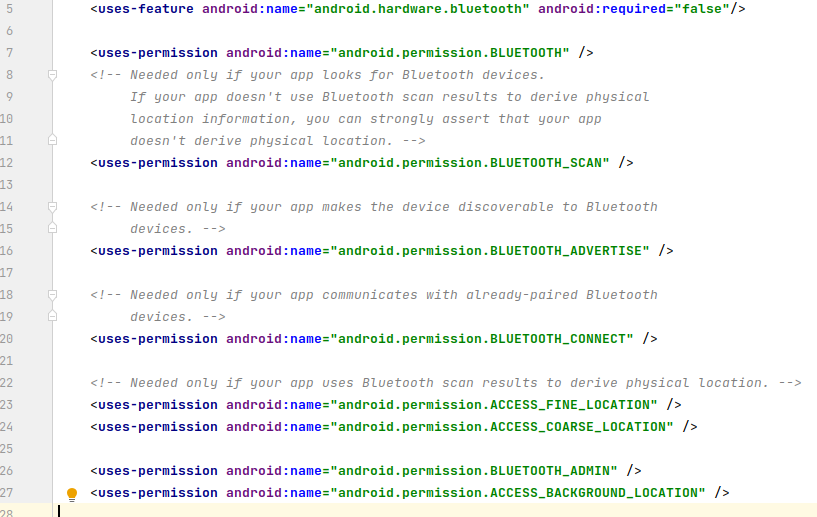
1. Przygotuj w activity_main.xml:
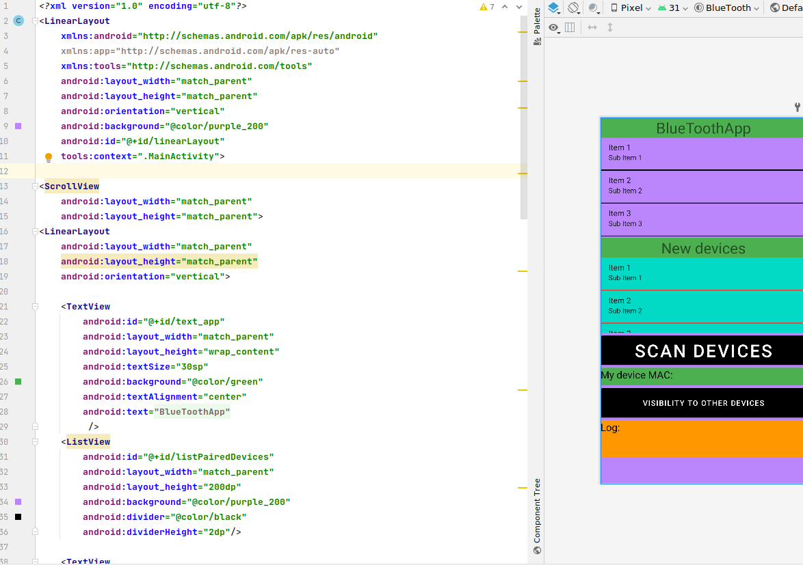
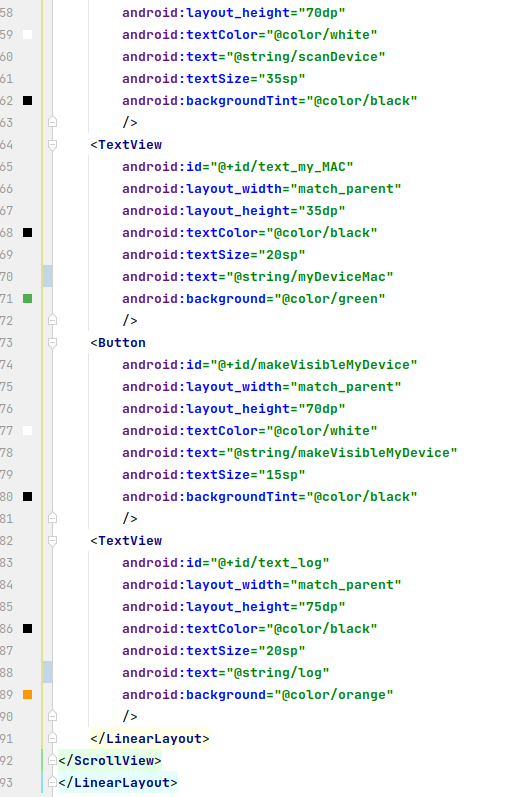
1. Utwórz nowy layout o nazwie list_view_items.xml
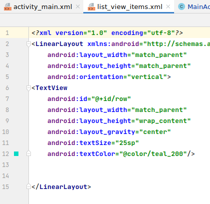
1. Dokończ tworzenie list dla sparowanych urządzeń i nowych urządzeń,
    np.:
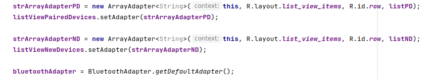
1. Jeśli bluetooth na urządzeniu jest wyłączony ustaw kolor czerwony na
    wybranych komponentach,
a kolor zielony jeśli bluetooth jest włączony, np.:
poniższy fragment wywołuje również okno z ustawieniami do włączenia
przez użytkownika!!!
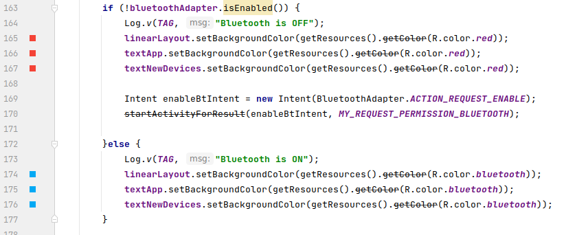
1. Napisz metodę sprawdzającą dostępność bluetooth na urządzeniu,
    fragment poniżej:
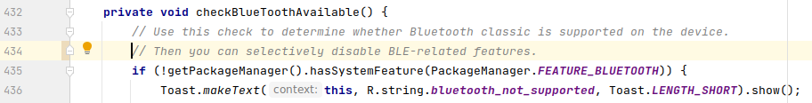
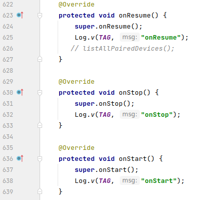
1. Zaimplementuj metody onResume(), onPause() itd.:.
1. Zaimplementuj także metodę onDestroy(), np.:
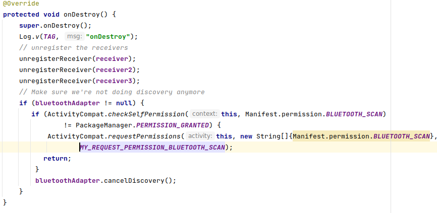
1. Utwórz listę sparowanych urządzeń:
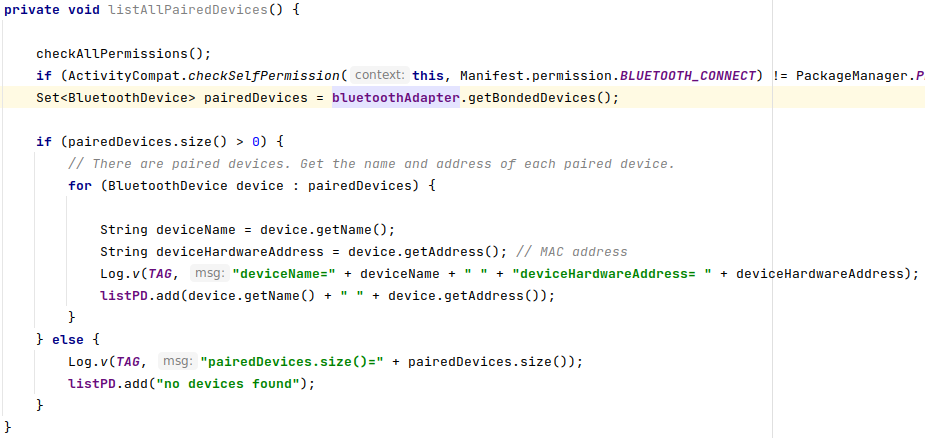
1. Przetestuj aplikację, uruchom na urządzeniu. Wyświetl listę
    sparowanych urządzeń.
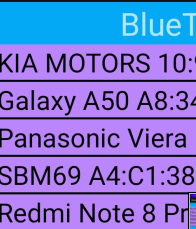
1. Stwórz metodę wyszukującą nowe urządzenia, poniżej przykładowy
    szkielet (patrz następny punkt):
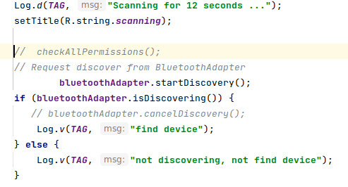
1. Zarejestruj receiver:
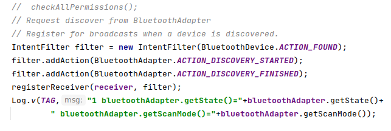
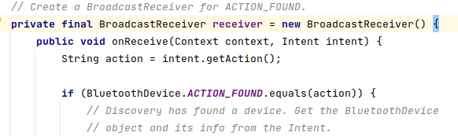
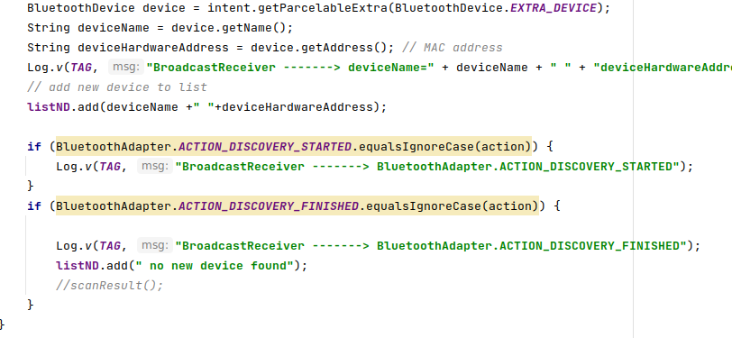
1. Przetestuj wykrywalność nowych urządzeń:
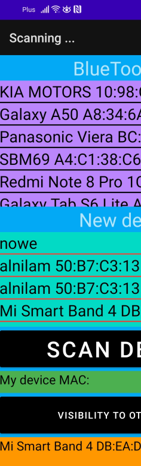
1. Widoczność urządzenia dla innych urządzeń:
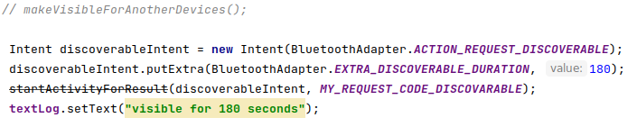
1. Dodaj receiver podający stany:
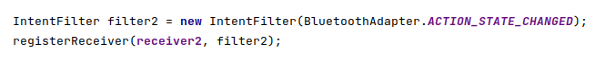
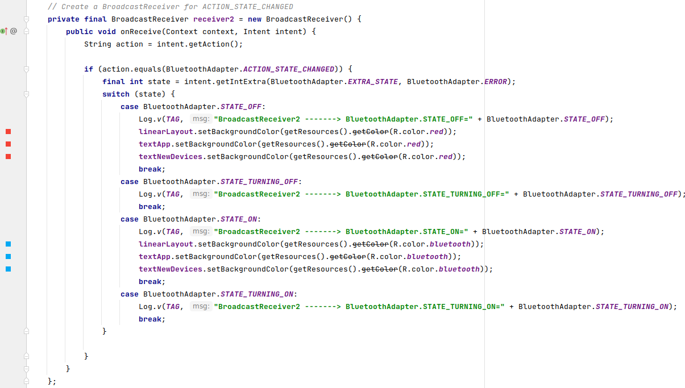
1. Dodaj receiver dla zmiany stanu skanowania:
IntentFilter:
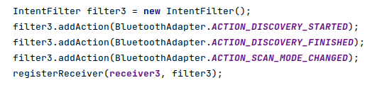
Receiver:
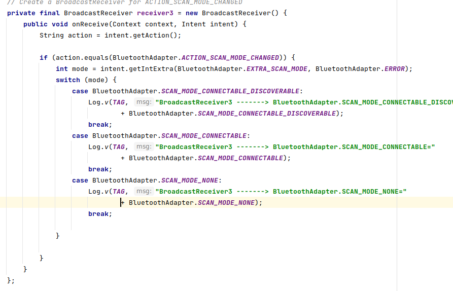
1. Część druga: napisanie komunikatora tekstowego po bluetooth.
<https://developer.android.com/guide/topics/connectivity/bluetooth/connect-bluetooth-devices>
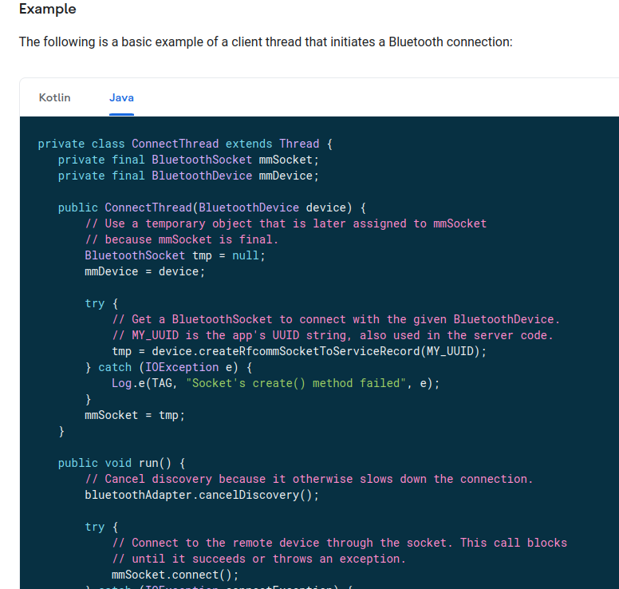
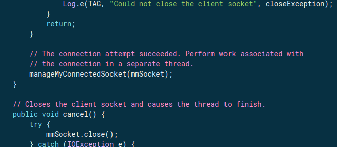
<https://developer.android.com/guide/topics/connectivity/bluetooth/transfer-data>
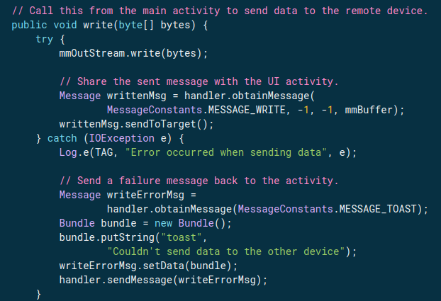
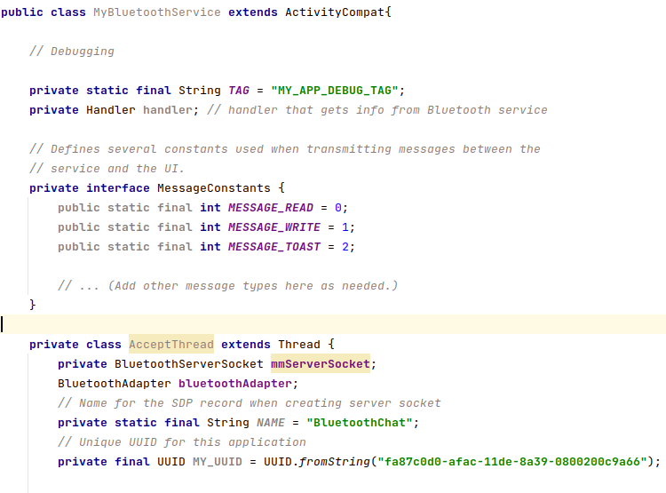
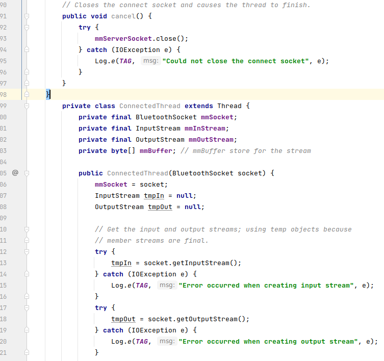
1. Wykonaj zadania
    a)  parowanie urządzeń towarzyszących:
<https://developer.android.com/guide/topics/connectivity/companion-device-pairing>
b)  przetestuj działanie komunikatora
c)  wybierz zadanie
<!-- -->
1. KONIEC.
