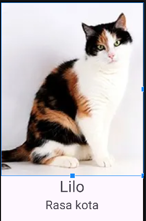

# Ćwiczenia 1 -- Android studio -- linear layouty

Na koniec zajęć prześlij pliki źródłowe:

- activity_main.xml,
- *.xml

 oraz obrazek do zasobu w teams.

1. Utwórz nowy projekt na podstawie Empty Activity (dobrać odpowiednie
    API 27) w katalogu na dysku C:

1. Uruchomić aplikację Hello World Shift+F10 (zielony trójkącik)

1. Usunąć TextView dla Hello World

1. Zmienić domyślny układ na LinearLayout

   

1. Dodać 1 obrazek, zdjęcie kota, psa do res

1. Dodać  EditText i inne zgodnie z

   <https://developer.android.com/guide/topics/ui/layout/linear>

1. Ustaw odstępy pomiędzy elementami GUI

1. Otworzyć dokumentację:

    <https://developer.android.com/develop/ui/views/layout/linear>

1. Dodaj drugi layout obok activity_main.xml :

   ```text
   res -> layout -> New -> Layout Resource File
   ```

   Podaj nazwę np.: activity_obrazek

1. Stwórz układ i wygląd:

   

1. KONIEC.
