Ćwiczenia 20 -- Android studio -- MediaPlayer Recorder, Bottom
Navigation
Na koniec zajęć prześlij pliki źródłowe (.xml, .java)+ obrazek do zasobu
w teams.
1.  Utwórz projekt o nazwie MyPlayAudioVideo na podstawie Empty
    Activity, dobierz odpowiednie API ( 28 -- Android 9).
2.  Otwórz dokumentację:
    <https://developer.android.com/guide/topics/media/mediaplayer>
    <https://developer.android.com/reference/com/google/android/material/bottomnavigation/BottomNavigationView>
    <https://material.io/components/bottom-navigation/android#using-bottom-navigation>
    <https://developer.android.com/guide/navigation/navigation-getting-started>
    <https://developer.android.com/guide/topics/media/mediarecorder>
    <https://developer.android.com/guide/topics/appwidgets>
3.  Dodaj potrzebne zależności, np.:
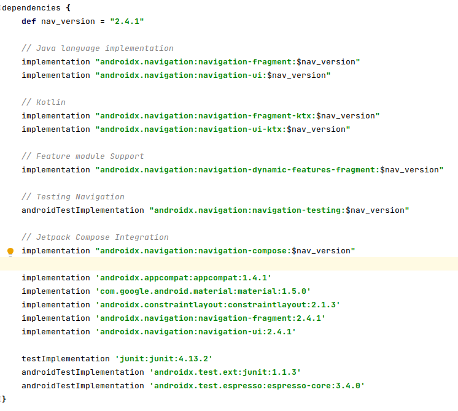
4.  Zbuduj nawigację dolną dla 5 fragmentów:
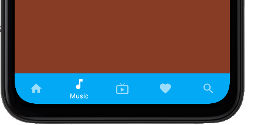
5.  Przygotuj ikony:
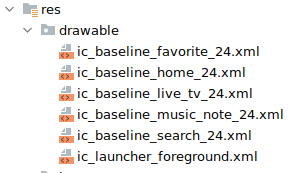
6.  Utwórz menu:
    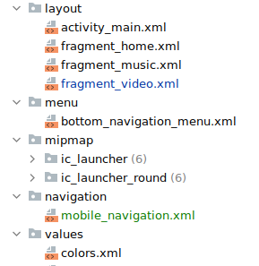
7.  Zawartość menu:
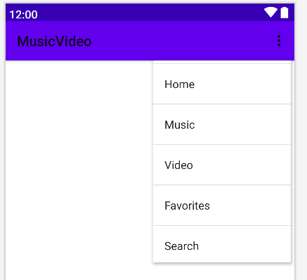
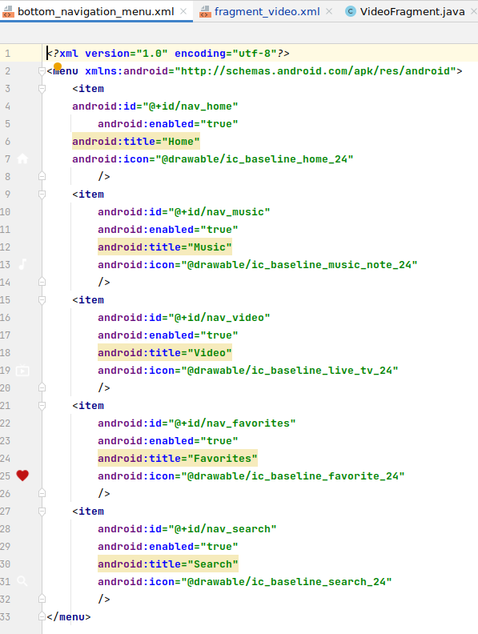
8.  W activity_main.xml:
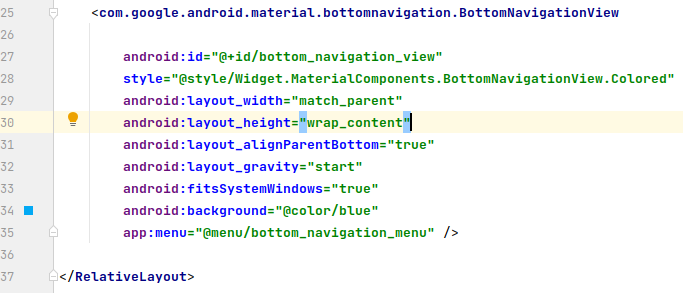
9.  Dodaj home fragment:
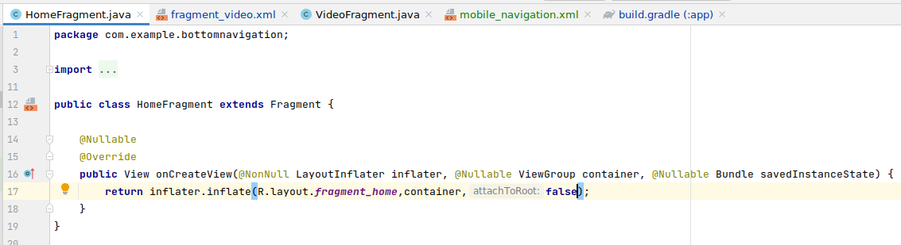
10. Dodaj layout dla home fragment:
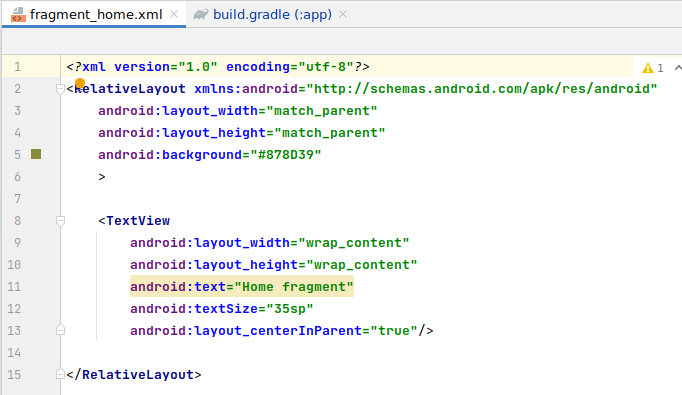
11. W onCreate() dodaj główny fragment HOME:
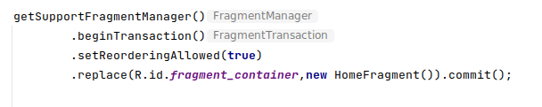
12. Dodaj obsługę dolnego menu:
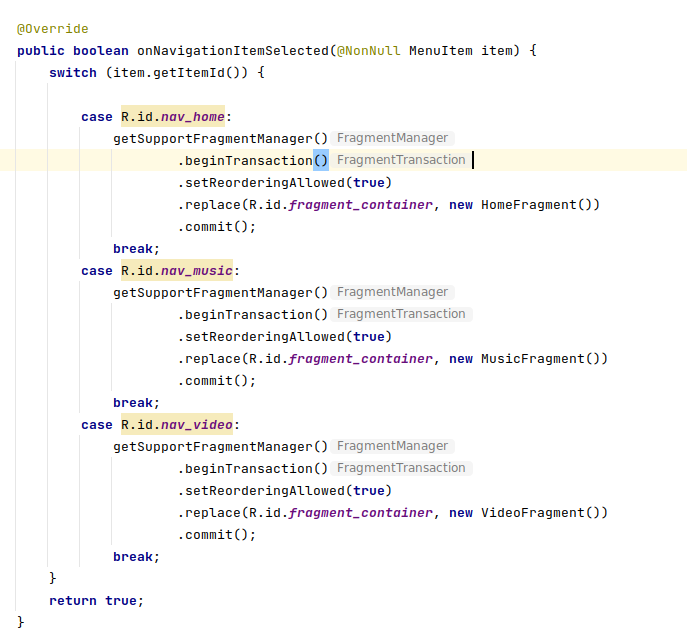
13. Dodaj odtwarzanie pliku audio.
14. Dodaj odtwarzanie pliku video.
15. Dodaj CalendarView w pozycję szukaj ( dodaj pozycję, zmodyfikuj
    zakres kalendarza, ect.)
16. Dodatkowe zadania
    a)  dodaj widżet:
        <https://developer.android.com/guide/topics/appwidgets>
    b)  zbuduj aplikację w oparciu o
        <https://developer.android.com/guide/navigation>
    c)  zapewnij obsługę trybu dark mode na urządzeniu
        <https://developer.android.com/guide/topics/ui/look-and-feel/darktheme>
        <https://developer.android.com/reference/androidx/appcompat/app/AppCompatDelegate#setDefaultNightMode(int>)
    d)  przygotuj ikonę dla aplikacji
        <https://developer.android.com/studio/write/image-asset-studio>
    e)  dodaj skróty 2 typu: podpięte dla odtwórz audio i odtwórz video
        <https://developer.android.com/guide/topics/ui/shortcuts>
        <https://developer.android.com/guide/topics/ui/shortcuts/creating-shortcuts#pinned>
    f)  przetestuj aplikację:
        <https://developer.android.com/studio/test/test-in-android-studio>
    g)  opublikuj aplikację :)
        <https://developer.android.com/studio/publish>
17. KONIEC.
