Ćwiczenia 21 -- Android studio -- sms, email send, shortcut
Na koniec zajęć prześlij pliki źródłowe (.xml, .java)+ obrazek do zasobu
w teams.
1.  Utwórz projekt o nazwie MySmsMailShortcut na podstawie Empty
    Activity, dobierz odpowiednie API ( 28 -- Android 9).
2.  Otwórz dokumentację:
<https://developer.android.com/guide/components/intents-common#ComposeEmail>
> <https://developer.android.com/guide/components/intents-common#SendMessage>
<https://developer.android.com/reference/android/telephony/SmsManager>
<https://developer.android.com/guide/topics/ui/shortcuts>
3.  AndroidManifest.xml
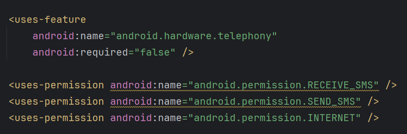
4.  Przygotuj activity_main.xml ( podanie numeru telefonu, treści
    wiadomości, przyciski do wysyłki smsa i maila pole dla emaila,
    miejsce do odbioru smsów )
5.  Przykładowa struktura:
> 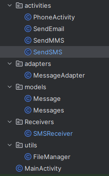
6.  Dodaj potrzebne zmienne:
> 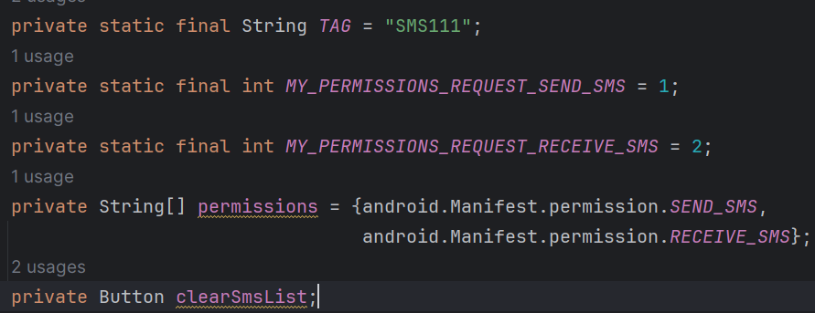
7.  Stwórz metodę wysyłającą sms poprzez SmsManagera, np.:
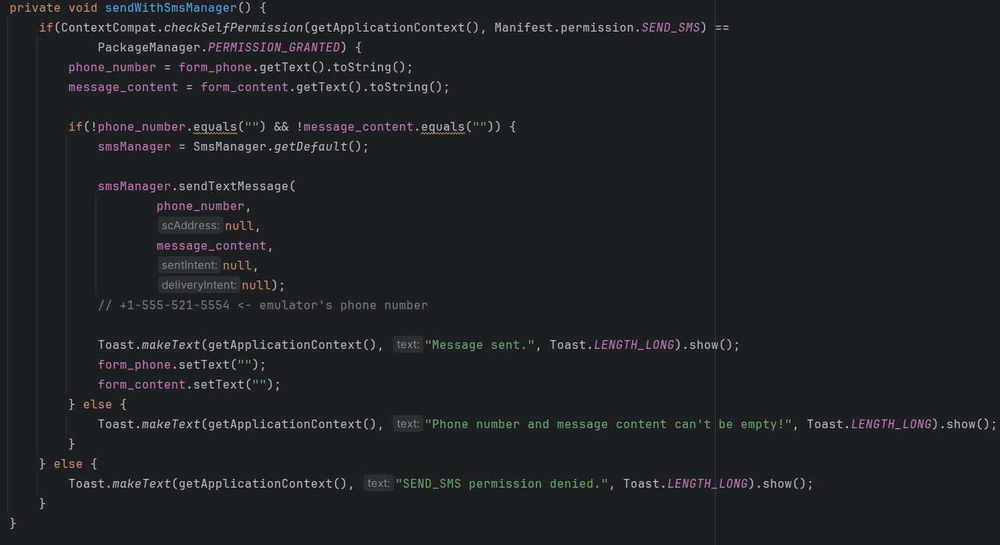
8.  Przetestuj aplikację, np.:
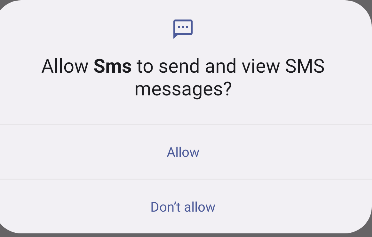
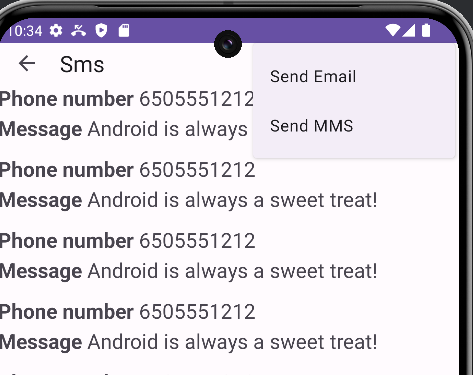
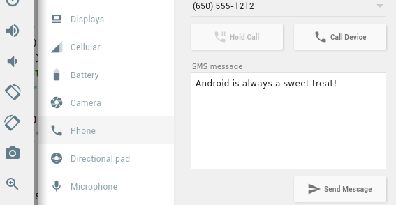
9.  Stwórz metodę wysyłającą sms poprzez Intent, np.:
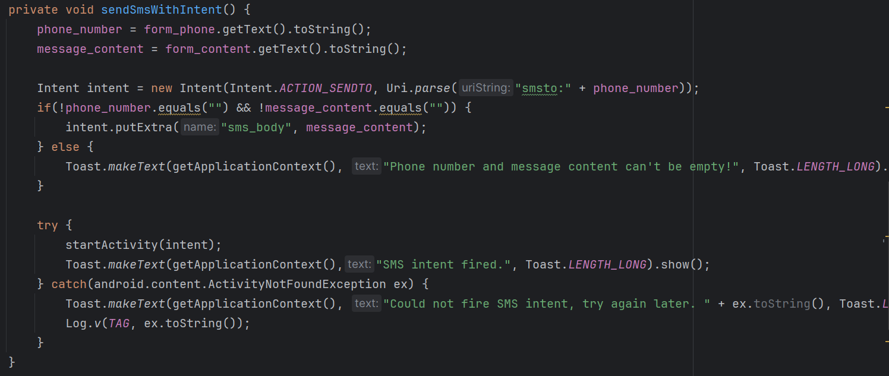
10. Wyślij mail poprzez Intent, np.:
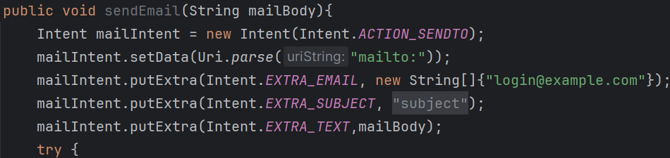
11. Przetestuj wysyłanie maila.
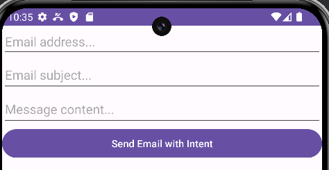
12. Dodaj klasę MyReceiver.java rozszerz ją o BroadcastReceiver
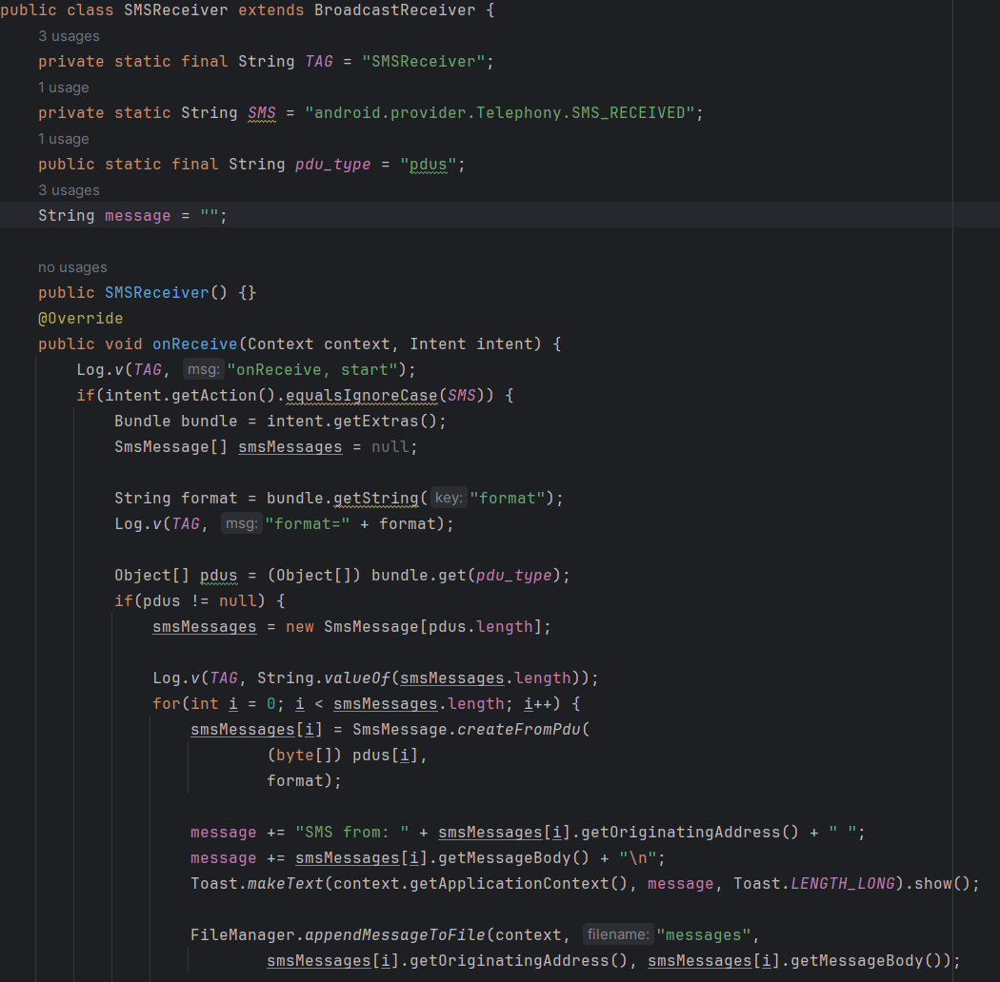
13. Możesz zapisać w onReceive() przychodzące smsy do pliku
> 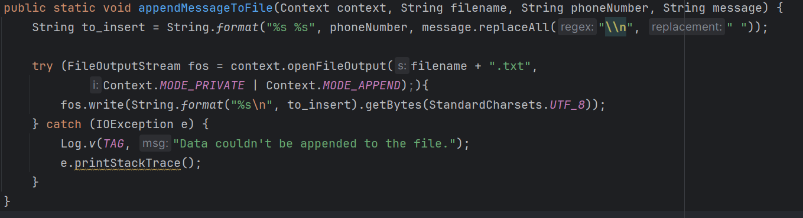
14. Dodaj w AndroidManifest.xml obsługę odbiornika
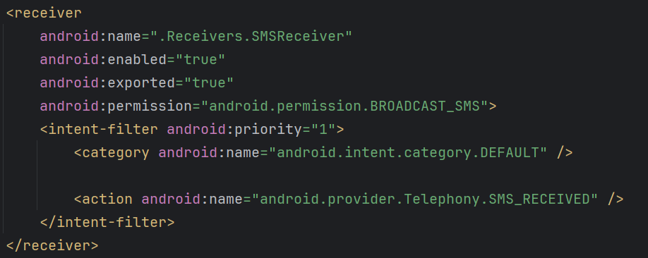
15. Przetestuj odbiór smsów.
16. Dodaj skróty w ikonie aplikacji dla funkcjonalności:
    a.  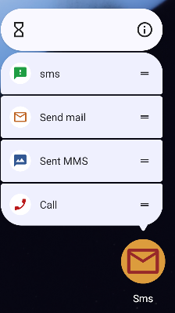
        wyślij sms ( skrót statyczny)
    b.  wyślij email ( skrót statyczny)
    c.  wyślij mms ( skrót dynamiczny)
    d.  zadźwoń dla chętnych , lub otwarcie przeglądarki
<https://developer.android.com/guide/topics/ui/shortcuts/creating-shortcuts>
Realizacja dla skrótów statycznych:
Zawartość z AndroidManifest.xml:
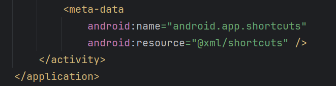
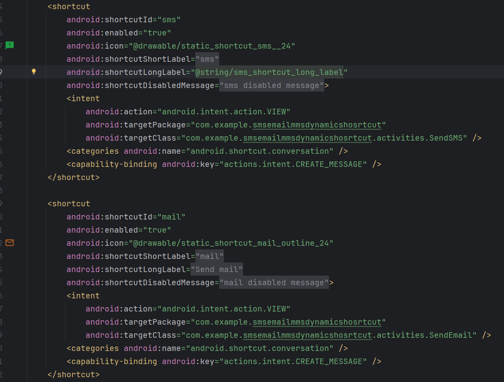
Realizacja skrótów dynamicznych:
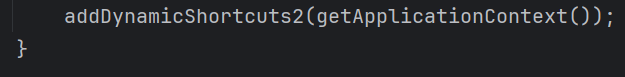
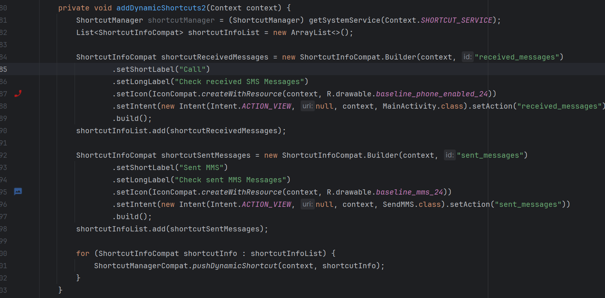
17. Zrealizuj dodatkowo zadania
    a)  zaimplementuj wysyłanie wieloczęściowego smsa
<https://developer.android.com/reference/android/content/Intent#ACTION_SEND_MULTIPLE>
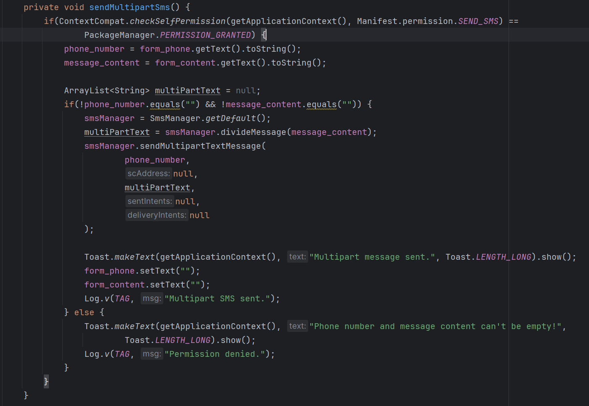
b)  zaimplementuj wysyłanie mmsa
c)  zapisanie przychodzących smsów i wyświetlenie w menu na RecycledView
<https://developer.android.com/guide/topics/ui/layout/recyclerview>
d)  dodaj ikonę dla aplikacji New - \> Image Asset

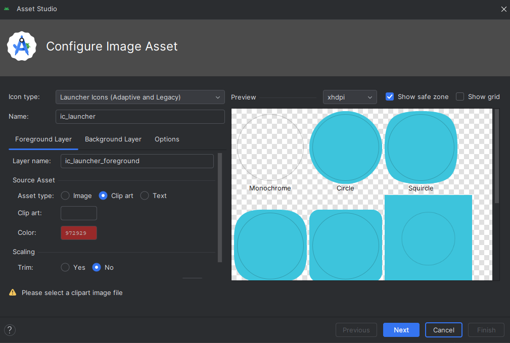
e)  napisz klasę, w której zrealizujesz wykonanie rozmowy telefonicznej
    (osobne ćwiczenia)
<!-- -->
18. 
    Napisz test wysłania maila i go
    wykonaj:
19. Lub z Espresso:
> 
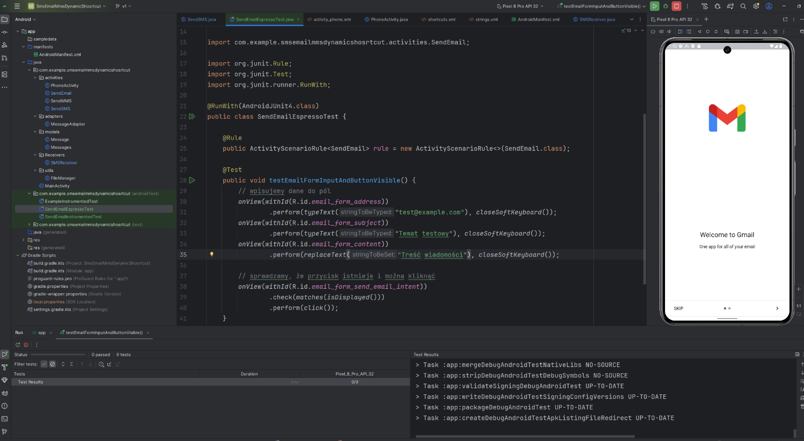
20. KONIEC.
