Ćwiczenia 21 -- Android studio -- sms, email send, shortcut
Na koniec zajęć prześlij pliki źródłowe (.xml, .java)+ obrazek do zasobu
w teams.

1. Utwórz projekt o nazwie MySmsMailShortcut na podstawie Empty
    Activity, dobierz odpowiednie API ( 28 -- Android 9).
2. Otwórz dokumentację:
<https://developer.android.com/guide/components/intents-common#ComposeEmail>

> <https://developer.android.com/guide/components/intents-common#SendMessage>
<https://developer.android.com/reference/android/telephony/SmsManager>
<https://developer.android.com/guide/topics/ui/shortcuts>

1. AndroidManifest.xml
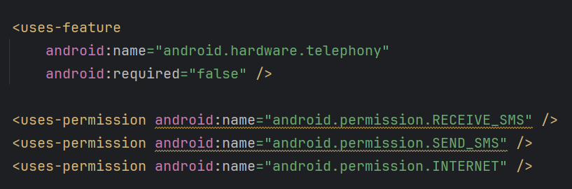
2. Przygotuj activity_main.xml ( podanie numeru telefonu, treści
    wiadomości, przyciski do wysyłki smsa i maila pole dla emaila,
    miejsce do odbioru smsów )
3. Przykładowa struktura:

> 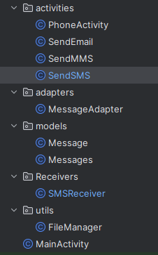

1. Dodaj potrzebne zmienne:

> 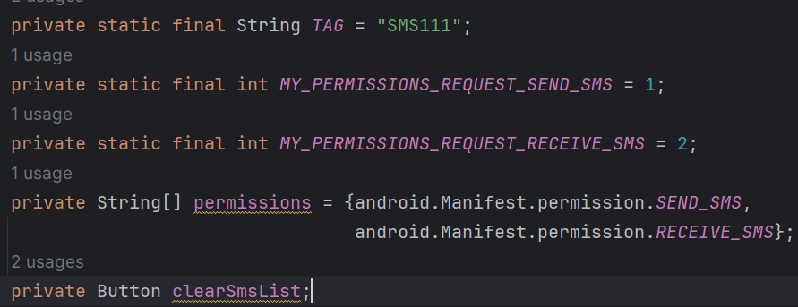

1. Stwórz metodę wysyłającą sms poprzez SmsManagera, np.:
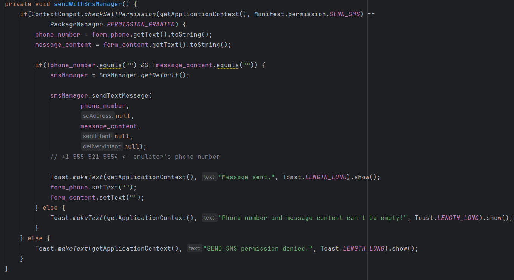
2. Przetestuj aplikację, np.:
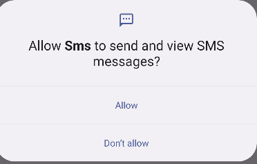
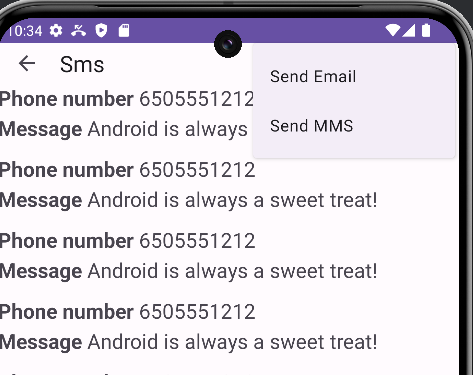
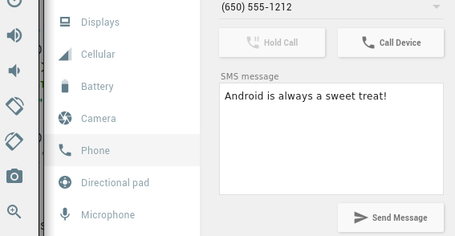
3. Stwórz metodę wysyłającą sms poprzez Intent, np.:
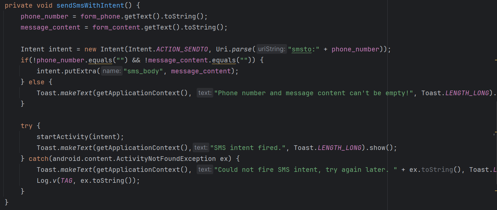
4. Wyślij mail poprzez Intent, np.:
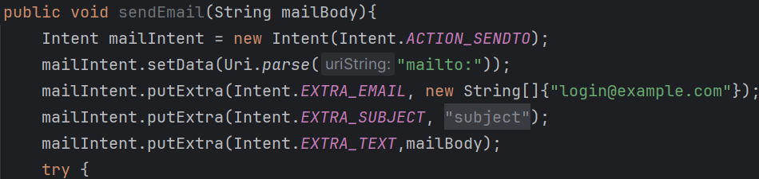
5. Przetestuj wysyłanie maila.
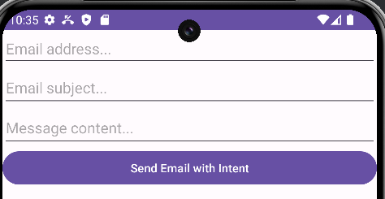
6. Dodaj klasę MyReceiver.java rozszerz ją o BroadcastReceiver
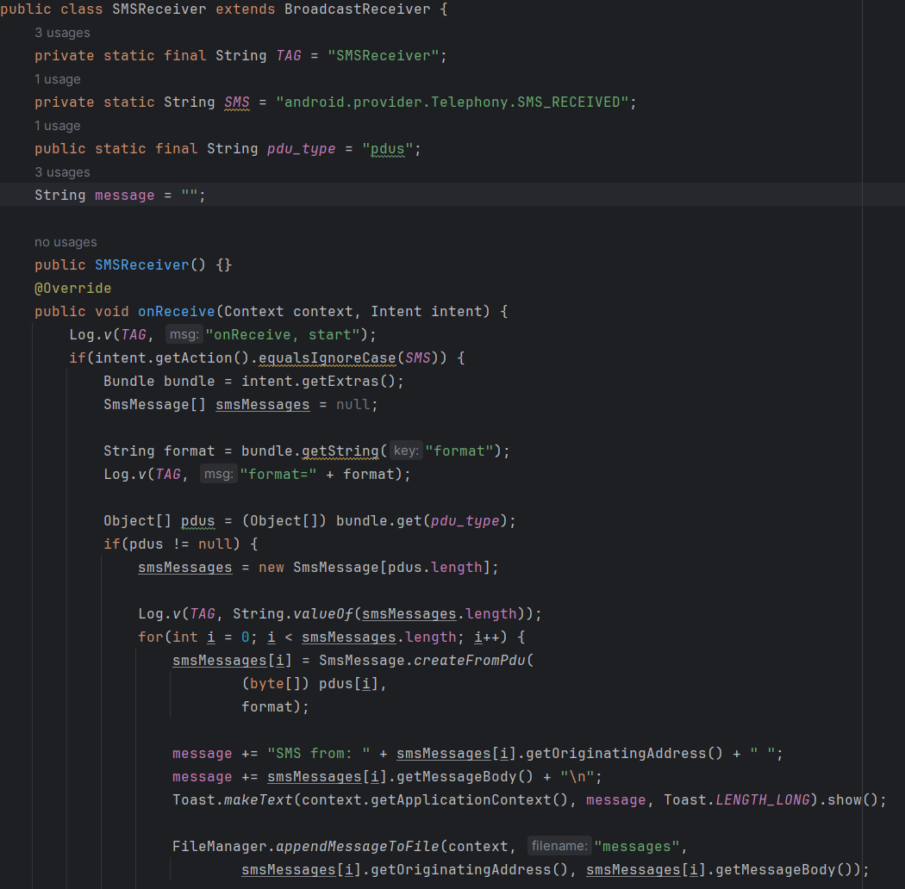
7. Możesz zapisać w onReceive() przychodzące smsy do pliku

> 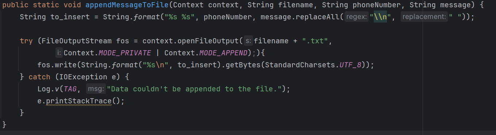

1. Dodaj w AndroidManifest.xml obsługę odbiornika
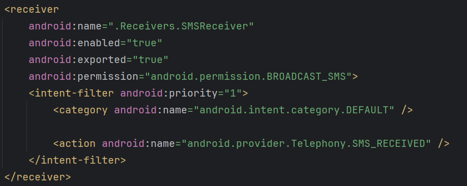
2. Przetestuj odbiór smsów.
3. Dodaj skróty w ikonie aplikacji dla funkcjonalności:
    a.  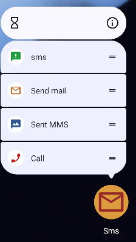
        wyślij sms ( skrót statyczny)
    b.  wyślij email ( skrót statyczny)
    c.  wyślij mms ( skrót dynamiczny)
    d.  zadźwoń dla chętnych , lub otwarcie przeglądarki
<https://developer.android.com/guide/topics/ui/shortcuts/creating-shortcuts>
Realizacja dla skrótów statycznych:
Zawartość z AndroidManifest.xml:
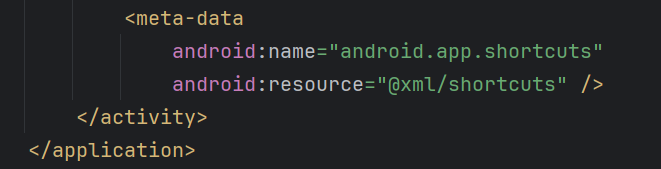
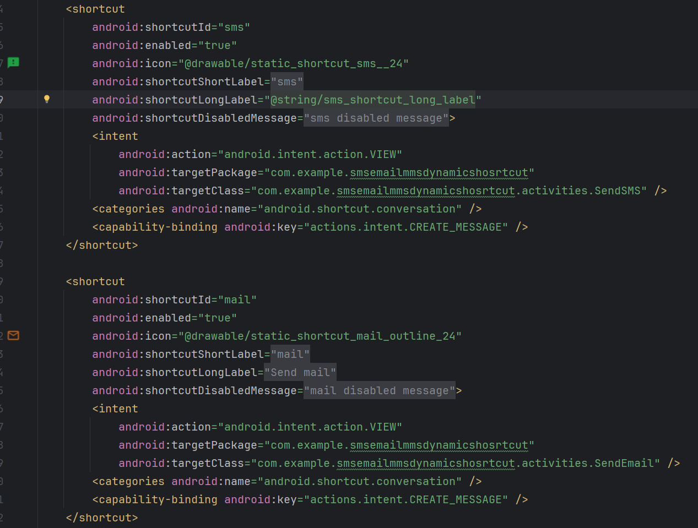
Realizacja skrótów dynamicznych:
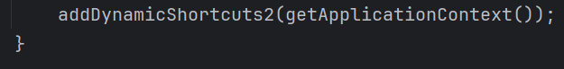
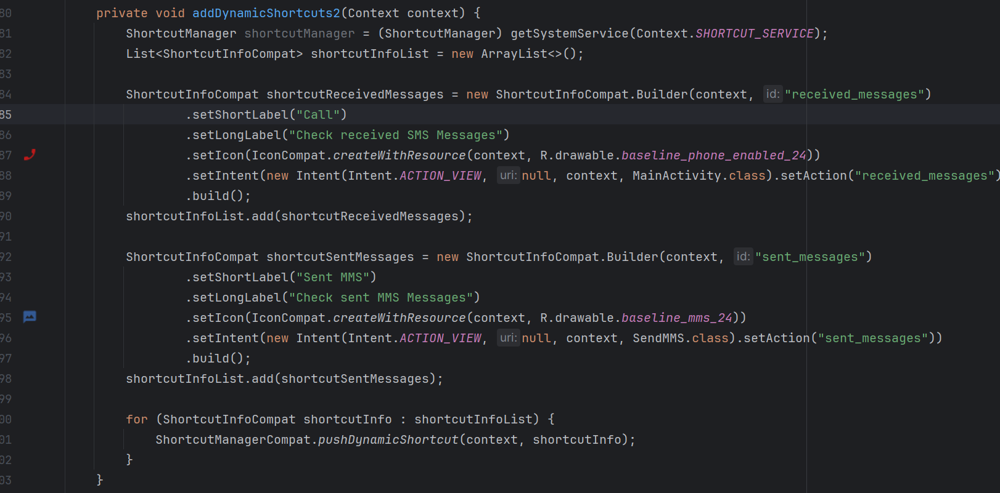
4. Zrealizuj dodatkowo zadania
    a)  zaimplementuj wysyłanie wieloczęściowego smsa
<https://developer.android.com/reference/android/content/Intent#ACTION_SEND_MULTIPLE>
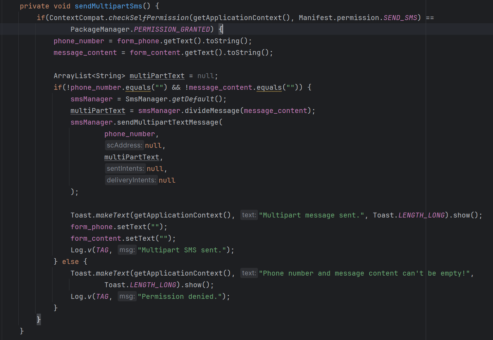
b)  zaimplementuj wysyłanie mmsa
c)  zapisanie przychodzących smsów i wyświetlenie w menu na RecycledView
<https://developer.android.com/guide/topics/ui/layout/recyclerview>
d)  dodaj ikonę dla aplikacji New - \> Image Asset

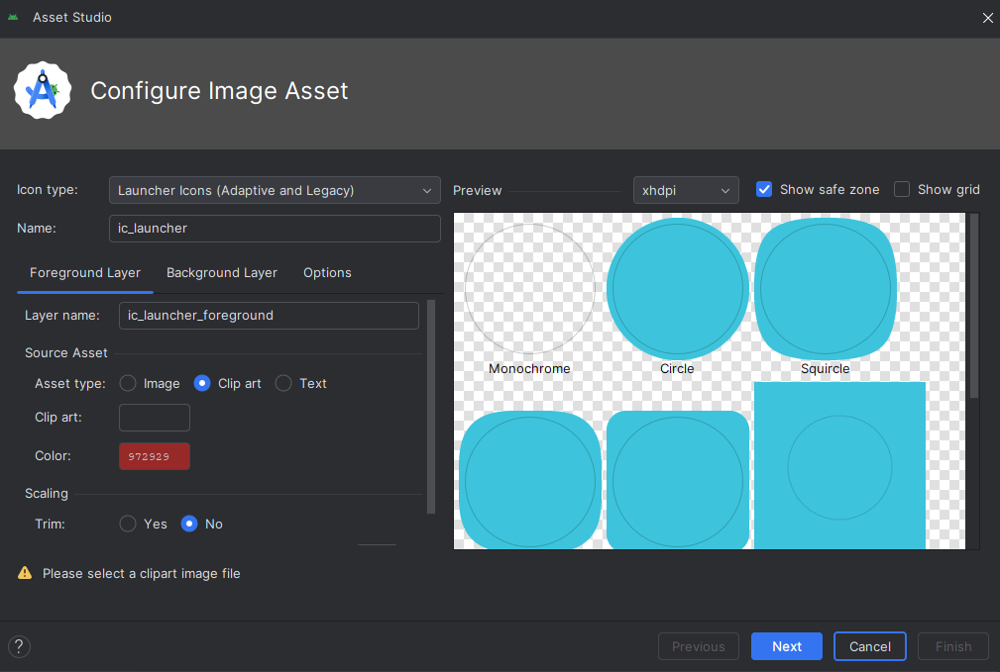
e)  napisz klasę, w której zrealizujesz wykonanie rozmowy telefonicznej
    (osobne ćwiczenia)
<!-- -->
1. 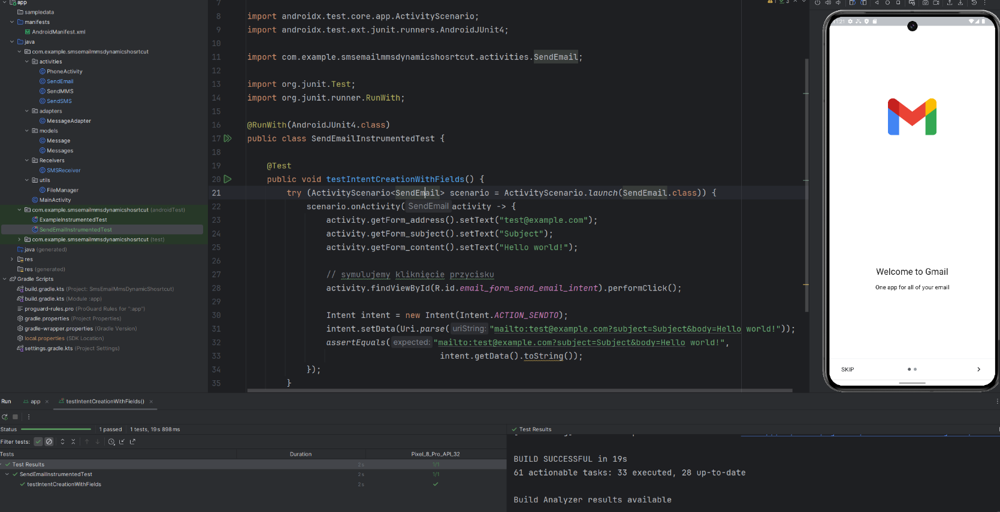
    Napisz test wysłania maila i go
    wykonaj:
2. Lub z Espresso:

> 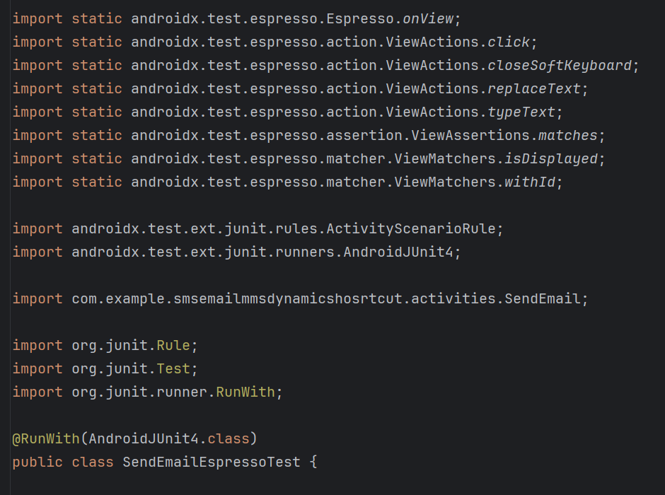
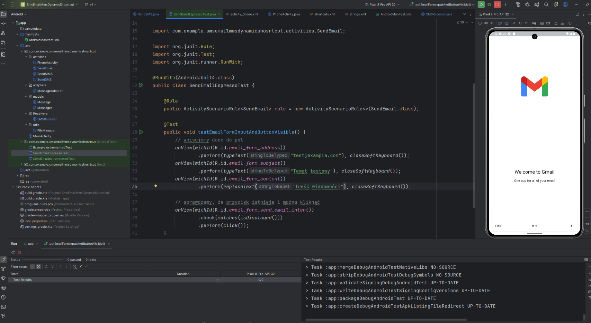

1. KONIEC.
