# Ćwiczenia 22 -- Android studio -- Rest API

📔 Na koniec zajęć prześlij pliki źródłowe (.xml, .java)+ obrazek do zasobu
w teams.
1.  Utwórz projekt o nazwie RestApi na podstawie Empty Activity, dobierz
    odpowiednie API ( 28 -- Android 9).
2.  Otwórz dokumentację:

    <https://developer.android.com/reference/org/json/JSONArray>
    <https://developer.android.com/reference/org/json/JSONObject>
    <https://developer.android.com/reference/android/os/AsyncTask>
    <https://developer.android.com/reference/java/util/concurrent/package-summary>
    <https://developer.android.com/reference/java/util/concurrent/Executor>

3. Efekt końcowy

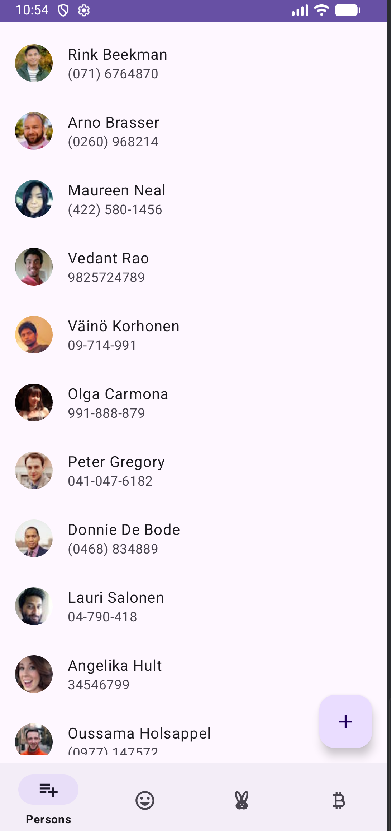

4. Stwórz klasę MyAsyncTask

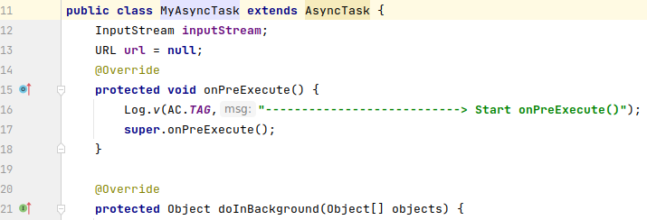

4.  Zaimplementuj metodę doInBackground(), <kbd>Alt</kbd>+<kbd>Enter</kbd>
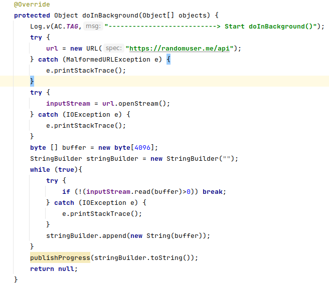
5.  Zaimplementuj pozostałe metody :

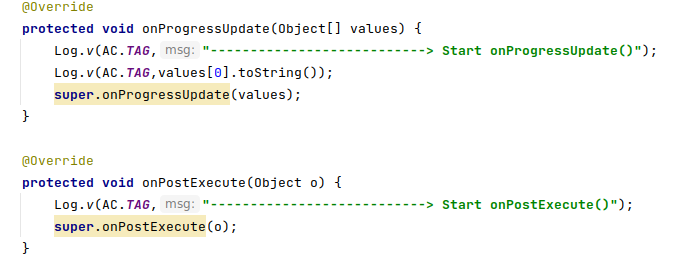

6.  Wywołaj wątek

    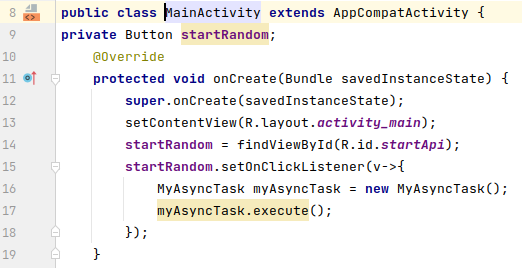
7.  Przetestuj aplikację. Oczekiwany efekt:

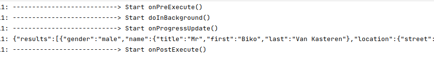

8.  Sprawdź zawartość strony: <https://randomuser.me/api>

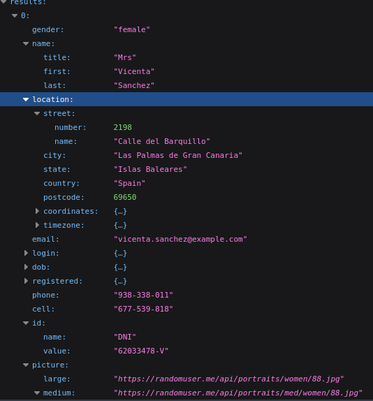

9.  Dodaj:

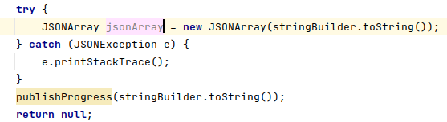
10. Odczytaj składowe

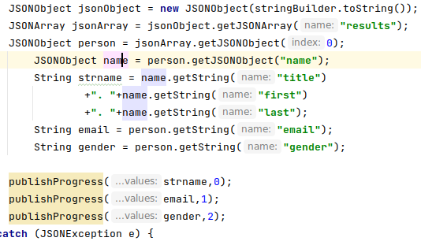

11. Uzupełnij metodę onProgressUpdate
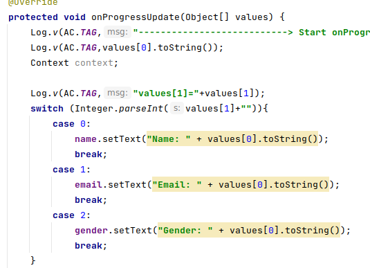
12. Przetestuj aplikację:

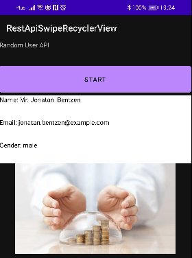

13. Krok 3: załaduj zdjęcie:
    <https://developer.android.com/topic/performance/graphics/load-bitmap>
<https://square.github.io/picasso/>
#### GRADLE
implementation \'com.squareup.picasso:picasso:*(insert latest
version)*\'
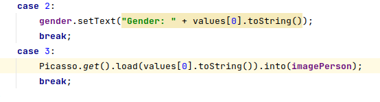
14. Załaduj zdjęcie:

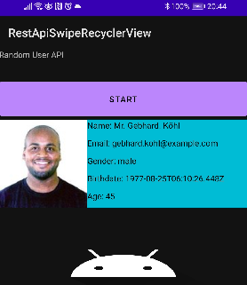

15. Dodaj datę urodzenia oraz wiek tak, aby otrzymać:

16. Samodzielnie dodaj pola: telefon, państwo, miasto i ulicę.

17. Dodaj nawigację dolną, możesz skorzystać z https://github.com/gacandrzej/BottomNav
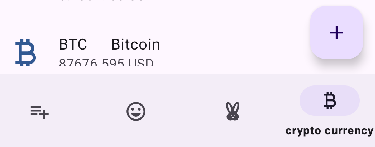
18. Po kliknięciu w pozycję listy otwiera się nowy widok:

19. Wykonaj:

    a)  dodaj zmianę wartości, zdjęcia poprzez odświeżenie
        SwipeRefreshLayout **swipeRefreshLayout**;
        zastąp zdarzenie kliknięcia w przycisk na przeciągnięcie palcem
        **swipeRefreshLayout**.setOnRefreshListener(() -\>

    b)utwórz aktywność dla innego API np.:
      - <https://rickandmortyapi.com/api/character/> 
    
    

    lub
      -  <https://api.chucknorris.io/jokes/random> lub
      -  <https://api.fbi.gov/wanted/v1/list> lub
      -  https://api.coinbase.com/v2/currencies/crypto
    
    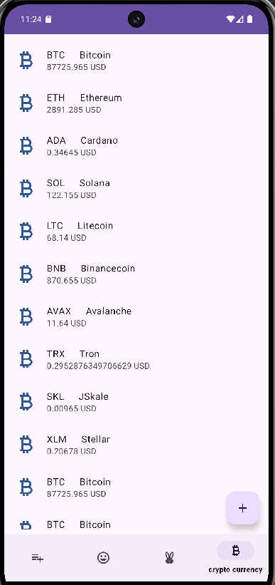
    
    c)  Umieść dane osób na komponencie ListView lub RecyclerView,
        kliknięcie pozycji listy przenosi do nowej aktywności na której
        wyświetlisz zdjęcie i dane osoby

    d)  zbuduj własne API: <https://www.postman.com/>

    e)  skorzystaj z innej biblioteki niż Picasso

    f)  zrealizuj ćwiczenie w oparciu o:

      - <https://developer.android.com/reference/java/util/concurrent/package-summary>
      -  <https://developer.android.com/reference/java/util/concurrent/Executor>
18. KONIEC.😀
