# Ćwiczenia 22 -- Android studio -- Rest API

📔 Na koniec zajęć prześlij pliki źródłowe (.xml, .java)+ obrazek do zasobu
w teams.

1. Utwórz projekt o nazwie RestApi na podstawie Empty Activity, dobierz
    odpowiednie API ( 28 -- Android 9).

1. Otwórz dokumentację:

    <https://developer.android.com/reference/org/json/JSONArray>
    <https://developer.android.com/reference/org/json/JSONObject>
    <https://developer.android.com/reference/android/os/AsyncTask>
    <https://developer.android.com/reference/java/util/concurrent/package-summary>
    <https://developer.android.com/reference/java/util/concurrent/Executor>

1. Efekt końcowy

   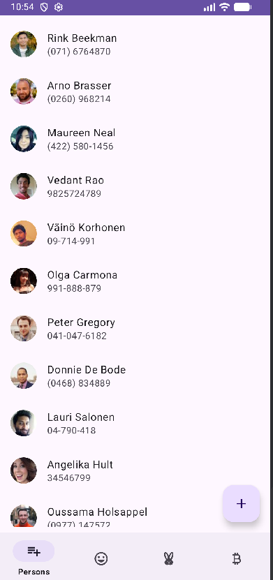

1. Stwórz klasę MyAsyncTask

   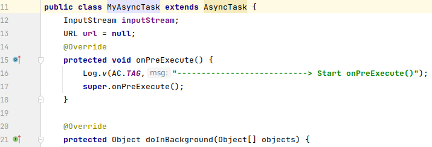

1. Zaimplementuj metodę doInBackground(), <kbd>Alt</kbd>+<kbd>Enter</kbd>

   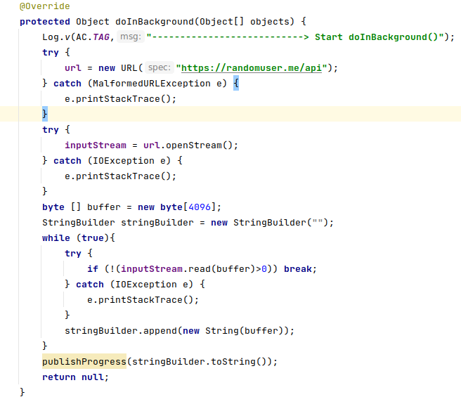

1. Zaimplementuj pozostałe metody :

   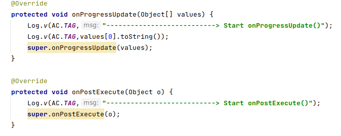

1. Wywołaj wątek

   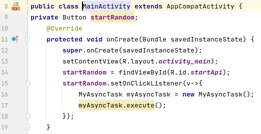

1. Przetestuj aplikację. Oczekiwany efekt:

   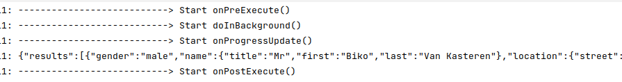

1. Sprawdź zawartość strony: <https://randomuser.me/api>

   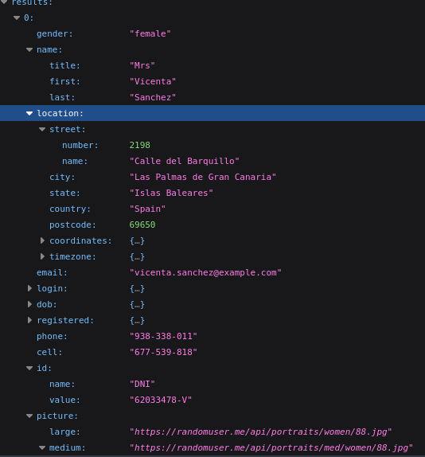

1. Dodaj:

   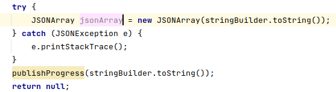

1. Odczytaj składowe

   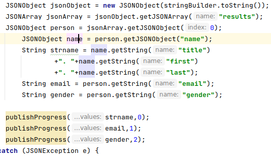

1. Uzupełnij metodę onProgressUpdate

   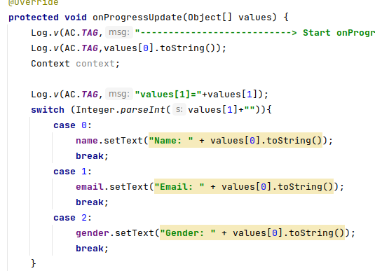

1. Przetestuj aplikację:

   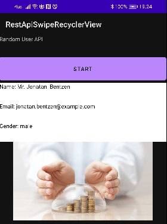

1. Krok 3: załaduj zdjęcie:

    <https://developer.android.com/topic/performance/graphics/load-bitmap>

    <https://square.github.io/picasso/>

   ```xml
   implementation \'com.squareup.picasso:picasso:*(insert latest version)*\'
   ```

   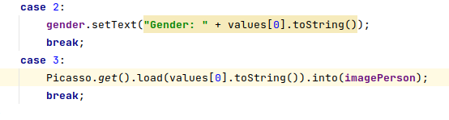

1. Załaduj zdjęcie:

   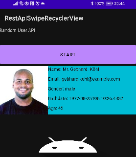

1. Dodaj datę urodzenia oraz wiek tak, aby otrzymać:

   

1. Samodzielnie dodaj pola: telefon, państwo, miasto i ulicę.

1. Dodaj nawigację dolną, możesz skorzystać z

   <https://github.com/gacandrzej/BottomNav>

   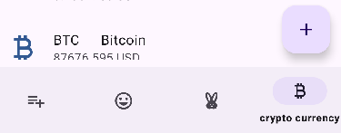

1. Po kliknięciu w pozycję listy otwiera się nowy widok:

   

1. Wykonaj:

    - dodaj zmianę wartości, zdjęcia poprzez odświeżenie
        SwipeRefreshLayout **swipeRefreshLayout**;
        zastąp zdarzenie kliknięcia w przycisk na przeciągnięcie palcem
        **swipeRefreshLayout**.setOnRefreshListener(() -\>

    - utwórz aktywność dla innego API np., zastąp AsyncTask przez Executor:

       <https://rickandmortyapi.com/api/character/>

      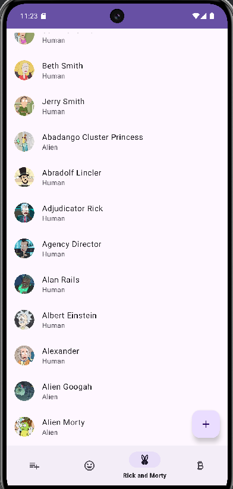

      lub

      - <https://www.apicountries.com/countries>

      - <https://api.fbi.gov/wanted/v1/list>

      - <https://api.coinbase.com/v2/currencies/crypto>

        

    - Umieść dane osób na komponencie ListView lub RecyclerView,
        kliknięcie pozycji listy przenosi do nowej aktywności na której
        wyświetlisz zdjęcie i dane osoby

    - zbuduj własne API: <https://www.postman.com/>

    - skorzystaj z innej biblioteki niż Picasso

    - zrealizuj ćwiczenie w oparciu o:

      - <https://developer.android.com/reference/java/util/concurrent/package-summary>
      - <https://developer.android.com/reference/java/util/concurrent/Executor>

      ```java
      Executor executor = Executors.newSingleThreadExecutor();

        newCharakterButton.setOnClickListener(l -> executor.execute(
                new RickAndMorty(mainActivity, "https://rickandmortyapi.com/api/character", rickAndMortyAdapter)
        ));
      ```

1. Dodaj testy:

   - czy JSON poprawnie się parsuje
     Pamiętaj o dodaniu jsona do testów

      ```xml
      dependencies {
        testImplementation("org.json:json:20251224")
        }

      ```

   ```java
   package andrzej.gac.restapibottomnavfragment.task;

    import org.json.JSONArray;
    import org.json.JSONObject;
    import org.junit.Test;

    import static org.junit.Assert.assertEquals;

    public class RickAndMortyRunnableTest {

        @Test
        public void testParseJson() throws Exception {
            String fakeJson = "{ \"results\": [" +
                    "{ \"name\":\"Rick Sanchez\", \"status\":\"Alive\", \"species\":\"Human\", " +
                    "\"gender\":\"Male\", \"origin\":{\"name\":\"Earth\"}, " +
                    "\"location\":{\"name\":\"Citadel\"}, " +
                    "\"image\":\"url\" }]}";

            JSONObject jsonObject = new JSONObject(fakeJson);
            JSONArray jsonArray = jsonObject.getJSONArray("results");

            JSONObject person = jsonArray.getJSONObject(0);

            String name = person.getString("name");

            assertEquals("Rick Sanchez", name);
        }
    }
    ```

     - test adaptera

      dodaj zależność:

      ```xml
      testImplementation("org.mockito:mockito-core:5.6.0")
      ```

     ```java
     package andrzej.gac.restapibottomnavfragment.adapter;

      import static org.junit.jupiter.api.Assertions.*;
      import static org.mockito.Mockito.mock;

      import androidx.fragment.app.FragmentManager;

      import org.junit.Test;
      import org.junit.jupiter.api.AfterEach;
      import org.junit.jupiter.api.BeforeEach;

      import java.util.ArrayList;
      import java.util.List;

      import andrzej.gac.restapibottomnavfragment.model.RickAndMortyModel;

      public class RickAndMortyAdapterTest {

          @BeforeEach
          void setUp() {
          }

          @AfterEach
          void tearDown() {
          }

          @Test
          public void testAdapterItemCount() {
              List<RickAndMortyModel> list = new ArrayList<>();
              list.add(new RickAndMortyModel("Rick", "Alive", "Human", "Male", "Earth", "Citadel", "url"));

              RickAndMortyAdapter adapter = new RickAndMortyAdapter(list, mock(FragmentManager.class));

              assertEquals(1, adapter.getItemCount());
          }

      }
     ```

- Test instrumentacyjny fragmentu

     ```xml
        // Unit tests
        testImplementation("junit:junit:4.13.2")
        testImplementation("org.junit.jupiter:junit-jupiter:6.0.3")

        // Instrumented tests
        androidTestImplementation("androidx.test:core:1.5.0")
        androidTestImplementation("androidx.test:runner:1.5.2")
        androidTestImplementation("androidx.test:rules:1.5.0")
        androidTestImplementation("androidx.test.ext:junit:1.1.5")

        androidTestImplementation("androidx.test.espresso:espresso-core:3.5.1")
        androidTestImplementation("androidx.test.espresso:espresso-contrib:3.5.1")
        androidTestImplementation("androidx.test.espresso:espresso-intents:3.5.1")

        // FragmentScenario
        debugImplementation("androidx.fragment:fragment-testing:1.6.2")

     ```

     ```java
     package andrzej.gac.restapibottomnavfragment;

      import androidx.fragment.app.testing.FragmentScenario;
      import androidx.test.ext.junit.runners.AndroidJUnit4;

      import org.junit.Test;
      import org.junit.runner.RunWith;

      import andrzej.gac.restapibottomnavfragment.fragments.RickAndMortyListFragment;

      import static androidx.test.espresso.Espresso.onView;
      import static androidx.test.espresso.matcher.ViewMatchers.*;
      import static androidx.test.espresso.assertion.ViewAssertions.*;

      @RunWith(AndroidJUnit4.class)
      public class RickAndMortyListFragmentTest {

          @Test
          public void testRecyclerViewDisplayed() {

              FragmentScenario.launchInContainer(
                      RickAndMortyListFragment.class,
                      null,
                      R.style.Theme_RestAPIbottomNavFragment
              );

              onView(withId(R.id.recycler_view))
                      .check(matches(isDisplayed()));
          }
      }
     ```

     W /src/debug utwórz plik AndroidManifest.xml:

     ```xml
     <manifest xmlns:android="http://schemas.android.com/apk/res/android"
     package="andrzej.gac.restapibottomnavfragment">

      <application
        android:theme="@style/Theme.RestAPIbottomNavFragment">

        <activity
            android:name="androidx.fragment.app.testing.EmptyFragmentActivity"
            android:exported="true" />
       </application>

     </manifest>
     ```

     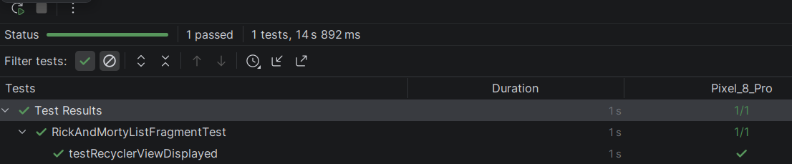

1. KONIEC.😀
