Ćwiczenia 23 -- Android studio -- Service
Na koniec zajęć prześlij pliki źródłowe (.xml, .java)+ obrazek do zasobu
w teams.
1.  Utwórz projekt o nazwie MySimpleServiceMusic na podstawie Empty
    Activity, dobierz odpowiednie API ( 28 -- Android 9).
2.  Otwórz dokumentację:
[https://developer.android.com/guide/components/foreground-services](https://developer.android.com/guide/components/foreground-services)
[https://developer.android.com/reference/android/app/PendingIntent](https://developer.android.com/reference/android/app/PendingIntent)
3.  Utwórz nowy service o nazwie MyForegroundService, New → Service →
    Service :
4.  Sprawdź obecność wpisów w AndroidManifest.xml:
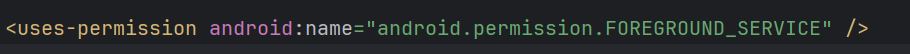
5.  W MainActivity:
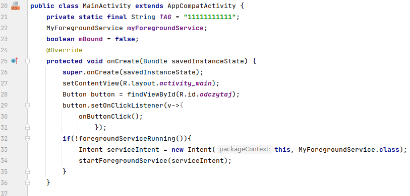
6.  W metodzie onStart():
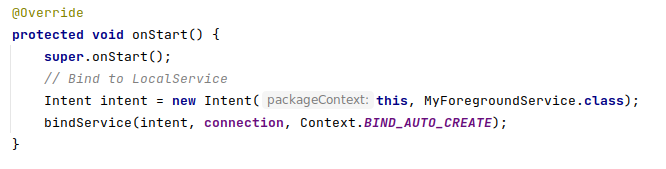
7.  
    W metodzie onStop():
8.  Szkielet metody onButtonClick():
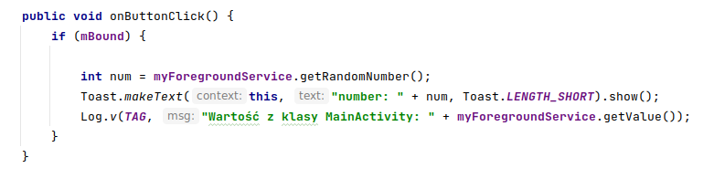
9.  Definiuje wywołania zwrotne dla wiązania usług, przekazywane do
    bindService():
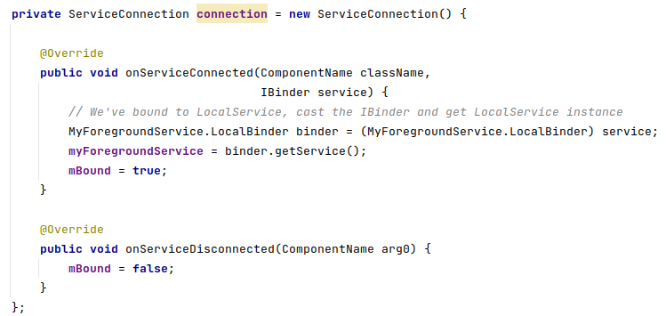
10. W klasie MyForegroundService zaimplementuj potrzebne metody do
    testów:
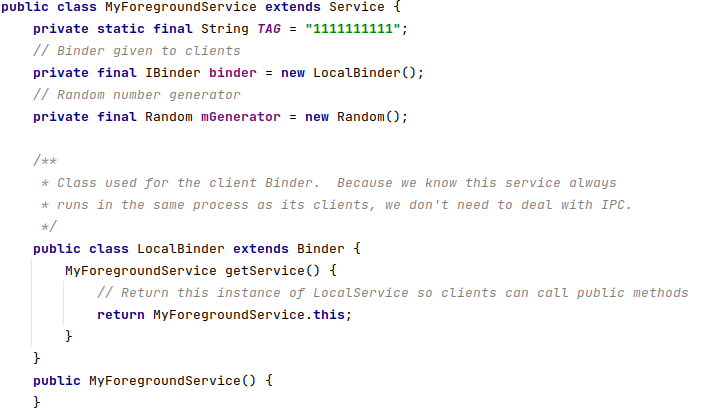
11. Zapoznaj się z fragmentem:
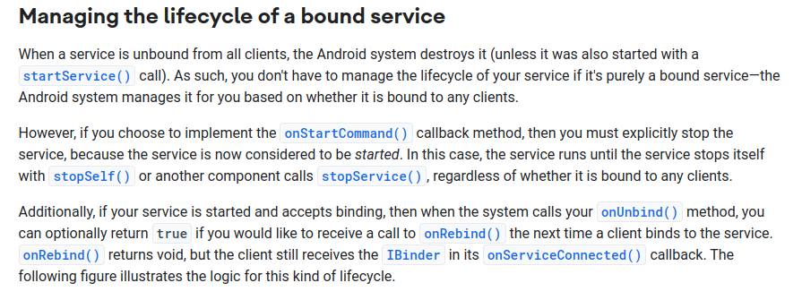
12. Odśwież informacje o cyklu życia:
13. Dodaj metodę onStartCommand ( jeśli musisz :)
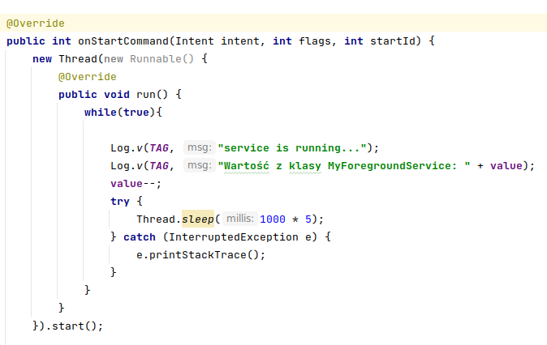
14. Przygotuj metody testowe:
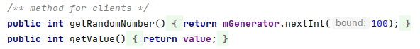
15. Sprawdź czy zwracasz binder:
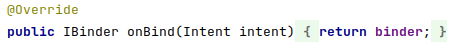
Przetestuj aplikację:
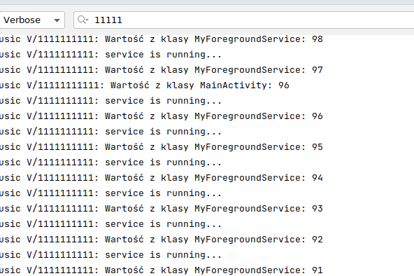
16. Upewnij się, że dodałeś/aś kanał:
<https://developer.android.com/training/notify-user/channels>
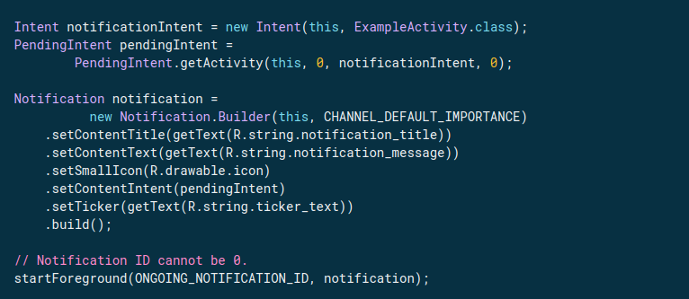
17. Pozostałe zadania:
    a)  przekształć service w usługę odtwarzającą muzykę dla aplikacji.
    b)  Przetestuj działanie usługi podczas zamykania aplikacji,
        otwierania, wznawiania, minimalizacji
    c)  dodaj nawigację do obsługi aplikacji, przyciski play, pause,
        resume i stop
> 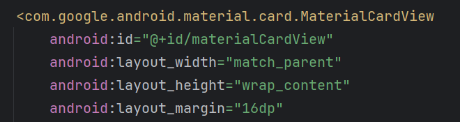
d)  dodaj całkowity czas utworu oraz aktualnie odtwarzany
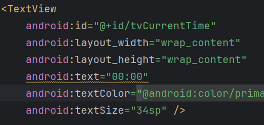
> 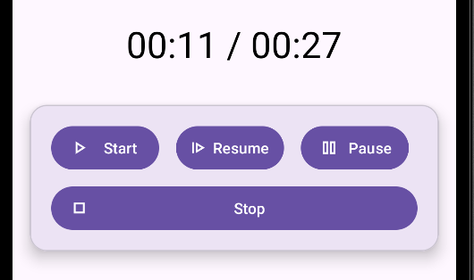
e)  dodaj TextView na nazwę utworu
f)  
    dodaj funkcjonalność odtworzenia
    muzyki z sieci z danego url, np.:
g)  dodaj odtwarzanie muzyki z plików \*.mp3
> 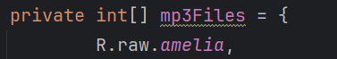
h)  dodaj widget z 3 przyciskami play, pause i stop
> 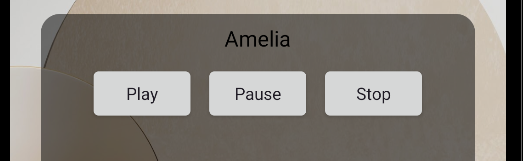
>
> 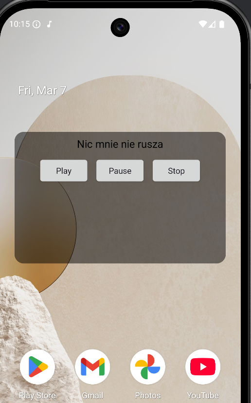
i)  dodaj odtwarzanie na powiadomnieniu
> 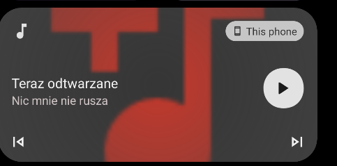
j)  dodaj odtwarzanie na ekranie blokady
> 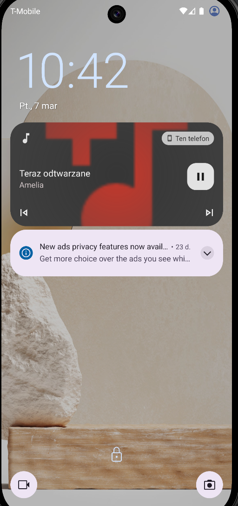
18. KONIEC.
