Ćwiczenia 24 -- Android studio -- AsyncTask, ExecutorService,
DownloadManager
Na koniec zajęć prześlij pliki źródłowe (.xml, .java)+ obrazek do zasobu
w teams.
1.  Utwórz projekt o nazwie MyAsyncTask na podstawie Empty Activity,
    dobierz odpowiednie API.
2.  Otwórz dokumentację:
> <https://developer.android.com/reference/android/os/AsyncTask>
>
> <https://developer.android.com/reference/android/app/PendingIntent>
>
> <https://developer.android.com/training/notify-user/build-notification#progressbar>
>
> <https://developer.android.com/reference/java/util/concurrent/package-summary>
>
> <https://developer.android.com/reference/java/util/concurrent/Executor>
3.  activity_main.xml:
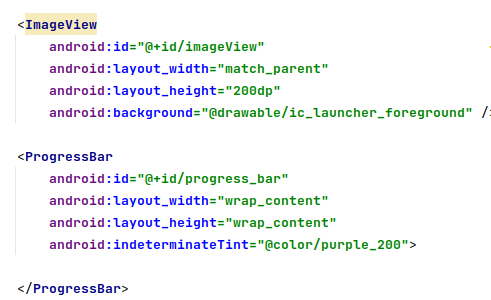
4.  Zadeklaruj potrzebne stałe, np.: ( adres wybierz dowolny)
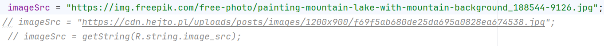
5.  Utwórz klasę MyAsyncTask
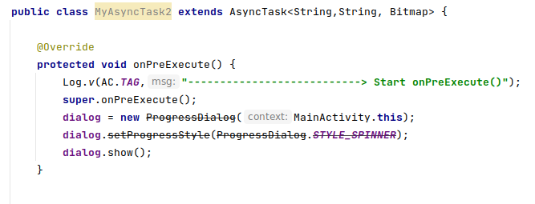
6.  Dodaj metodę doInBackground:
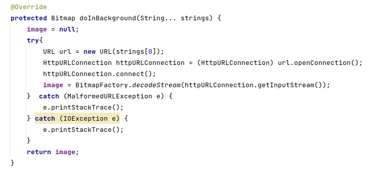
7.  Ustaw pobrane zdjęcie:
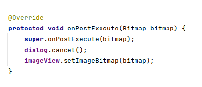
8.  Dla dostępnych urządzeń:
> 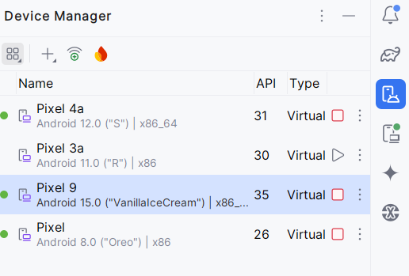
9.  Uruchom Pixel i wywołaj instancję klasy:
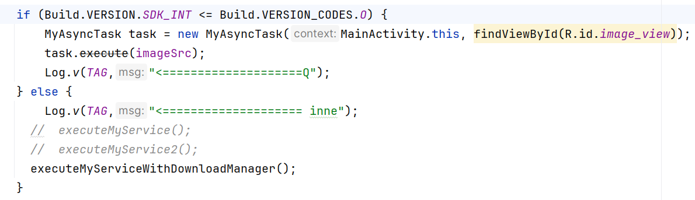
10. Sprawdzenie logCata:
> 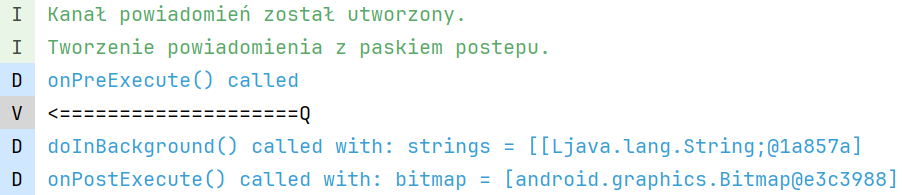
11. Uzyskany efekt ( tylko zdjęcie u dołu):
> 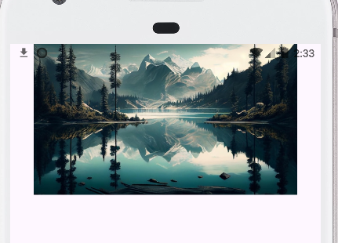
Widok z ProgressDialog:
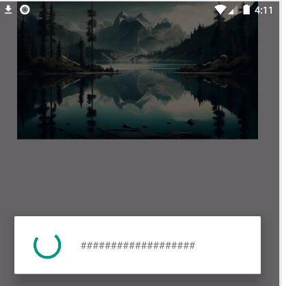
12. Klasa ExecutorService:
    a)  zrealizuj powyższe ćwiczenie z wykorzystaniem Klasy
        ExecutorService:
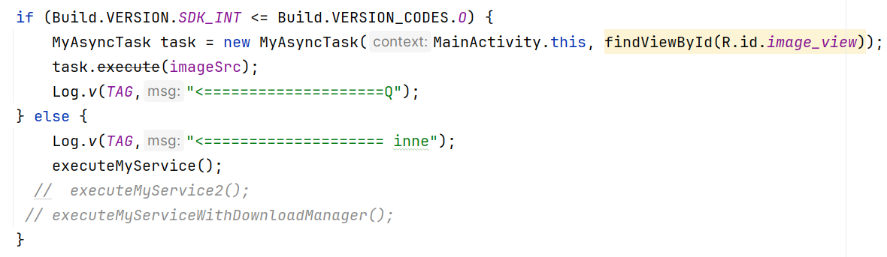
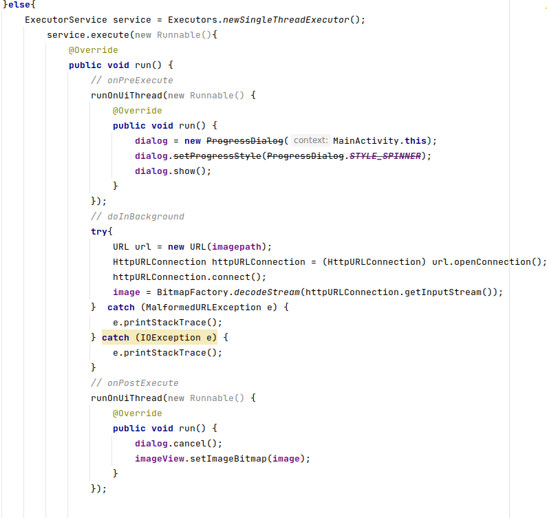
13. Sprawdź pobranie zdjęcia:
> 
14. Zastąp przestarzały DialogProgress na rzecz ProgressBar:
    
15. Utwórz klasę :
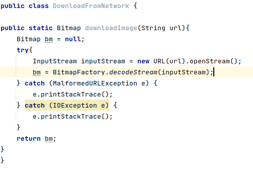
16. Sprawdź uprawnienia od wersji 33+ tiramisu
> 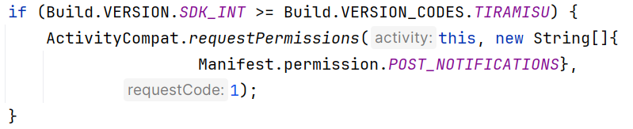
17. Wywołaj
18. 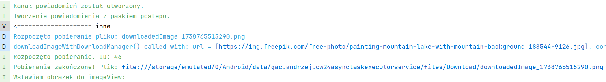
    Sprawdź logcata:
19. Metoda executeMyService2():
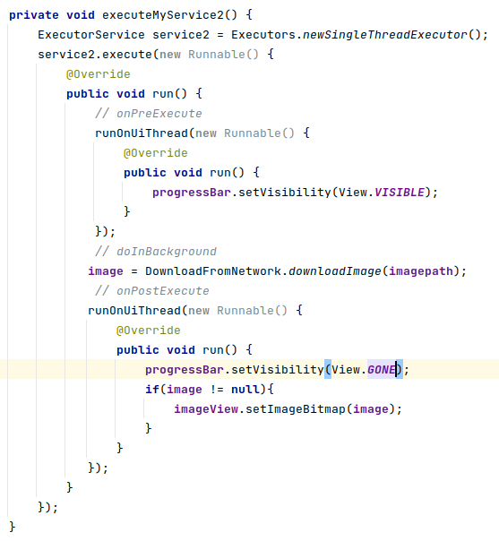
20. Powiadomienie: dodaj powiadomienie z paskiem postępu, w stylu:
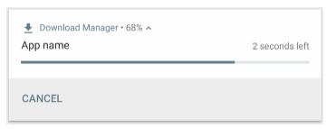
21. 
    Fragment z realizacji:
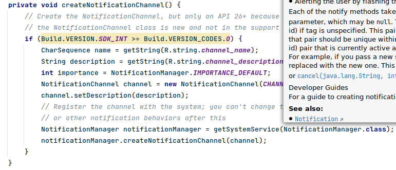
22. Wywołanie na Pixel 4a:
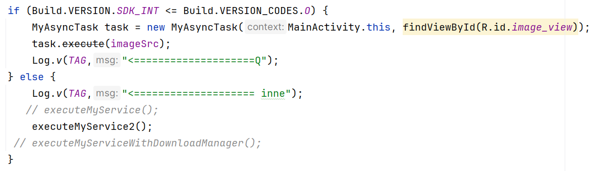
23. Sprawdzenie:
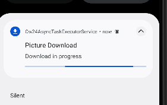
24. LogCat:
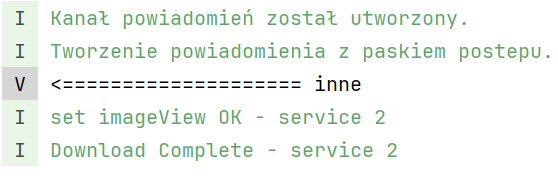
25. Użyj:
<https://developer.android.com/reference/android/app/DownloadManager>
26. Efekt: ( środkowe po kliknięciu w powiadomienie DownloadManagera )
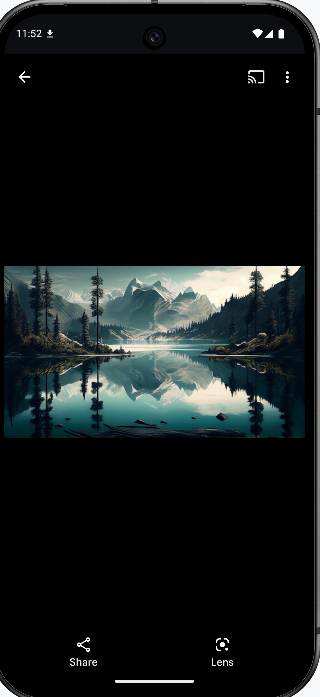

27. KONIEC.
