# Ćwiczenia 24 -- Android studio -- AsyncTask, ExecutorService, DownloadManager

💡Na koniec zajęć prześlij pliki źródłowe (.xml, .java)+ obrazek do zasobu
w teams.

1. Utwórz projekt o nazwie MyAsyncTask na podstawie Empty Activity,
    dobierz odpowiednie API.

1. Otwórz dokumentację:

   <https://developer.android.com/reference/android/os/AsyncTask>

   <https://developer.android.com/reference/android/app/PendingIntent>

   <https://developer.android.com/training/notify-user/build-notification#progressbar>

   <https://developer.android.com/reference/java/util/concurrent/package-summary>

   <https://developer.android.com/reference/java/util/concurrent/Executor>

1. activity_main.xml:

      ```xml
            <?xml version="1.0" encoding="utf-8"?>

    <LinearLayout xmlns:android="http://schemas.android.com/apk/res/android"
        xmlns:tools="http://schemas.android.com/tools"
        android:layout_width="match_parent"
        android:layout_height="match_parent"
        tools:context=".MainActivity"
        android:gravity="center_horizontal"
        android:orientation="vertical">

        <ImageView
            android:id="@+id/image_view"
            android:layout_width="match_parent"
            android:layout_height="200dp"
            android:background="@drawable/ic_launcher_foreground"
            android:scaleType="fitCenter"
            android:contentDescription="@string/loaded_image" />

        <ProgressBar
            android:id="@+id/progress_bar"
            android:visibility="gone"
            android:layout_width="wrap_content"
            android:layout_height="wrap_content"
            android:indeterminateTint="@color/blue" />

    </LinearLayout>
   ```

1. Zadeklaruj potrzebne zmienne i stałe w MainActivity, np.: ( adres wybierz dowolny)

   ```java
   static final String TAG = "MainActivity";
    private static final String CHANNEL_ID = "Andrzej";
    private static final int NOTIFICATION_ID_PROGRESSBAR = 4;
    private NotificationManager notificationManager;
    private String imageSrc;
    private ProgressBar progressBar;
    private ImageView imageView;
   imageSrc = "https://img.freepik.com/free-photo/painting-mountain-lake-with-mountain-background_188544-9126.jpg";
   ```

1. Utwórz klasę MyAsyncTask

   ```java
   public class MyAsyncTask extends AsyncTask<String, String, Bitmap> {
    private ProgressDialog dialog;
    private Context context;
    private ImageView imageView;
    public MyAsyncTask(Context context, ImageView imageView) {
        this.context = context;
        this.imageView = imageView;
    }

    @Override
    protected void onPreExecute() {
            dialog = new ProgressDialog(context);
            dialog.setMessage("###################");
            dialog.setProgressStyle(ProgressDialog.STYLE_SPINNER);
            dialog.setIndeterminate(true);
            dialog.setProgress(0);
            dialog.show();
            Log.d(MainActivity.TAG, "onPreExecute() called");
    }
   ```

1. Dodaj metodę doInBackground:

   ```java
   @Override
    protected Bitmap doInBackground(String... strings) {
        Bitmap image;
        try {
            URL url = new URL(strings[0]);
            HttpURLConnection httpURLConnection = (HttpURLConnection) url.openConnection();
            httpURLConnection.connect();
            image = BitmapFactory.decodeStream(httpURLConnection.getInputStream());
            Log.d(MainActivity.TAG, "doInBackground() called with: strings = [" + strings + "]");
            dialog.setProgress(50);
            try {
                Thread.sleep(5000);
            } catch (InterruptedException e) {
                throw new RuntimeException(e);
            }
        } catch (IOException e) {
            throw new RuntimeException(e);
        }
        return image;
    }
   ```

1. Ustaw pobrane zdjęcie:

   ```java
    @Override
    protected void onPostExecute(Bitmap bitmap) {
        if (dialog != null) {
            dialog.cancel();
            dialog.dismiss();
        }

        if (imageView != null && bitmap != null) {
            Log.d(MainActivity.TAG, "onPostExecute() called with: bitmap = [" + bitmap + "]");
            imageView.setImageBitmap(bitmap);
        }
    }
   ```

1. Dla dostępnych urządzeń:

   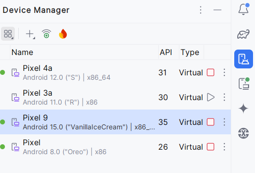

1. Uruchom Pixel i wywołaj instancję klasy:

   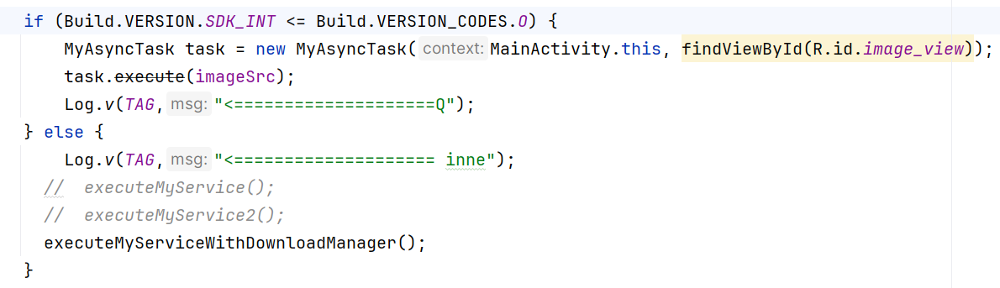

1. Zezwól na powiadomnienia:

   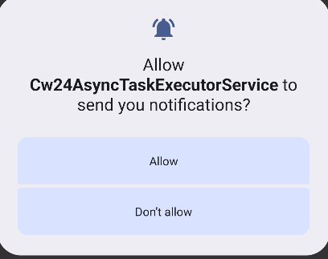

1. Sprawdzenie logCata:

   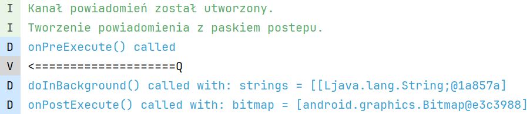

1. Uzyskany efekt ( tylko zdjęcie u dołu):

   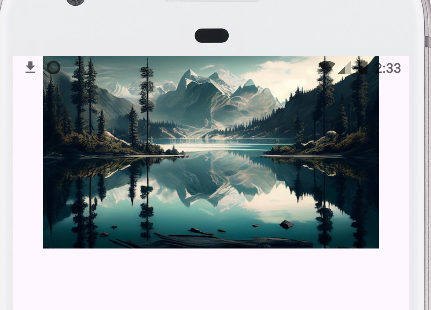

   Widok z ProgressDialog:

   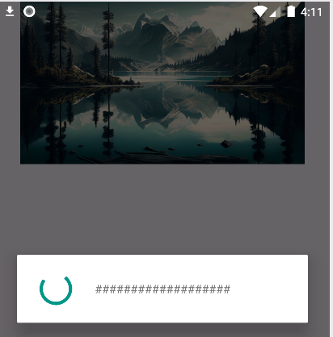

1. Klasa ExecutorService:

   - zrealizuj powyższe ćwiczenie z wykorzystaniem Klasy
     ExecutorService:

   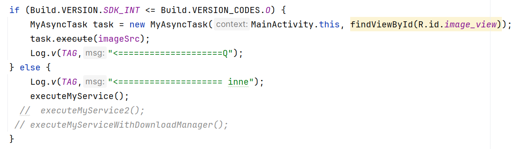

   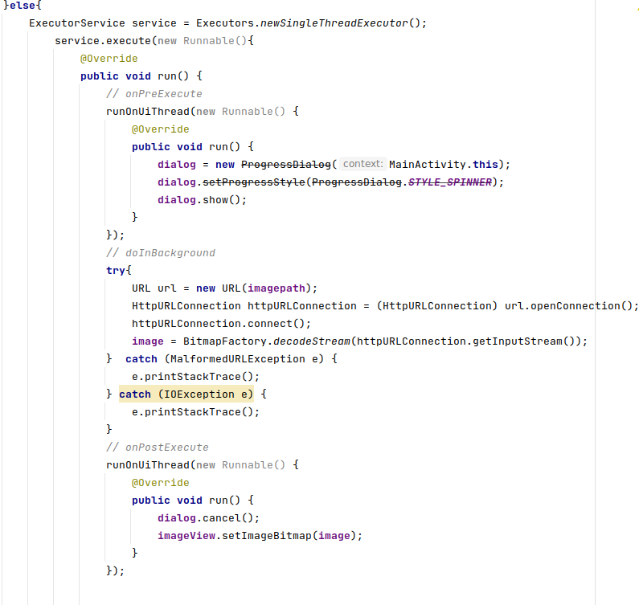

1. Sprawdź pobranie zdjęcia:

   

1. Zastąp przestarzały DialogProgress na rzecz ProgressBar:

   

1. Utwórz klasę :

   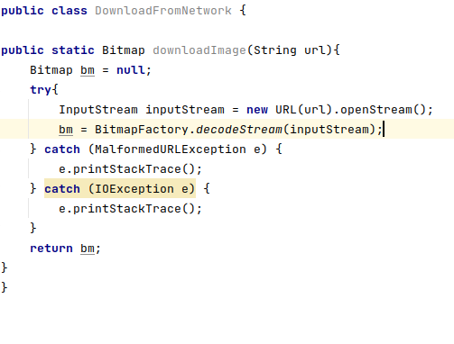

1. Sprawdź uprawnienia od wersji 33+ tiramisu

   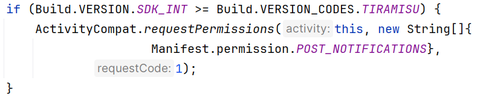

1. Przetestuj aplikację:

   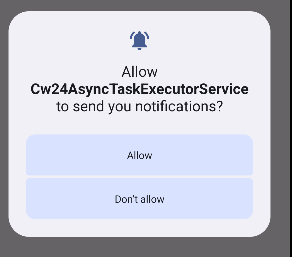

1. Sprawdź logcata:

   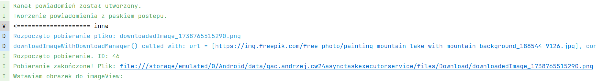

1. Metoda executeMyService2():

   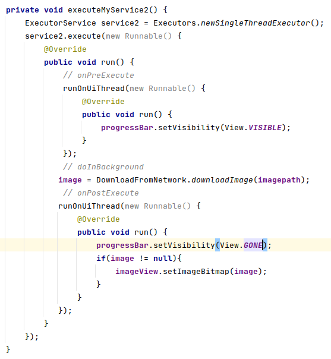

1. Powiadomienie: dodaj powiadomienie z paskiem postępu, w stylu:

   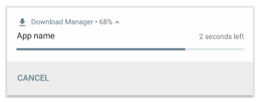

   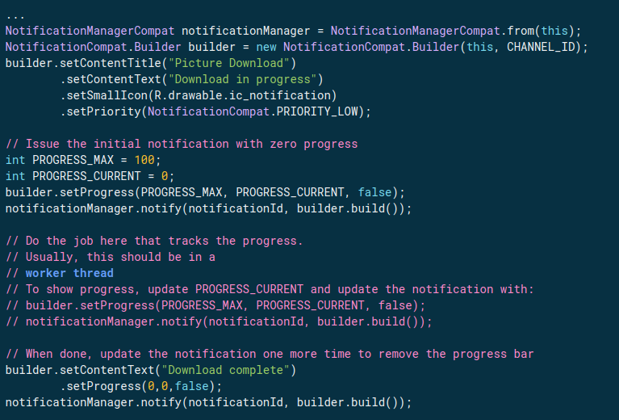

1. Fragment z realizacji:

   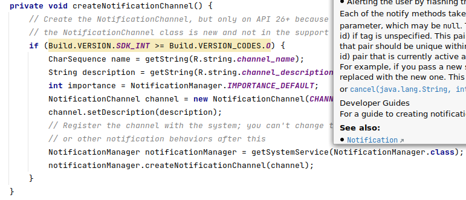

1. Wywołanie na Pixel 4a:

   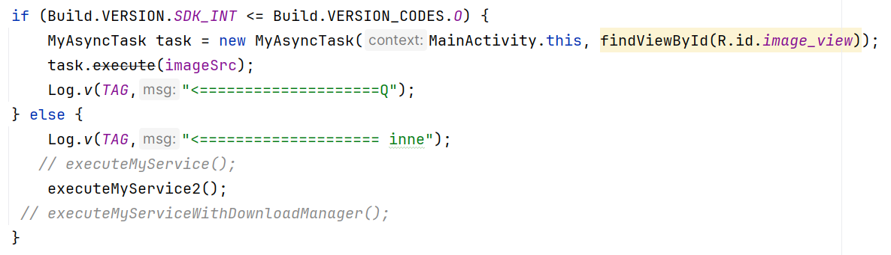

1. Sprawdzenie:

   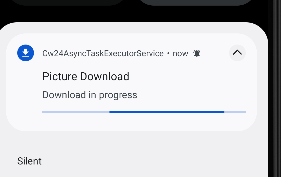

1. LogCat:

   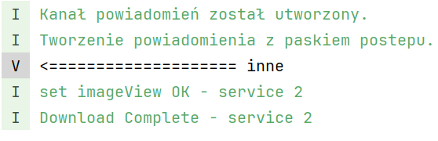

1. Użyj:

   <https://developer.android.com/reference/android/app/DownloadManager>

1. Efekt: ( środkowe po kliknięciu w powiadomienie DownloadManagera )

   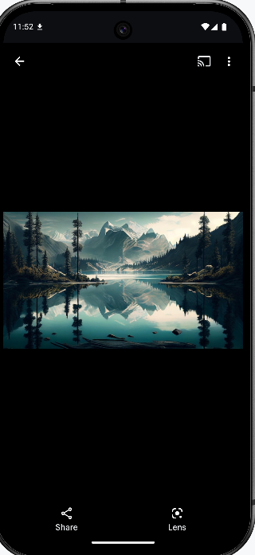

   

1. KONIEC.🔚
