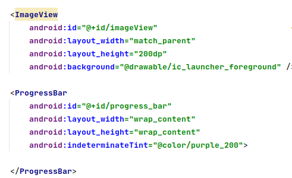
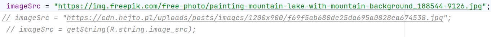
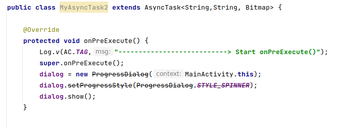
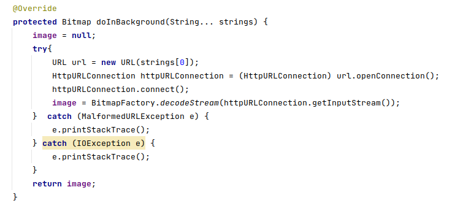
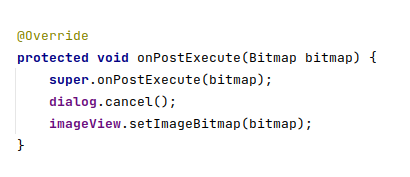

# Ćwiczenia 24 -- Android studio -- AsyncTask, ExecutorService, DownloadManager

💡Na koniec zajęć prześlij pliki źródłowe (.xml, .java)+ obrazek do zasobu
w teams.

1. Utwórz projekt o nazwie MyAsyncTask na podstawie Empty Activity,
    dobierz odpowiednie API.

1. Otwórz dokumentację:

   <https://developer.android.com/reference/android/os/AsyncTask>

   <https://developer.android.com/reference/android/app/PendingIntent>

   <https://developer.android.com/training/notify-user/build-notification#progressbar>

   <https://developer.android.com/reference/java/util/concurrent/package-summary>

   <https://developer.android.com/reference/java/util/concurrent/Executor>

1. activity_main.xml:

   

1. Zadeklaruj potrzebne stałe, np.: ( adres wybierz dowolny)

   

1. Utwórz klasę MyAsyncTask

   

1. Dodaj metodę doInBackground:

   

1. Ustaw pobrane zdjęcie:

   

1. Dla dostępnych urządzeń:

   

1. Uruchom Pixel i wywołaj instancję klasy:

   

1. Sprawdzenie logCata:

   

1. Uzyskany efekt ( tylko zdjęcie u dołu):

   

   Widok z ProgressDialog:

   

1. Klasa ExecutorService:

   - zrealizuj powyższe ćwiczenie z wykorzystaniem Klasy
     ExecutorService:

   

   

1. Sprawdź pobranie zdjęcia:

   

1. Zastąp przestarzały DialogProgress na rzecz ProgressBar:

   

1. Utwórz klasę :

   

1. Sprawdź uprawnienia od wersji 33+ tiramisu

   

1. Przetestuj aplikację:

   

1. Sprawdź logcata:

   

1. Metoda executeMyService2():

   

1. Powiadomienie: dodaj powiadomienie z paskiem postępu, w stylu:

   

   

1. Fragment z realizacji:

   

1. Wywołanie na Pixel 4a:

   

1. Sprawdzenie:

   

1. LogCat:

   

1. Użyj:

   <https://developer.android.com/reference/android/app/DownloadManager>

1. Efekt: ( środkowe po kliknięciu w powiadomienie DownloadManagera )

   

   

1. KONIEC.🔚
