Ćwiczenia 25 -- Android studio -- RecyclerView, GridLayout
Na koniec zajęć prześlij pliki źródłowe (.xml, .java)+ obrazek do zasobu
w teams.
1.  Utwórz projekt o nazwie MyAsyncTask na podstawie Empty Activity,
    dobierz odpowiednie API ( 28 -- Android 9).
2.  Otwórz dokumentację:
    <https://developer.android.com/reference/androidx/recyclerview/widget/RecyclerView>
    <https://developer.android.com/jetpack/androidx/releases/recyclerview>
    <https://developer.android.com/guide/topics/ui/layout/recyclerview>
    <https://developer.android.com/reference/androidx/recyclerview/widget/DividerItemDecoration>
3.  Zależności ( brak dodatkowych)
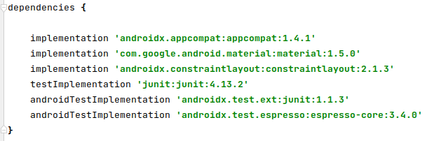
4.  Chcemy uzyskać w pierwszej części listę dla tekstów (po prawej
    GridLayout):
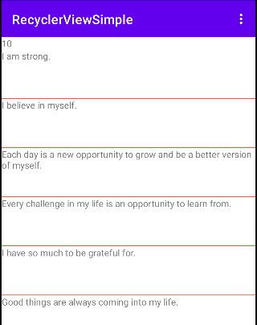
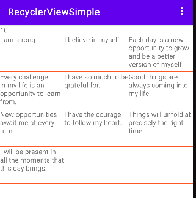
5.  activity_main.xml:
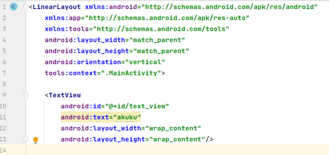
6.  Dodaj w strings.xml:

I am strong.
I believe in myself.
Each day is a new opportunity to grow and be a better version of myself.
Every challenge in my life is an opportunity to learn from.
I have so much to be grateful for.
Good things are always coming into my life.
New opportunities await me at every turn.
I have the courage to follow my heart.
Things will unfold at precisely the right time.
I will be present in all the moments that this day brings.
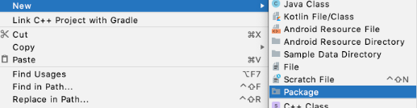
7.  Dodaj nowe pakiety: adapter, config i data ( New → Package )
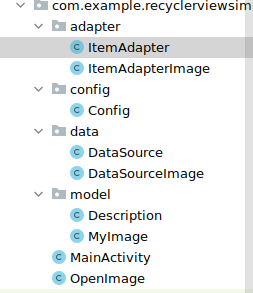
8.  Utwórz klasę, która będzie źródłem danych o nazwie Datasource:
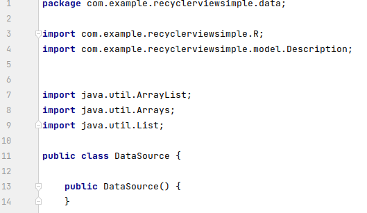
9.  Klasa Description:
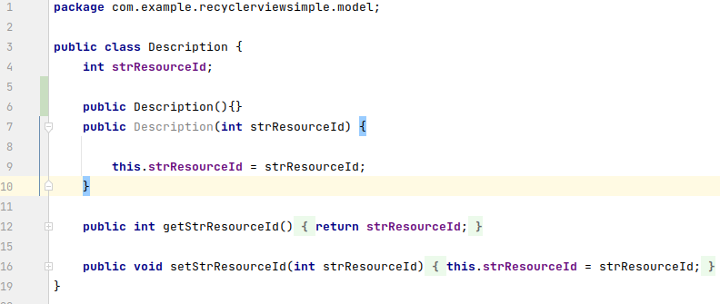
10. Jeżeli stworzysz klasę Description to wówczas dodaj do klasy
    Datasource:
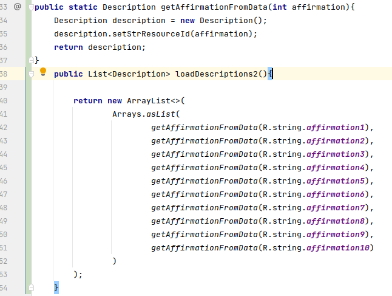
11. Dodaj kod i przetestuj aplikację, wyświetl długość listy:
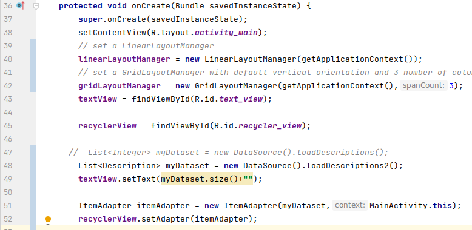
12. Dodajemy RecyclerView:
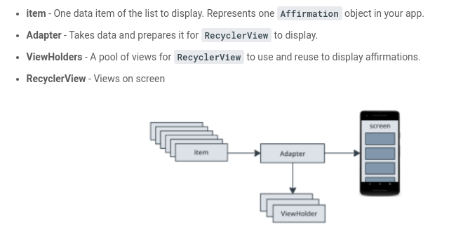
13. Dodaj w main_activity.xml:
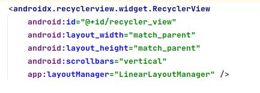
14. W res - \> layout utwórz list_item,.xml:
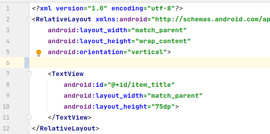
15. Utwórz klasę ItemAdapter:
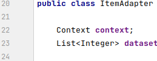
16. Dodaj construktor:
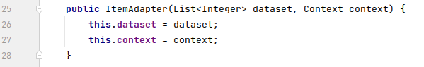
17. Wewnątrz klasy ItemAdapter utwórz klasę zagnieżdżoną o nazwie
    ItemViewHolder:
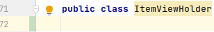
18. Rozszerz klasę ItemViewHolder o RecyclerView.ViewHolder oraz dodaj
    constuktor z view:
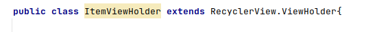

19. Dodaj TextView, cała klasa ItemViewHolder:
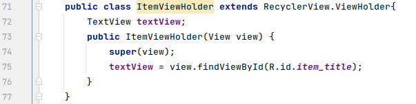
20. Rozszerz klasę adaptera ItemAdapter :
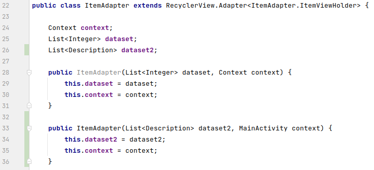
21. Napraw błędy:
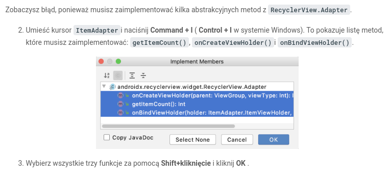
22. Zaimplementuj trzy metody, napierw getItemCount():
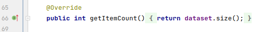
23. Implementuj metodę onCreateViewHolder( ):
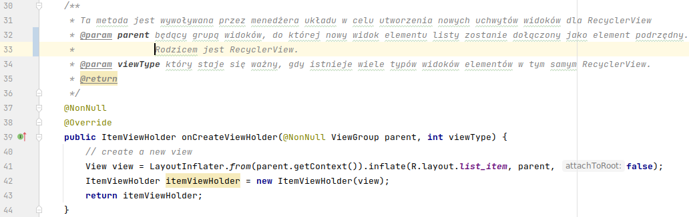
24. Zaimplementuj metodę onBindViewHolder():
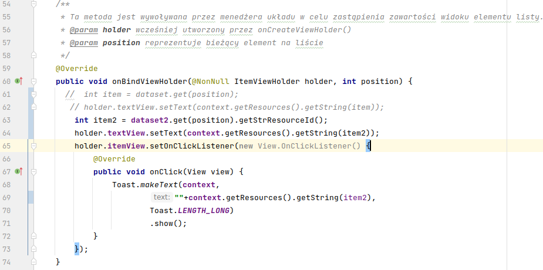
25. W onCreate() dodaj kod ustawiający adapter dla RecyclerView:
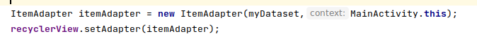
26. Dodaj separator:
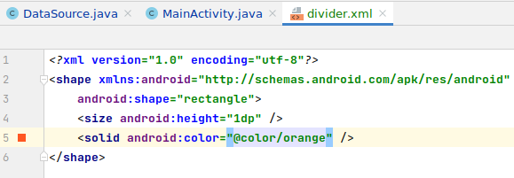
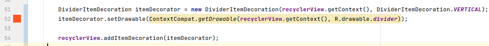
27. Przetestuj aplikację.
    
28. Dodaj menu dla zmiany układów:
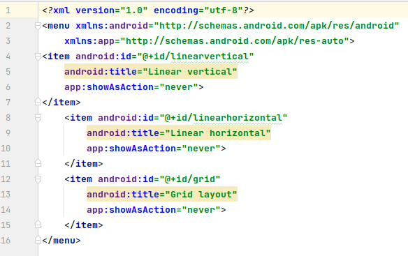
29. W MainActivity dodaj potrzebne metody i zadeklaruj użycie layoutów:
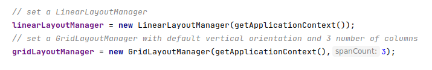
30. Obsługa menu:
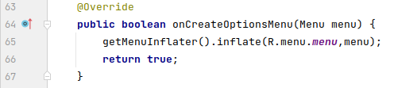
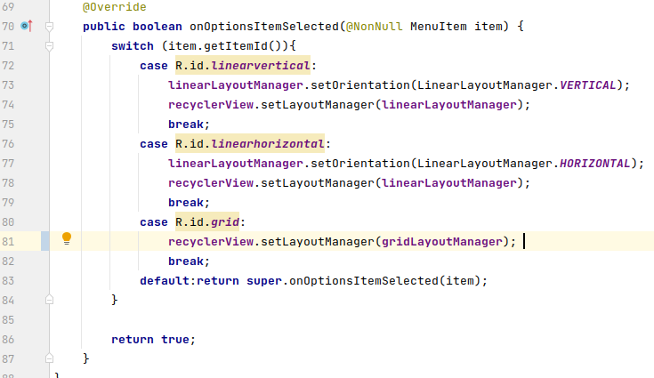
31. Przetestuj przełączenie układów:

32. Dodatkowe zadania
    a)  dodaj do projektu 12 zdjęć i utwórz do ich obsługi adapter i
        potrzebne klasy ItemAdapterImage i DataSourceImage
    b)  dodaj nową aktywność po tapnięciu w zdjęcie:
        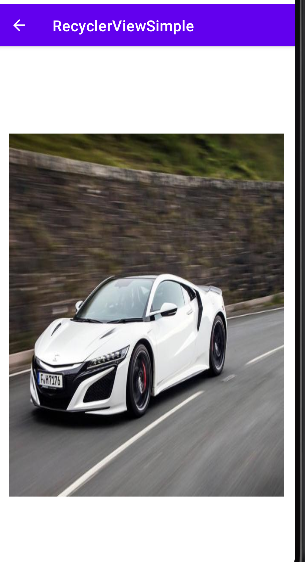
    c)  dodaj metodę odświeżającą elementy RecyclerView
    d)  zrealizuj powyższe ćwiczenie z wykorzystaniem \...
        <https://developer.android.com/guide/topics/ui/layout/recyclerview-custom>
    e)  inne zadanie ...
33. Efekt:
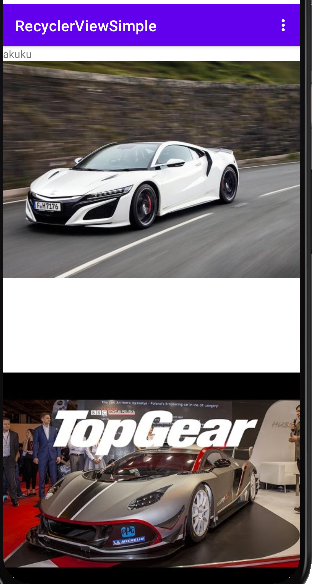
34. KONIEC.
