# Ćwiczenia 25 -- Android studio -- RecyclerView, GridLayout

Na koniec zajęć prześlij pliki źródłowe (.xml, .java)+ obrazek do zasobu
w teams.

1. Utwórz projekt o nazwie MyAsyncTask na podstawie Empty Activity,
    dobierz odpowiednie API ( 28 -- Android 9).

1. Otwórz dokumentację:

    <https://developer.android.com/reference/androidx/recyclerview/widget/RecyclerView>

    <https://developer.android.com/jetpack/androidx/releases/recyclerview>

    <https://developer.android.com/guide/topics/ui/layout/recyclerview>

    <https://developer.android.com/reference/androidx/recyclerview/widget/DividerItemDecoration>

1. Zależności ( brak dodatkowych)

   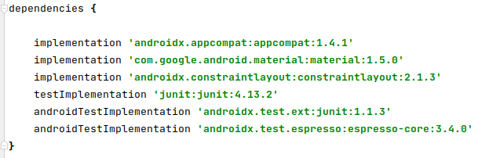

1. Chcemy uzyskać w pierwszej części listę dla tekstów (po prawej
    GridLayout):

   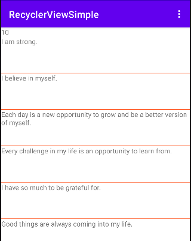

   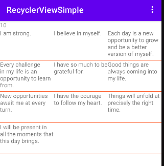

1. activity_main.xml:

   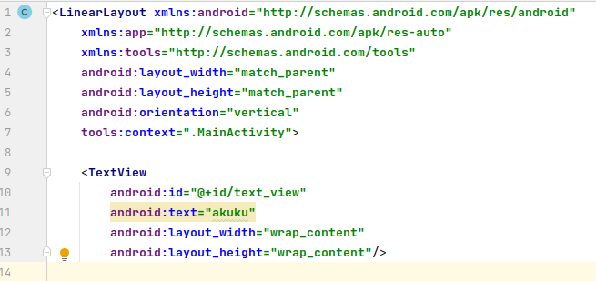

1. Dodaj w strings.xml:

   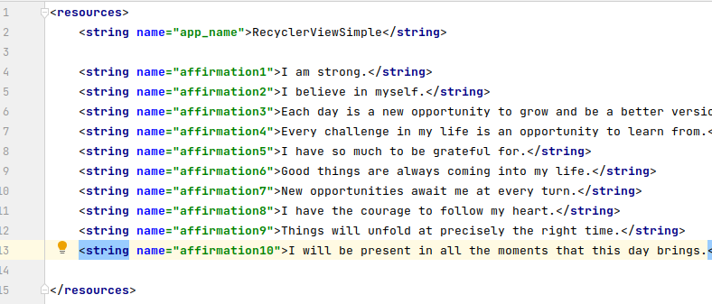

   ```text
    I am strong.
    I believe in myself.
    Each day is a new opportunity to grow and be a better version of myself.
    Every challenge in my life is an opportunity to learn from.
    I have so much to be grateful for.
    Good things are always coming into my life.
    New opportunities await me at every turn.
    I have the courage to follow my heart.
    Things will unfold at precisely the right time.
    I will be present in all the moments that this day brings.
    ```

    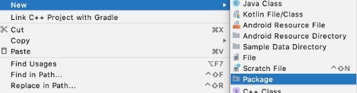

1. Dodaj nowe pakiety: adapter, config i data ( New → Package )

   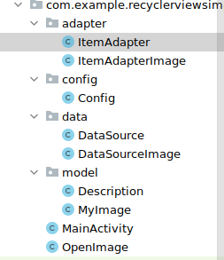

1. Utwórz klasę, która będzie źródłem danych o nazwie Datasource:

   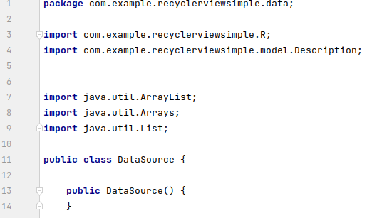

1. Klasa Description:

   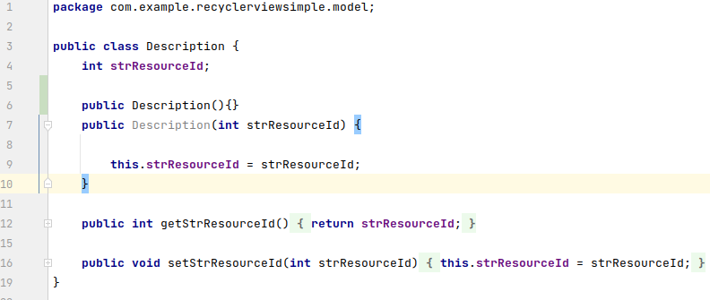

1. Jeżeli stworzysz klasę Description to wówczas dodaj do klasy
    Datasource:

   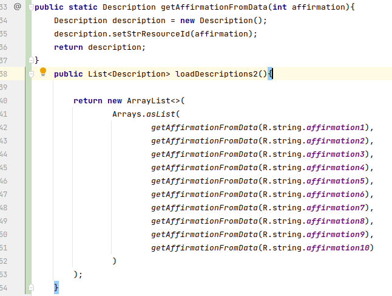

1. Dodaj kod i przetestuj aplikację, wyświetl długość listy:

   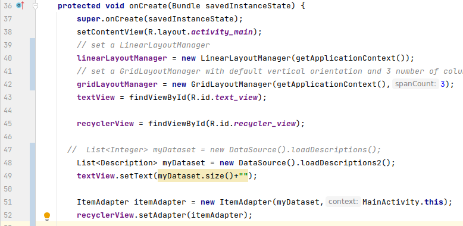

1. Dodajemy RecyclerView:

   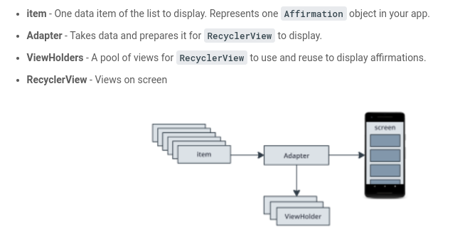

1. Dodaj w main_activity.xml:

   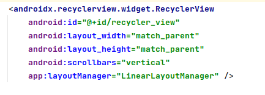

1. W res - \> layout utwórz list_item,.xml:

   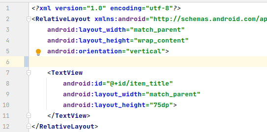

1. Utwórz klasę ItemAdapter:

   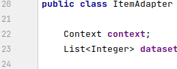

1. Dodaj construktor:

   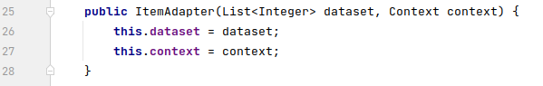

1. Wewnątrz klasy ItemAdapter utwórz klasę zagnieżdżoną o nazwie
    ItemViewHolder:

   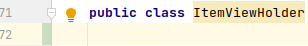

1. Rozszerz klasę ItemViewHolder o RecyclerView.ViewHolder oraz dodaj
    constuktor z view:

   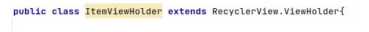

   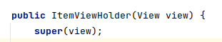

1. Dodaj TextView, cała klasa ItemViewHolder:

   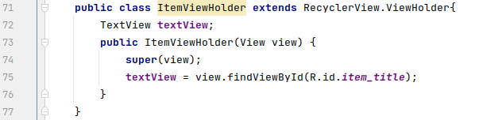

1. Rozszerz klasę adaptera ItemAdapter :

   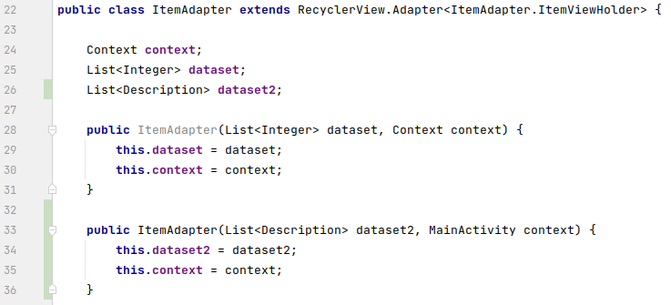

1. Napraw błędy:

   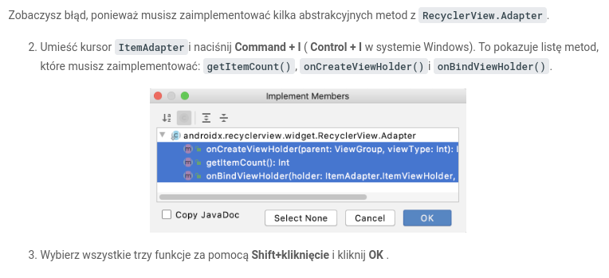

1. Zaimplementuj trzy metody, napierw getItemCount():

   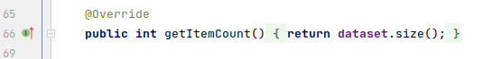

1. Implementuj metodę onCreateViewHolder( ):

   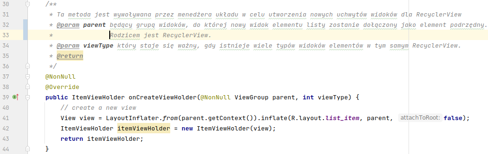

1. Zaimplementuj metodę onBindViewHolder():

   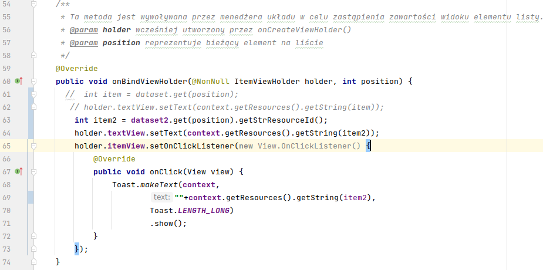

1. W onCreate() dodaj kod ustawiający adapter dla RecyclerView:

   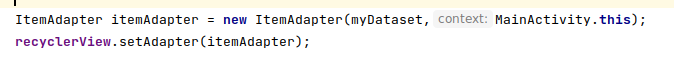

1. Dodaj separator:

   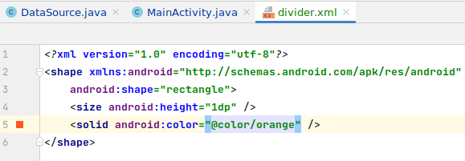

   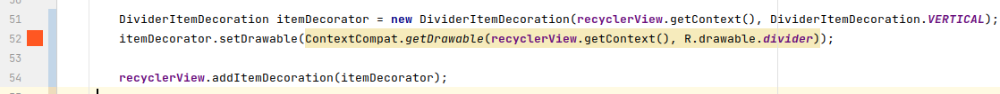

1. Przetestuj aplikację.

   

1. Dodaj menu dla zmiany układów:

   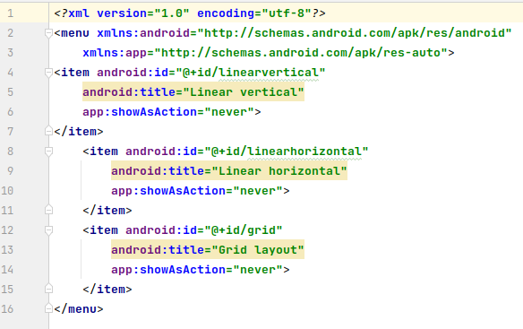

1. W MainActivity dodaj potrzebne metody i zadeklaruj użycie layoutów:

   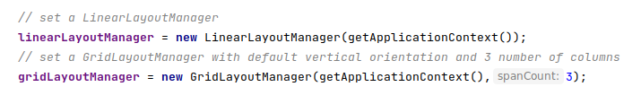

1. Obsługa menu:

   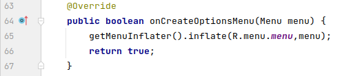

   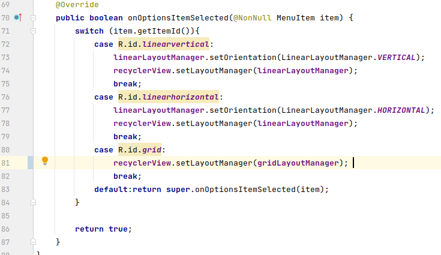

1. Przetestuj przełączenie układów:

   

1. Dodatkowe zadania
    - dodaj do projektu 12 zdjęć i utwórz do ich obsługi adapter i
        potrzebne klasy ItemAdapterImage i DataSourceImage
    - dodaj nową aktywność po tapnięciu w zdjęcie:

        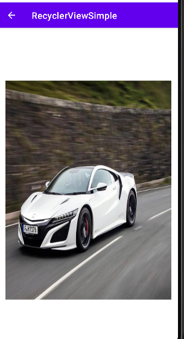

    - dodaj metodę odświeżającą elementy RecyclerView
    - zrealizuj powyższe ćwiczenie z wykorzystaniem \...

        <https://developer.android.com/guide/topics/ui/layout/recyclerview-custom>

    - inne zadanie ...

1. Efekt:

   

1. KONIEC.🔚
