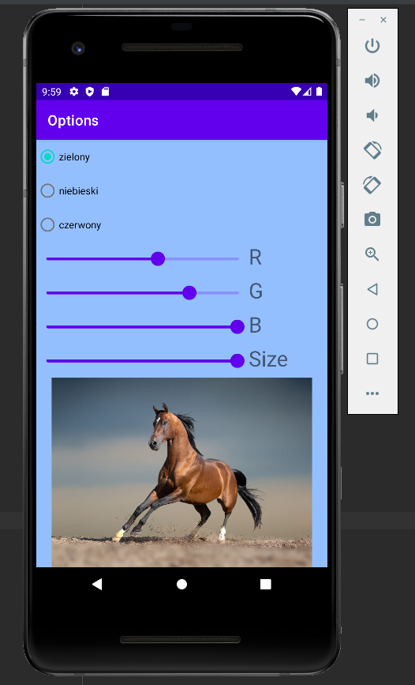
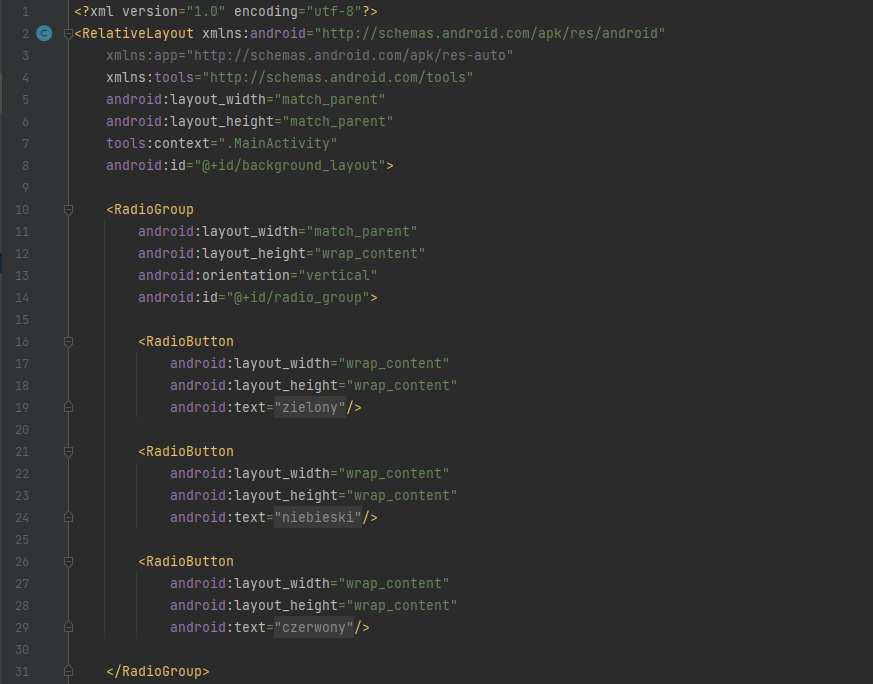
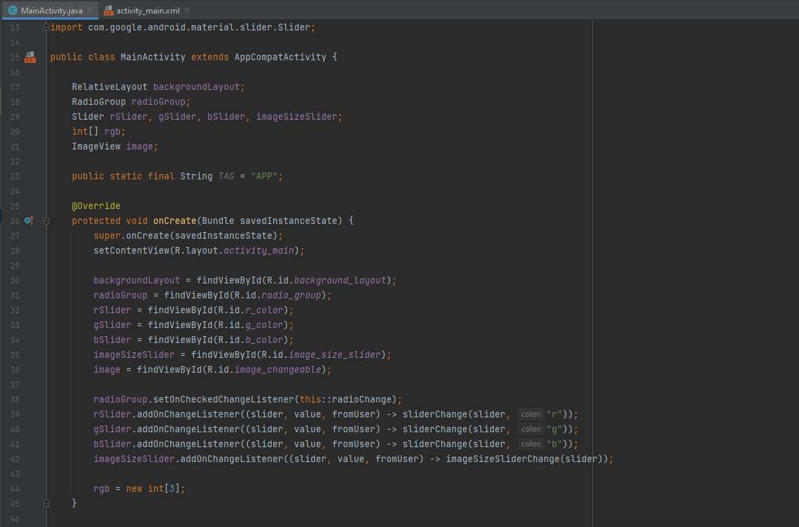
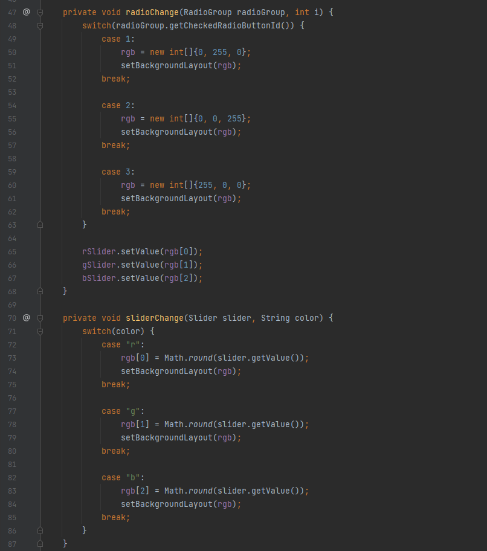
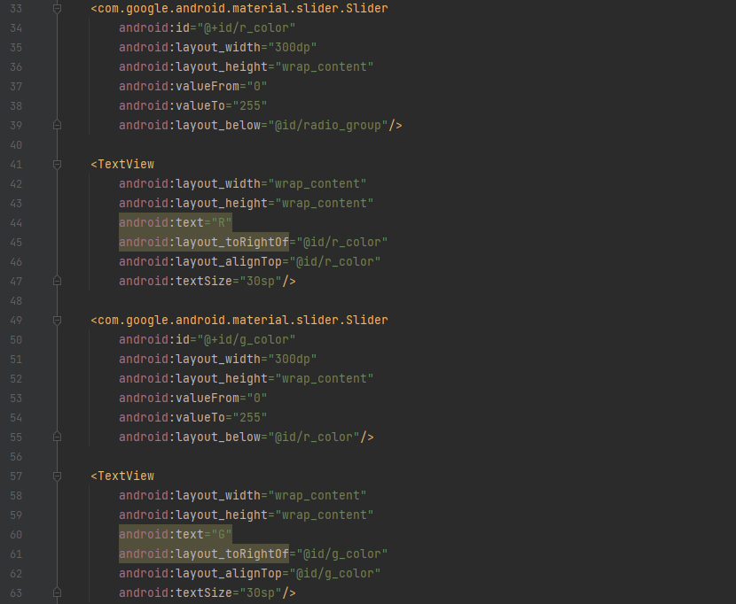
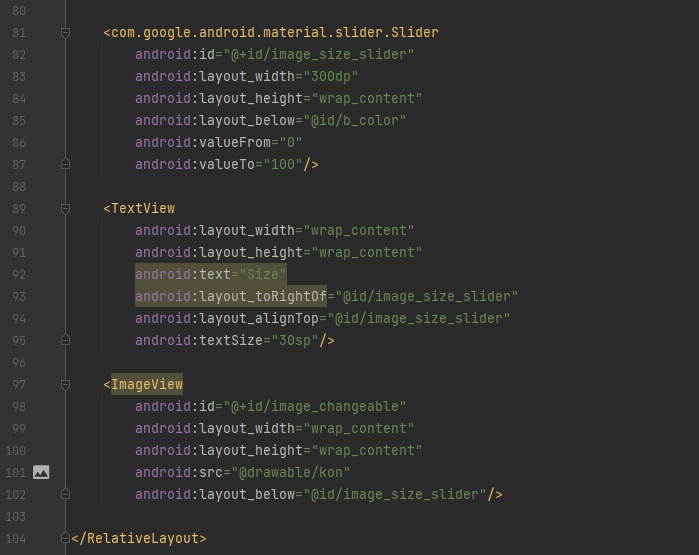
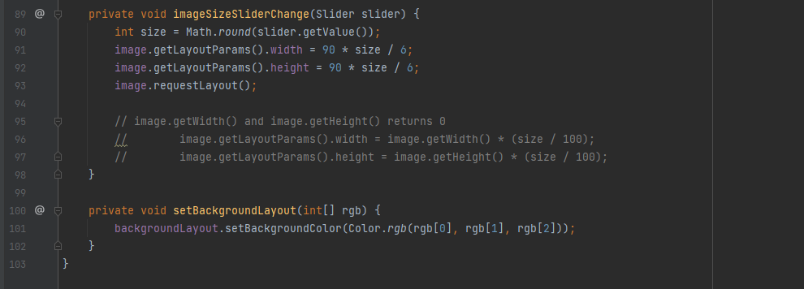

Ćwiczenia 28 -- Android studio -- Slider, radiogroup
Na koniec zajęć prześlij pliki źródłowe (.xml, .java)+ obrazek do zasobu
w teams.
1.  Utwórz projekt o nazwie MySliderRadio na podstawie Empty Activity,
    dobierz odpowiednie API ( 28 -- Android 9).
2.  Otwórz dokumentację:
    <https://developer.android.com/reference/com/google/android/material/slider/Slider?hl=en>
    <https://developer.android.com/reference/android/widget/RadioGroup>
3.  Zależności ( brak dodatkowych)
4.  Chcemy uzyskać zmianę koloru tła oraz rozmiaru zdjęcia:

5.  Dodaj kod:
    
6.  Dodaj potrzebny kod:

7.  Dodaj kod:
    
8.  Dodaj w main_activity.xml:

9.  Dodaj:

10. Dodaj:

11. Dodatkowe zadania
    a)  dodaj metodę \...
    b)  zrealizuj powyższe ćwiczenie z wykorzystaniem checkbox
12. KONIEC.
