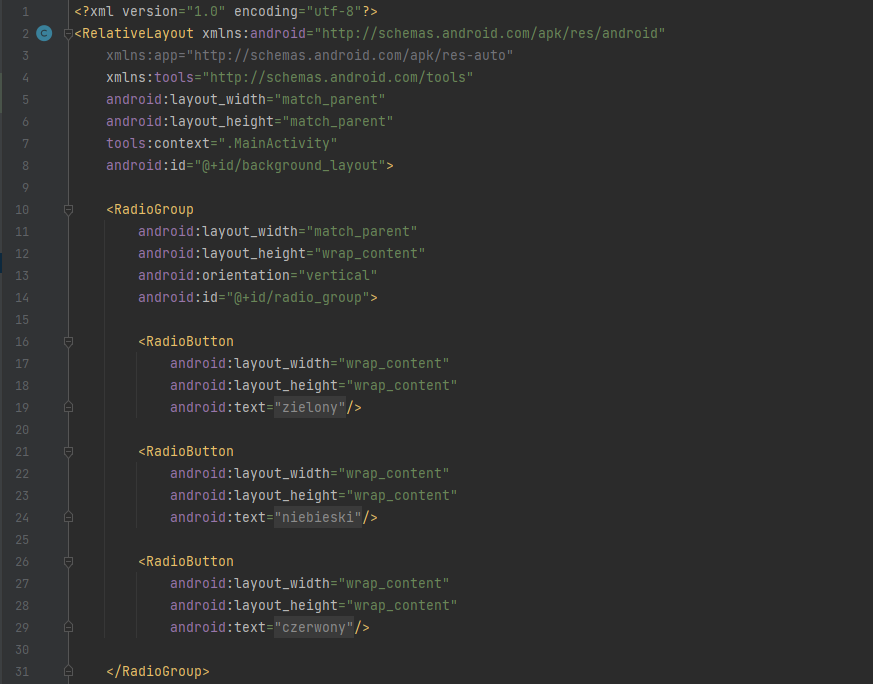
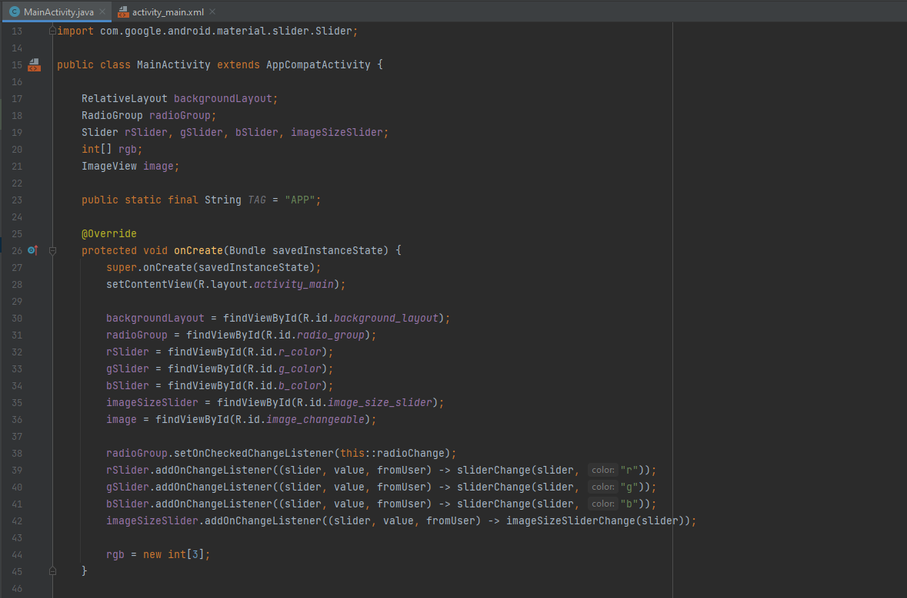
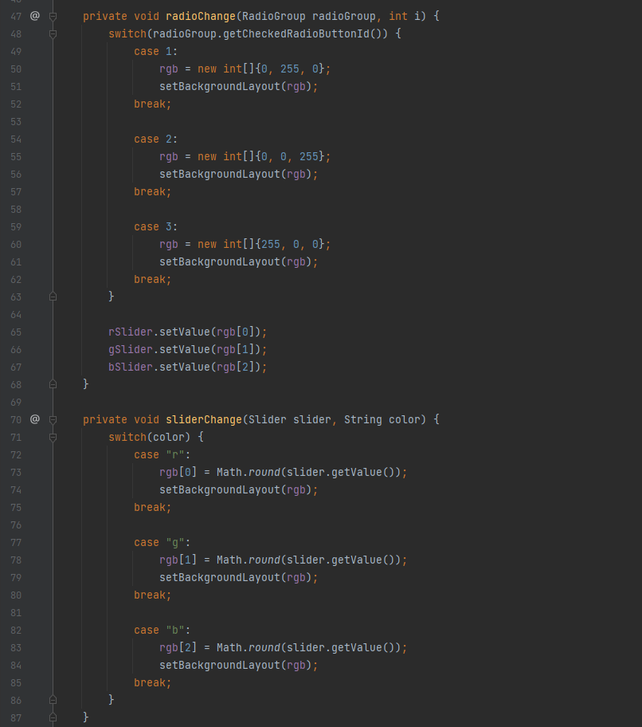
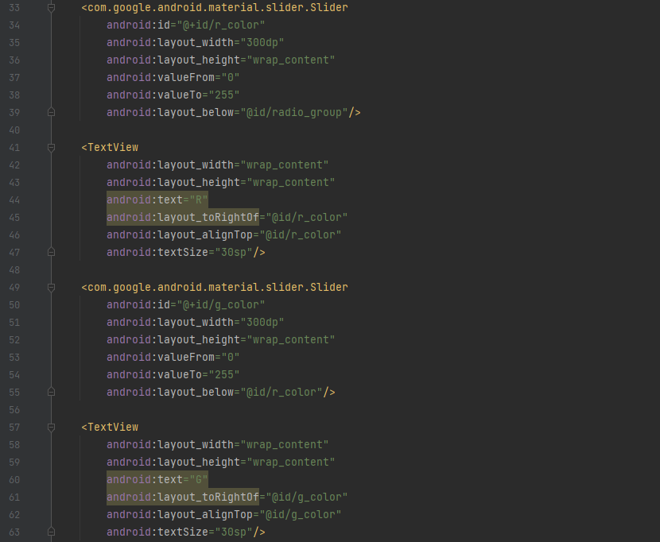
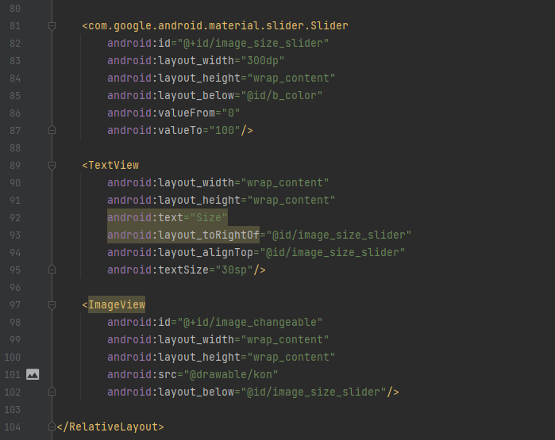
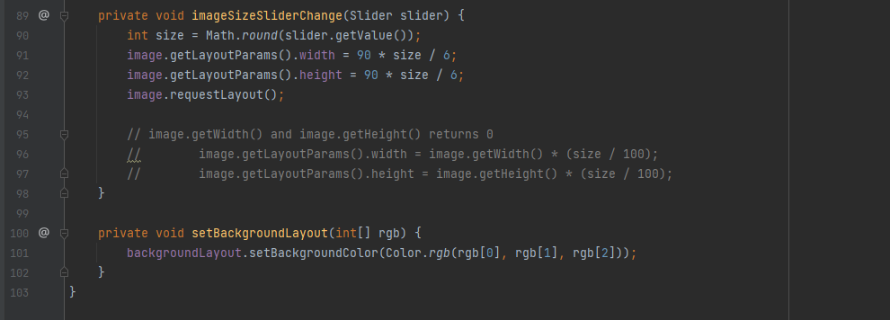

# Ćwiczenia 28 -- Android studio -- Slider, radiogroup

Na koniec zajęć prześlij pliki źródłowe (.xml, .java)+ obrazek do zasobu
w teams.

1. Utwórz projekt o nazwie MySliderRadio na podstawie Empty Activity,
    dobierz odpowiednie API ( 28 -- Android 9).

1. Otwórz dokumentację:

    <https://developer.android.com/reference/com/google/android/material/slider/Slider?hl=en>

    <https://developer.android.com/reference/android/widget/RadioGroup>

1. Zależności ( brak dodatkowych)

1. Chcemy uzyskać zmianę koloru tła oraz rozmiaru zdjęcia:

   [image1](media/image1.png)

1. Dodaj kod:

    

1. Dodaj potrzebny kod:

   

1. Dodaj kod:

   

1. Dodaj w main_activity.xml:

   

1. Dodaj:

   

1. Dodaj:

   

1. Dodatkowe zadania

    - dodaj metodę i slajder do obrotu obrazka

    - zrealizuj powyższe ćwiczenie z wykorzystaniem checkbox

1. KONIEC.🔚
