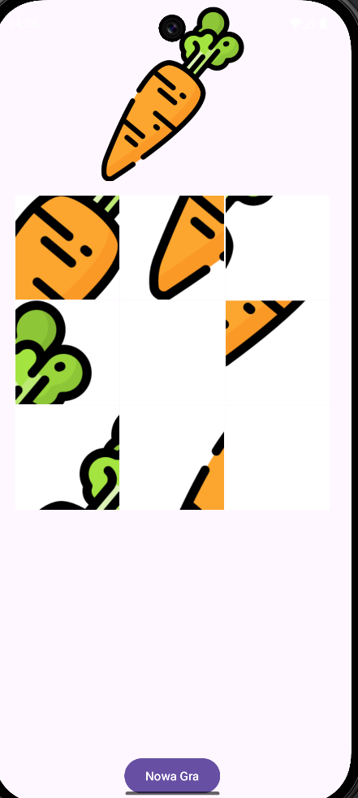
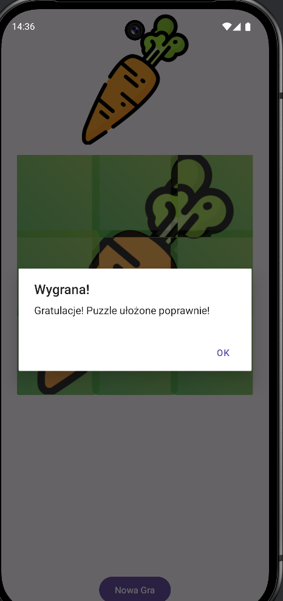
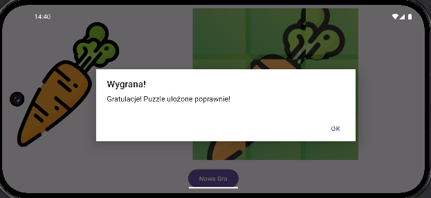
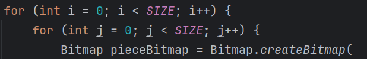
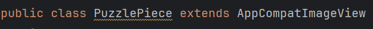
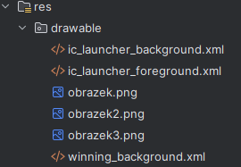

Ćwiczenia 29 -- Android studio -- puzzle
Na koniec zajęć prześlij pliki źródłowe (.xml, .java)+ obrazek do zasobu
w teams.
1.  Utwórz projekt o nazwie ArrayAdapter na podstawie Empty Activity,
    dobierz odpowiednie API ( min. 26).
2.  Otworzyć dokumentację:
> <https://developer.android.com/reference/android/widget/GridLayout>
<https://developer.android.com/jetpack/androidx/releases/gridlayout>
<https://developer.android.com/reference/kotlin/androidx/gridlayout/widget/GridLayout>
3.  Docelowo chcemy uzyskać :

4.  Dodaj w activity_main.xml
5.  Zapewnić zachowanie stanu przy rotacji:
> 
6.  Uzupełnij MainActivity.java:
7.  Podziel obrazek na równe części:
> 
8.  Przetestuj aplikację, uruchom na urządzeniu.
9.  Klasa dla puzzli:
> <https://developer.android.com/reference/androidx/appcompat/widget/AppCompatImageView>

10. W res umieść kilka obrazków do losowania:
> 
11. Dalej, szkielet dla onCreate():
12. Utwórz plik spinner_item.xml:
13. Utwórz klasę MyAdapter.java, rozrzesz ją o BaseAdapter:
14. Sprawdź wbudowane metody:
15. Ostatnia metoda:
16. Wykonaj zadania:
    a)  dodaj obsługę kliknięcia w item, wyświetl toast
    b)  utwórz przycisk dodający nowy element do listy
    c)  zachowaj całą listę w ShredPreferences, sprawdź stan linty po
        rotacji urządzenia
    d)  przebuduj projekt tworząc klasę i listę, utwórz stosowny adapter
17. KONIEC.
