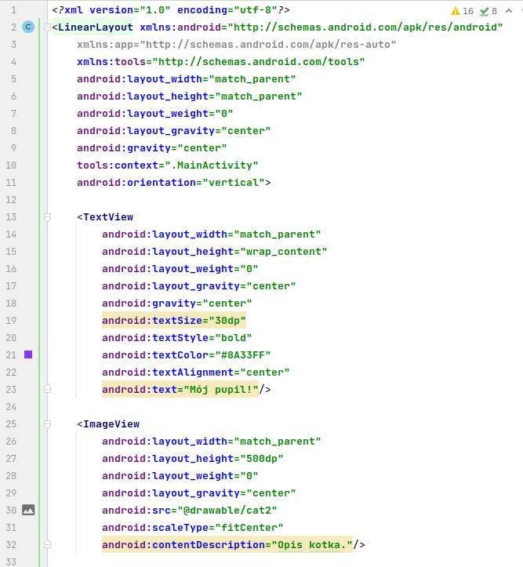
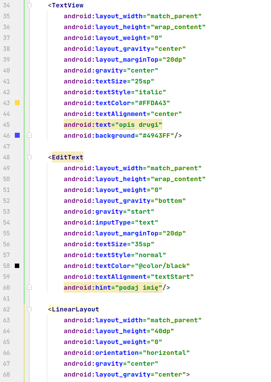
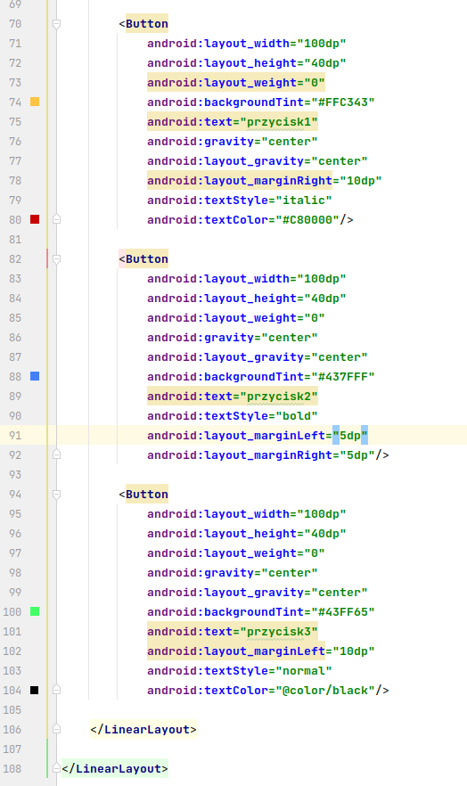

Ćwiczenia 2 -- Android studio -- linear layout
Na koniec zajęć prześlij pliki źródłowe (activity_main.xml,
MainActivity.java)+ obrazek do zasobu w teams.
1.  Utwórz nowy projekt na podstawie Empty Activity (dobrać odpowiednie
    API 24) w katalogu na dysku C:
2.  Uruchomić aplikację Hello World Shift+F10 (zielony trójkącik)
3.  Usunąć TextView dla Hello World
4.  Zmienić domyślny układ na
    
    LinearLayout
5.  Dodać 1 obrazek, zdjęcie kota, psa do res
6.  Dodać 2 TextView + EditText
7.  Ustaw odstępy pomiędzy elementami GUI
8.  Otworzyć dokumentację:
    <https://developer.android.com/guide/topics/ui/layout/linear>
    <https://developer.android.com/develop/ui/views/layout/linear>
9.  Ustawić(pozmieniać) parametry dla TextView i EditText:
    a)  textSize
    b)  textStyle
    c)  textColor
    d)  textAlignment
    e)  text
    f)  background
    g)  dla EditText hint
10. Ustawić (pozmieniać) parametry dla ImageView:
<!-- -->
a)  scaleType
b)  src
c)  contentDescription
<!-- -->
11. Ustawić (pozmieniać ) do wszystkich parametry:
    a)  layout_height
    b)  layout_width
    c)  layout_weight
    d)  gravity
    e)  layout_gravity
12. Sprawdź dla całego layouta android:orientation i android:gravity
    <https://developer.android.com/reference/android/widget/LinearLayout#attr_android:gravity>
13. Dodaj przycisk Button, a następnie ustaw parametry:
    a)  tło ( backgroundT\...)
    b)  tekst
14. Umieść przycisk w nowym Linearlayout
15. Za pomocą layout_gravity zmień pozycję przycisku.
16. Dodaj jeszcze 2 przyciski obok (po prawej od istniejącego)
17. Ustaw dla przycisków:
    a)  różne kolory tła
    b)  różne style tekstu
    c)  marginesy
18. Przykładowa realizacja:

19. KONIEC.
