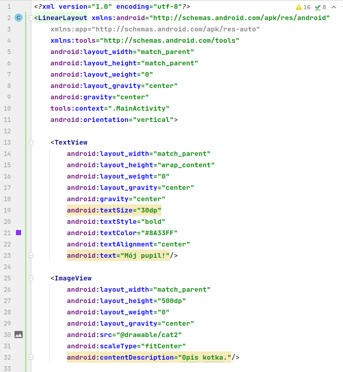
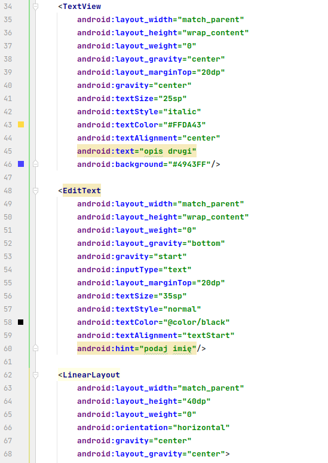
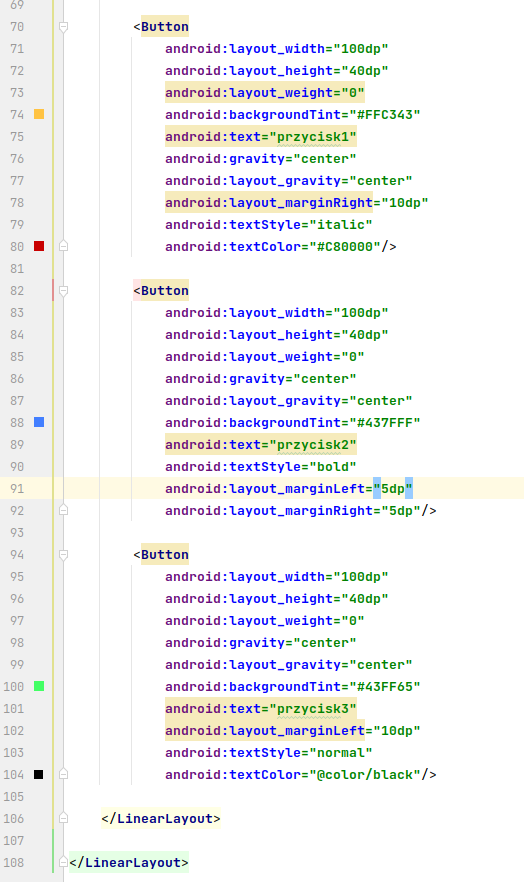

# Ćwiczenia 2 -- Android studio -- linear layout

Na koniec zajęć prześlij pliki źródłowe:

- activity_main.xml,
- MainActivity.java,

 oraz obrazek do zasobu w teams.

1. Utwórz nowy projekt na podstawie Empty Activity (dobrać odpowiednie
    API 27) w katalogu na dysku C:

1. Uruchomić aplikację Hello World Shift+F10 (zielony trójkącik)

1. Usunąć TextView dla Hello World

1. Zmienić domyślny układ na LinearLayout

   

1. Dodać 1 obrazek, zdjęcie kota, psa do res

1. Dodać 2 TextView + EditText

1. Ustaw odstępy pomiędzy elementami GUI

1. Otworzyć dokumentację:

    <https://developer.android.com/guide/topics/ui/layout/linear>

    <https://developer.android.com/develop/ui/views/layout/linear>

1. Ustawić(pozmieniać) parametry dla TextView i EditText:
    - textSize
    - textStyle
    - textColor
    - textAlignment
    - text
    - background
    - dla EditText hint

1. Ustawić, pozmieniać parametry dla ImageView:

   - scaleType
   - src
   - contentDescription

1. Ustawić, pozmieniać do wszystkich parametry:
    - layout_height
    - layout_width
    - layout_weight
    - gravity
    - layout_gravity

1. Sprawdź dla całego layouta android:orientation i android:gravity

    <https://developer.android.com/reference/android/widget/LinearLayout#attr_android:gravity>

1. Dodaj przycisk Button, a następnie ustaw parametry:
    - tło ( backgroundT\...)
    - tekst

1. Umieść przycisk w nowym Linearlayout

1. Za pomocą layout_gravity zmień pozycję przycisku.

1. Dodaj jeszcze 2 przyciski obok, po prawej od istniejącego.

1. Ustaw dla przycisków:
    - różne kolory tła
    - różne style tekstu
    - marginesy

1. Przykładowa realizacja:

   
   
   

1. KONIEC.🔚
