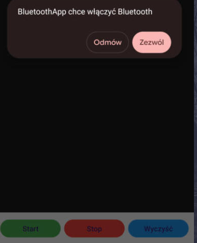
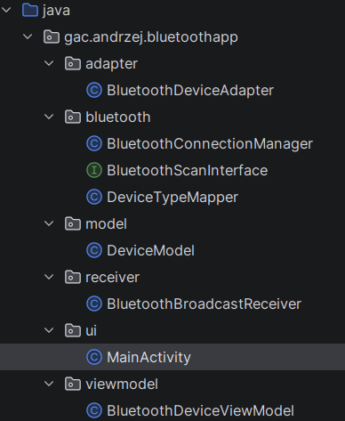
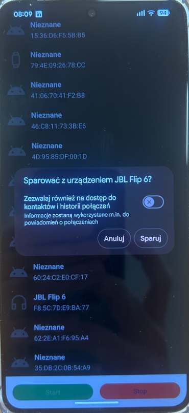

# Ćwiczenia - bluetooth - parowanie urządzeń

💡Do realizacji ćwiczeń wymagany jest tablet lub smartfon oraz głośnik bluetooth

1. Otwórz dokumentację:

    <https://developer.android.com/guide/topics/permissions/overview>
    <https://developer.android.com/guide/topics/connectivity/bluetooth/permissions>
    <https://developer.android.com/guide/topics/connectivity/bluetooth>
    <https://developer.android.com/guide/topics/connectivity/bluetooth/setup>
    <https://developer.android.com/guide/topics/connectivity/bluetooth/find-bluetooth-devices>
    <https://developer.android.com/guide/topics/connectivity/bluetooth/transfer-data>

1. Pobierz i rozpakuj 

1. AndroidManifest.xml:

   ```xml
   <uses-permission
        android:name="android.permission.BLUETOOTH"
        android:maxSdkVersion="30" />

    <!-- Uprawnienia dla Androida 12+ (API 31+) -->
    <uses-permission android:name="android.permission.BLUETOOTH_CONNECT" />
    <uses-permission
        android:name="android.permission.BLUETOOTH_SCAN"
        android:usesPermissionFlags="neverForLocation" />

    <!-- Lokalizacja wymagana TYLKO dla Androida 11 i starszych -->
    <uses-permission android:name="android.permission.ACCESS_FINE_LOCATION" />
    <uses-permission android:name="android.permission.ACCESS_COARSE_LOCATION" />

    <uses-permission android:name="android.permission.BLUETOOTH_ADMIN"
        android:maxSdkVersion="30"/>

    <!-- Deklaracja, że Bluetooth jest wymagany do działania aplikacji -->
    <uses-feature android:name="android.hardware.bluetooth" />
   ```

1. Dodaj zmienne do ActivityMain:

   ```java
   private BluetoothDeviceViewModel viewModel;
    private BluetoothDeviceAdapter adapter;
    private BluetoothAdapter bluetoothAdapter;
    private BluetoothConnectionManager bluetoothConnectionManager;
    private ActivityResultLauncher<Intent> enableBluetoothLauncher;
   ```

1. W OnCreate() :

   ```java
   BluetoothManager bluetoothManager = (BluetoothManager) getSystemService(BLUETOOTH_SERVICE);

        if (bluetoothManager != null) {
            bluetoothAdapter = bluetoothManager.getAdapter();
        }
   ```

1. Zawartość activity_main.xml:

   ```xml
      <?xml version="1.0" encoding="utf-8"?>

    <androidx.constraintlayout.widget.ConstraintLayout xmlns:android="<http://schemas.android.com/apk/res/android>"
        xmlns:app="<http://schemas.android.com/apk/res-auto>"
        android:layout_width="match_parent"
        android:layout_height="match_parent">

        <!-- Lista urządzeń zajmująca całą dostępną przestrzeń od góry do przycisków -->
        <androidx.recyclerview.widget.RecyclerView
            android:id="@+id/recyclerViewDevices"
            android:layout_width="0dp"
            android:layout_height="0dp"
            android:layout_marginTop="8dp"
            app:layout_constraintBottom_toTopOf="@+id/layoutButtons"
            app:layout_constraintEnd_toEndOf="parent"
            app:layout_constraintStart_toStartOf="parent"
            app:layout_constraintTop_toTopOf="parent" />

        <!-- Dolny panel z przyciskami sterującymi -->
        <LinearLayout
            android:id="@+id/layoutButtons"
            android:layout_width="match_parent"
            android:layout_height="wrap_content"
            android:orientation="horizontal"
            android:padding="12dp"
            android:background="#FFFFFF"
            android:elevation="8dp"
            app:layout_constraintBottom_toBottomOf="parent">

            <Button
                android:id="@+id/btnStartScan"
                android:layout_width="0dp"
                android:layout_height="wrap_content"
                android:layout_weight="1"
                android:layout_marginEnd="4dp"
                android:text="Start"
                android:backgroundTint="#4CAF50" />

            <Button
                android:id="@+id/btnStopScan"
                android:layout_width="0dp"
                android:layout_height="wrap_content"
                android:layout_weight="1"
                android:layout_marginHorizontal="4dp"
                android:text="Stop"
                android:backgroundTint="#F44336" />

            <Button
                android:id="@+id/btnClear"
                android:layout_width="0dp"
                android:layout_height="wrap_content"
                android:layout_weight="1"
                android:layout_marginStart="4dp"
                android:text="Wyczyść"
                android:backgroundTint="#2196F3" /> 

        </LinearLayout>

    </androidx.constraintlayout.widget.ConstraintLayout>

   ```

1. Przy uruchomieniu raz spradzić czy jest bluetooth włączony

   

   ```java
   // Rejestracja callbacku dla wyniku zapytania o włączenie Bluetooth
               enableBluetoothLauncher = registerForActivityResult(
                new ActivityResultContracts.StartActivityForResult(),
                result -> {
                    if (result.getResultCode() == RESULT_OK) {
                        Log.d(TAG, "onActivityResult() called with: result = [" + result + "Użytkownik kliknął zezwól");
                        Toast.makeText(MainActivity.this, "Włączono Bluetooth", Toast.LENGTH_SHORT).show();
                    } else {
                        // Użytkownik kliknął "Odmów" - nie uruchamiamy skanowania Bluetooth
                        Log.d(TAG, "onActivityResult() called with: result = [" + result + "]Użytkownik kliknął odmów");
                        Toast.makeText(MainActivity.this, "Nie włączono Bluetooth", Toast.LENGTH_SHORT).show();
                    }
                }
        );
   ```

1. Struktura projektu, sugerowana:

   

1. Zawartość elementu listy RecyclerView:

   ```xml
      <?xml version="1.0" encoding="utf-8"?>

    <RelativeLayout xmlns:android="http://schemas.android.com/apk/res/android"
        xmlns:app="http://schemas.android.com/apk/res-auto"
        android:layout_width="match_parent"
        android:layout_height="wrap_content"
        android:padding="12dp"> <ImageView
        android:id="@+id/imageViewIcon"
        android:layout_width="48dp"
        android:layout_height="48dp"
        android:layout_alignParentStart="true"
        android:layout_centerVertical="true"
        app:srcCompat="@drawable/ic_launcher_background" />

        <TextView
            android:id="@+id/textViewDeviceName"
            android:layout_width="match_parent"
            android:layout_height="wrap_content"
            android:layout_toEndOf="@id/imageViewIcon"
            android:layout_marginStart="12dp"
            android:text="Nazwa urządzenia"
            android:textSize="16sp"
            android:textStyle="bold"
            android:textColor="?android:attr/textColorPrimary" />

        <TextView
            android:id="@+id/textViewDeviceAddress"
            android:layout_width="match_parent"
            android:layout_height="wrap_content"
            android:layout_toEndOf="@id/imageViewIcon"
            android:layout_below="@id/textViewDeviceName"
            android:layout_marginStart="12dp"
            android:layout_marginTop="4dp"
            android:textColor="?android:attr/textColorSecondary"
            android:text="00:11:22:33:44:55"
            android:textSize="14sp" />

    </RelativeLayout>
   ```

1. Po kliknięciu w pozycję listy, sparuj głośnik

 

1. KONIEC. 🔚
