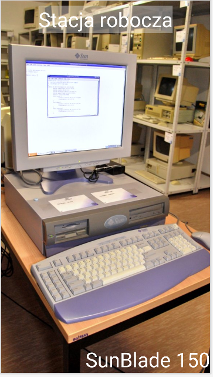
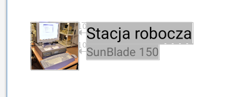
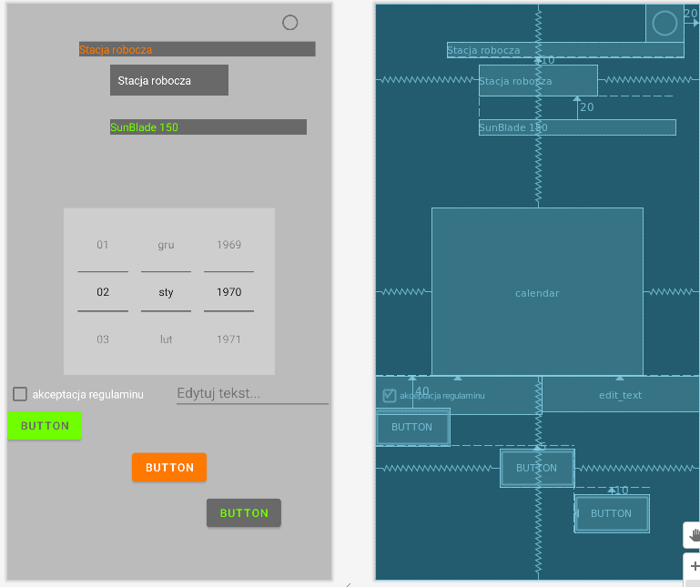
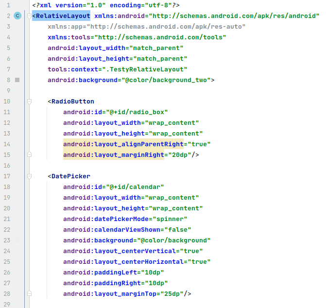
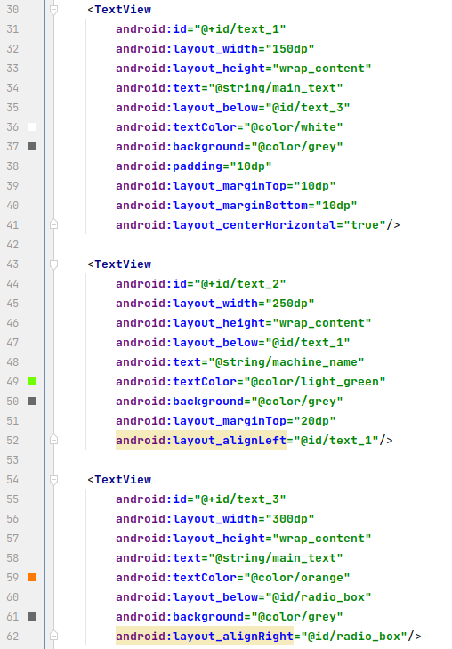
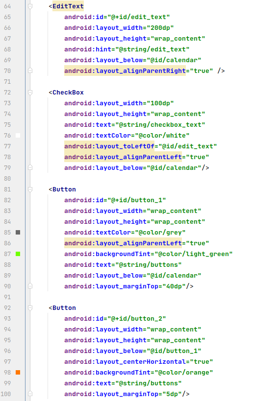
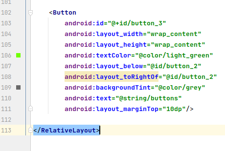

Ćwiczenia 3 -- Android studio -- relative layout
Na koniec zajęć prześlij pliki źródłowe (activity_main.xml,
MainActivity.java)+ obrazek do zasobu w teams.
1.  Utwórz nowy projekt na podstawie Empty Activity (dobrać odpowiednie
    API 24) w katalogu na dysku C:
2.  Uruchomić aplikację Hello World Shift+F10 (zielony trójkącik)
3.  Usunąć TextView dla Hello World
4.  Otworzyć dokumentację:
    <https://developer.android.com/guide/topics/ui/layout/relative>
5.  Zmienić domyślny układ na
    Relative
    Layout.
6.  Wykonaj zadanie 2 z prezentacji umieszczonej na teams.
7.  Dodaj Empty Activity o nazwie Zadanie3 do realizacji zadania 3 z
    prezentacji umieszczonej na teams.
    
8.  Dodaj Empty Activity o nazwie TestyRelativeLayout.
9.  Dodać komponenty tak jak na stronie dokumentacyjnej z punktu 4:
    a)  RadioButton
    b)  DatePicker (datePickerMode=\"spinner\",
        calendarViewShown=\"false\")
    c)  TextView 3x ( w osobnych wierszach, drugi zaczyna się równo z
        pierwszym, trzeci pod RadioButton)
    d)  EditText (z podpowiedzią)
    e)  CheckBox ( z tekstem: akceptacja regulaminu), po lewej od
        EditText
    f)  Button 3x ( w osobnych wierszach, pierwszy do lewej, drugi na
        środku , trzeci zaczyna się, gdzie kończy się drugi)
        
10. Zdefiniować w pliku values\\strings.xml minimum 5 własnych tekstów.
11. Zdefiniować w pliku values\\colors.xml minimum 5 własnych kolorów.
12. Otwórz dokumentację:
    <https://developer.android.com/reference/android/widget/RelativeLayout.LayoutParams>
13. Wykorzystać powyższe definicje kolorów i tekstów do komponentów z
    layout: activity_testy_relative_layout.
14. Wyrównać komponenty:
    a)  prawą krawędzią
    b)  lewą krawędzią
    c)  wyśrodkowane
    d)  wyśrodkowane po prawej
    e)  układ wymyślony przez Ciebie
15. Ustaw odstępy pomiędzy elementami GUI (padding, layout_margin)
16. Przykładowa realizacja:

17. Zaprogramuj przechodzenie pomiędzy aktywnościami:
    <https://developer.android.com/training/basics/firstapp/starting-activity>
18. Wykonaj własne ćwiczenie.
19. KONIEC.
