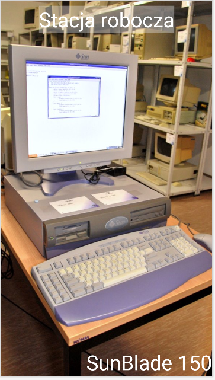
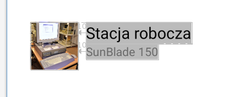
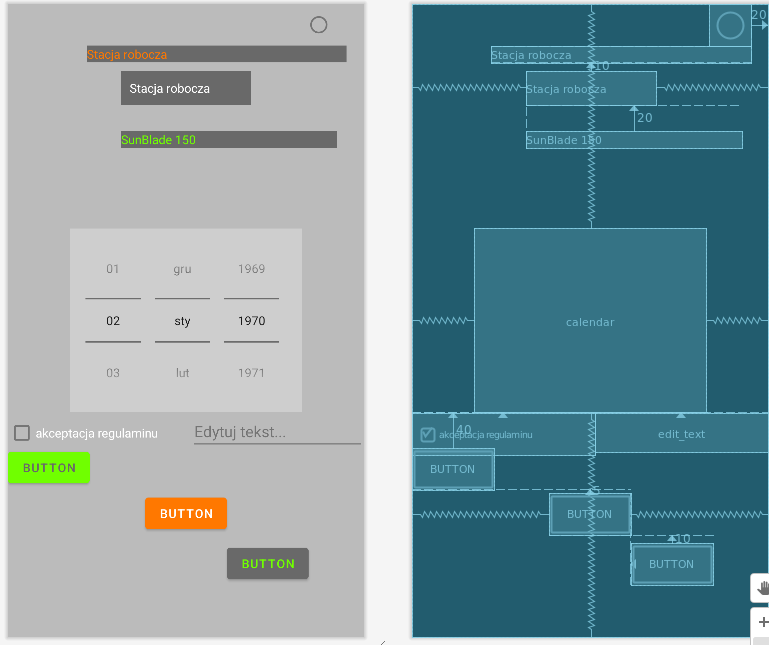
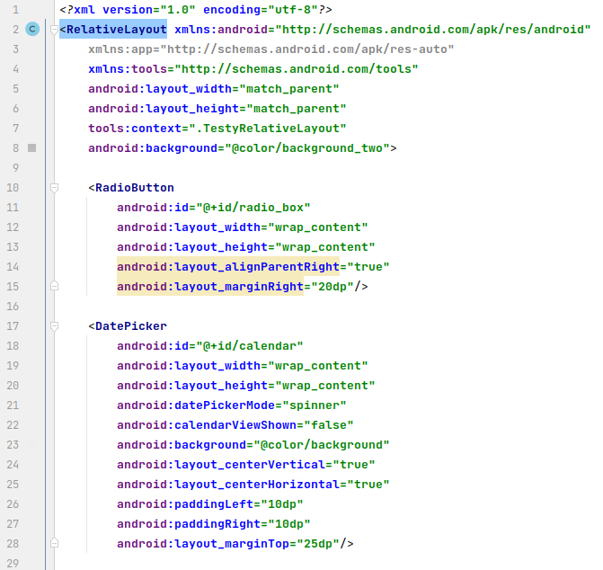
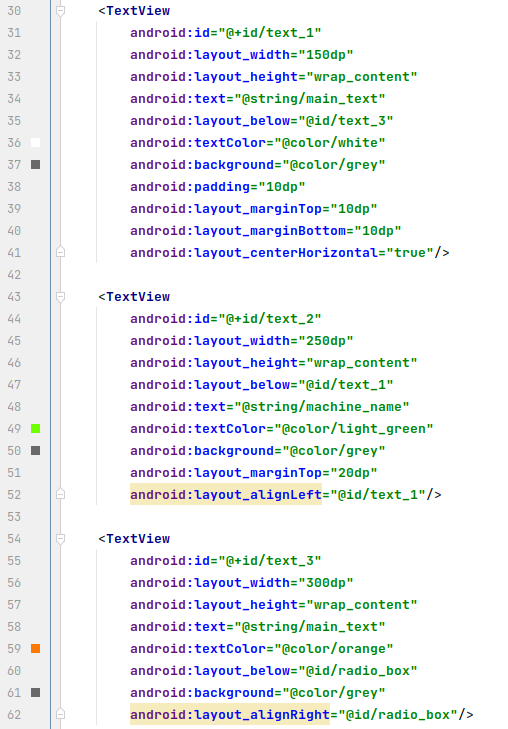
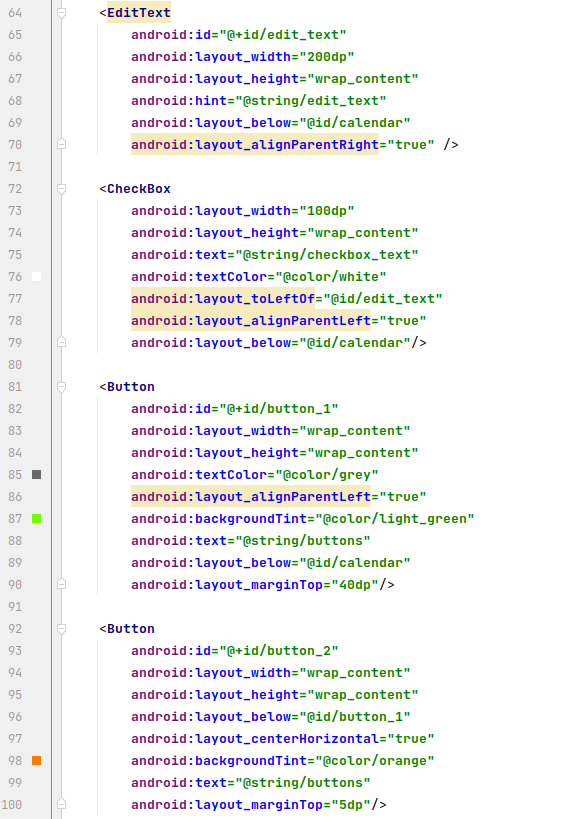
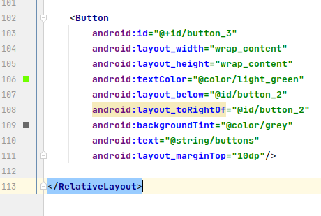

# Ćwiczenia 3 -- Android studio -- relative layout

Na koniec zajęć prześlij pliki źródłowe (activity_main.xml,
MainActivity.java)+ obrazek do zasobu w teams.

1. Utwórz nowy projekt na podstawie Empty Activity (dobrać odpowiednie
    API ) w katalogu na dysku C:

1. Uruchomić aplikację Hello World Shift+F10 (zielony trójkącik)

1. Usunąć TextView dla Hello World

1. Otworzyć dokumentację:

    <https://developer.android.com/guide/topics/ui/layout/relative>

1. Zmienić domyślny układ na relative layout.

1. Wykonaj zadanie 2 z prezentacji umieszczonej na teams.

   

1. Dodaj Empty Activity o nazwie Zadanie3 do realizacji zadania 3 z
    prezentacji umieszczonej na teams.

    

1. Dodaj Empty Activity o nazwie TestyRelativeLayout.

1. Dodać komponenty tak jak na stronie dokumentacyjnej z punktu 4:
    - RadioButton
    - DatePicker (datePickerMode="spinner",calendarViewShown="false")
    - TextView 3x ( w osobnych wierszach, drugi zaczyna się równo z
        pierwszym, trzeci pod RadioButton)
    - EditText (z podpowiedzią)
    - CheckBox ( z tekstem: akceptacja regulaminu), po lewej od
        EditText
    - Button 3x ( w osobnych wierszach, pierwszy do lewej, drugi na
        środku , trzeci zaczyna się, gdzie kończy się drugi)

        

1. Zdefiniować w pliku values\\strings.xml minimum 5 własnych tekstów.

1. Zdefiniować w pliku values\\colors.xml minimum 5 własnych kolorów.

1. Otwórz dokumentację:

    <https://developer.android.com/reference/android/widget/RelativeLayout.LayoutParams>

1. Wykorzystać powyższe definicje kolorów i tekstów do komponentów z
    layout: activity_testy_relative_layout.

1. Wyrównać komponenty:
    - prawą krawędzią
    - lewą krawędzią
    - wyśrodkowane
    - wyśrodkowane po prawej
    - układ wymyślony przez Ciebie

1. Ustaw odstępy pomiędzy elementami GUI: 
   - padding, 
   - layout_margin

1. Przykładowa realizacja:

   

   

   

   

1. Zaprogramuj przechodzenie pomiędzy aktywnościami:

    <https://developer.android.com/training/basics/firstapp/starting-activity>

1. Wykonaj własne ćwiczenie.

1. KONIEC.🔚
