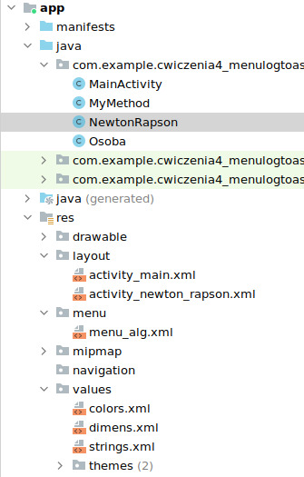
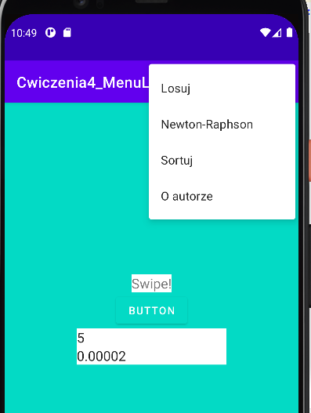
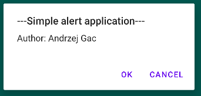
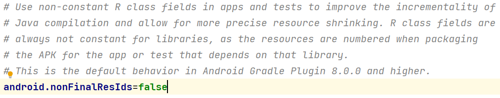
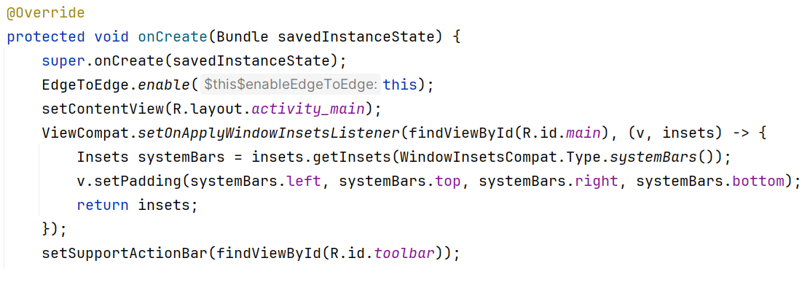
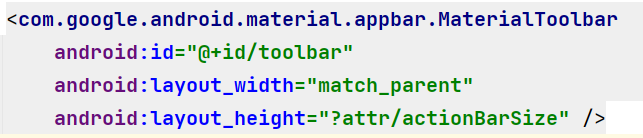
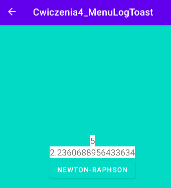
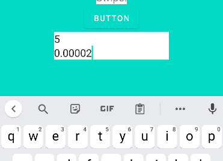
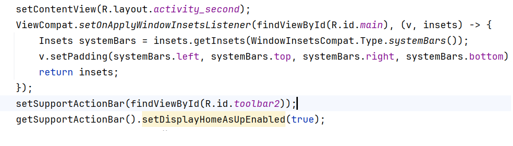

Ćwiczenia 4,5 -- Android studio -- Menu, Log, Toast, onClick
Na koniec zajęć prześlij pliki źródłowe (\*.xml, \*.java)+ obrazek do
zasobu w teams.
1.  Utwórz nowy projekt na podstawie Empty Activity (dobrać odpowiednie
    API ) w katalogu na dysku C:
2.  Uruchomić aplikację Hello World Shift+F10 (zielony trójkącik)
3.  Usunąć TextView dla Hello World.
4.  Otworzyć dokumentację:
> <https://developer.android.com/studio/debug/logcat>
>
> <https://developer.android.com/develop/ui/views/components/menus>
>
> <https://developer.android.com/guide/topics/resources/menu-resource>
>
> <https://developer.android.com/guide/topics/ui/notifiers/toasts>
5.  Pamiętaj, aby w pliku values\\strings.xml i values\\colors.xml
    umieścić kolory i teksty.
6.  Dla przycisku w pliku xml dodaj parametr onClick z metodą
    „losujLiczby".
7.  Napisz metodę losujLiczby, która wylosuje 6 liczb tak jak w dużym
    totolotku ( funkcja z wykładu ).
8.  Sprawdź działanie metody dla przycisku.
9.  Utwórz katalog w res o nazwie menu. ( prawy przycisk myszy na res
    New - \> Directory )

10. Utwórz plik o nazwie menu_alg Menu Resource File. ( prawy przycisk
    myszy na res/menu )
11. Do tworzenia menu wykorzystaj z dokumentacji plik \*.xml oraz
    metody(utwórz je z pomocą CTRL+o):
    a)  onCreateOptionsMenu
    b)  onOptionsItemSelected
12. Dodaj do activity_main.xml potrzebne komponenty (Np. EditText do
    pobierania wartości itd.)

13. Utwórz menu z czterema pozycjami:
<!-- -->
a.  Losuj ( z punktu 6, duży totolotek, materiał z wykładu)
<!-- -->
a.  Newton-Raphson ( dla pierwiastka kwadratowego, materiał z wykładu )
b.  Sortuj ( liczby całk. Sztuk 50, sortowanie **przez zliczanie** ,
    materiał z wykładu)
c.  
    O autorze (wykorzystaj AlertDialog
> Dokumentacja:
>
> <https://developer.android.com/reference/android/app/AlertDialog.Builder>
>
> <https://developer.android.com/develop/ui/views/components/dialogs>
14. Do pliku gradle.properties dodaj o ile korzystasz z wersji gradle
    8.0.0 lub wyższej oraz
    
    korzystasz z switch case w metodzie
    onOptionsItemSelected
> 
15. W activity_main.xml dodaj:
> 
16. Dodaj kod w MainActivity:
17. Dla każdej pozycji utwórz metodę, sprawdź działanie z pomocą Log i
    Toast.
18. Dodaj Empty Activity o nazwie NewtonRaphson do realizacji zadania 3.
19. Pobierz od użytkownika liczbę do pierwiastkowania i precyzję
    obliczeń i przekaż je do aktywności NewtonRaphson z pomocą putExtra.
    Realizacja samego algorytmu w aktywności NewtonRaphson.

20. Utwórz pozycję podmenu o nazwie algorytmy z pozycjami:
> Newton-Raphson (przenieś) oraz MonteCarlo z realizacją algorytmu
> podanego na wykładzie.
21. Zapewnij, aby menu pojawiło się w każdej z aktywności.
22. 
    Zapewnij powrót z każdej aktywności za
    pomocą strzałki powrotnej.
23. Dodatkowe zadania:
<!-- -->
a)  Dodaj pozycję sortowanie przez kopcowanie
b)  Inne podane przez nauczyciela
<!-- -->
24. KONIEC.
