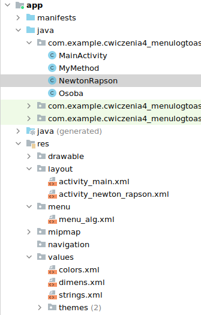
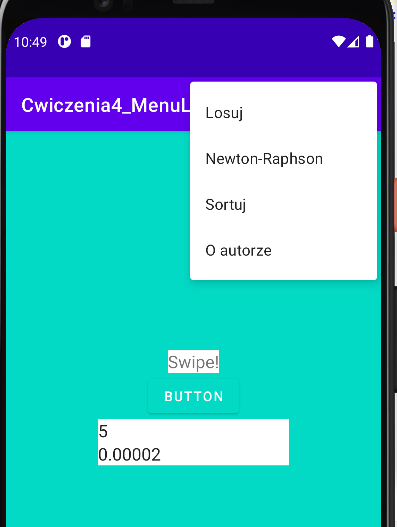
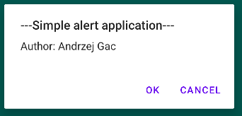
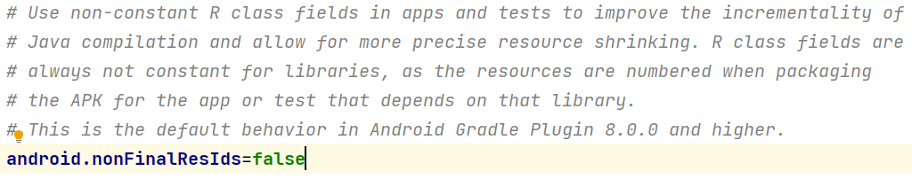
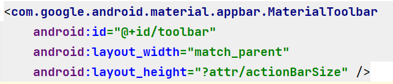
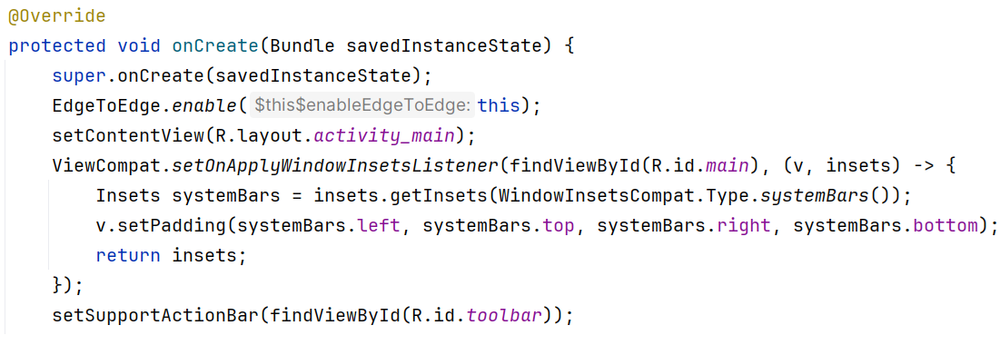
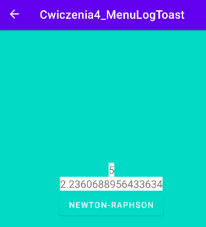
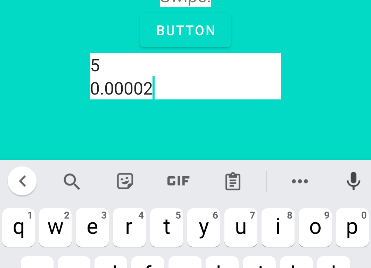
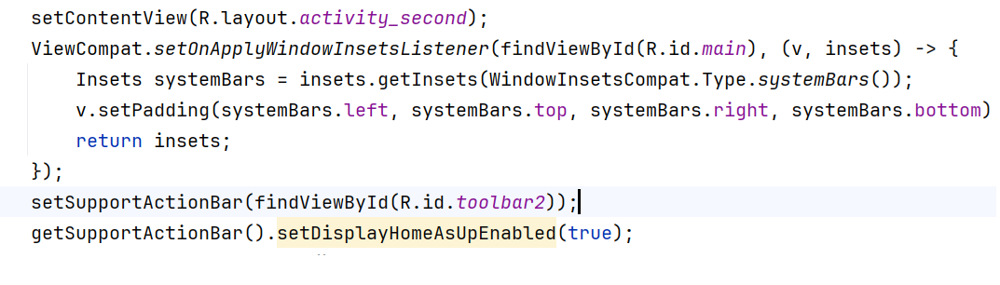

# Ćwiczenia 4,5 -- Android studio -- Menu, Log, Toast, onClick

Na koniec zajęć prześlij pliki źródłowe (\*.xml, \*.java)+ obrazek do
zasobu w teams.

1. Utwórz nowy projekt na podstawie Empty Activity (dobrać odpowiednie
    API ) w katalogu na dysku C:

1. Uruchomić aplikację Hello World Shift+F10 (zielony trójkącik)

1. Usunąć TextView dla Hello World.

1. Otworzyć dokumentację:

   <https://developer.android.com/studio/debug/logcat>

   <https://developer.android.com/develop/ui/views/components/menus>

   <https://developer.android.com/guide/topics/resources/menu-resource>

   <https://developer.android.com/guide/topics/ui/notifiers/toasts>

1. Pamiętaj, aby w pliku values\\strings.xml i values\\colors.xml
    umieścić kolory i teksty.

1. Dla przycisku w pliku xml dodaj parametr onClick z metodą
    „losujLiczby".

1. Napisz metodę losujLiczby, która wylosuje 6 liczb tak jak w dużym
    totolotku ( funkcja z wykładu ).

1. Sprawdź działanie metody dla przycisku.

1. Utwórz katalog w res o nazwie menu. ( prawy przycisk myszy na res

   New - \> Directory )

   

1. Utwórz plik o nazwie menu_alg Menu Resource File. ( prawy przycisk
    myszy na res/menu )

1. Do tworzenia menu wykorzystaj z dokumentacji plik \*.xml oraz
    metody(utwórz je z pomocą CTRL+o):
    * onCreateOptionsMenu
    * onOptionsItemSelected

1. Dodaj do activity_main.xml potrzebne komponenty (Np. EditText do
    pobierania wartości itd.)

   

1. Utwórz menu z czterema pozycjami:

   * losuj ( z punktu 6, duży totolotek, materiał z wykładu)
   * Newton-Raphson ( dla pierwiastka kwadratowego, materiał z wykładu )
   * sortuj ( liczby całk. Sztuk 50, sortowanie **przez zliczanie** , materiał z wykładu)
   * o autorze (wykorzystaj AlertDialog

      

   Dokumentacja:

   <https://developer.android.com/reference/android/app/AlertDialog.Builder>

   <https://developer.android.com/develop/ui/views/components/dialogs>

1. Do pliku gradle.properties dodaj o ile korzystasz z wersji gradle
    8.0.0 lub wyższej oraz

   

   korzystasz z switch case w metodzie
   onOptionsItemSelected

1. W activity_main.xml dodaj:

   

1. Dodaj kod w MainActivity:

   

1. Dla każdej pozycji utwórz metodę, sprawdź działanie z pomocą Log i Toast.

1. Dodaj Empty Activity o nazwie NewtonRaphson do realizacji zadania 3.

1. Pobierz od użytkownika liczbę do pierwiastkowania i precyzję
    obliczeń i przekaż je do aktywności NewtonRaphson z pomocą putExtra.

    Realizacja samego algorytmu w aktywności NewtonRaphson.

   

   

1. Utwórz pozycję podmenu o nazwie algorytmy z pozycjami:

   * Newton-Raphson (przenieś)
   * MonteCarlo z realizacją algorytmu podanego na wykładzie.

1. Zapewnij, aby menu pojawiło się w każdej z aktywności.

   

1. Zapewnij powrót z każdej aktywności za
    pomocą strzałki powrotnej.
1. Dodatkowe zadania:
   * dodaj pozycję sortowanie przez kopcowanie
   * inne podane przez nauczyciela

1. KONIEC. 🔚
