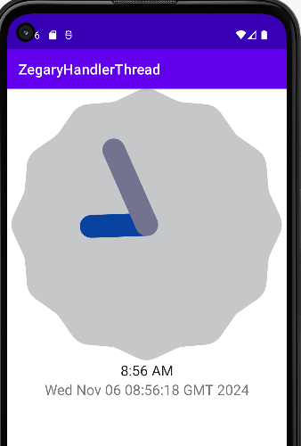
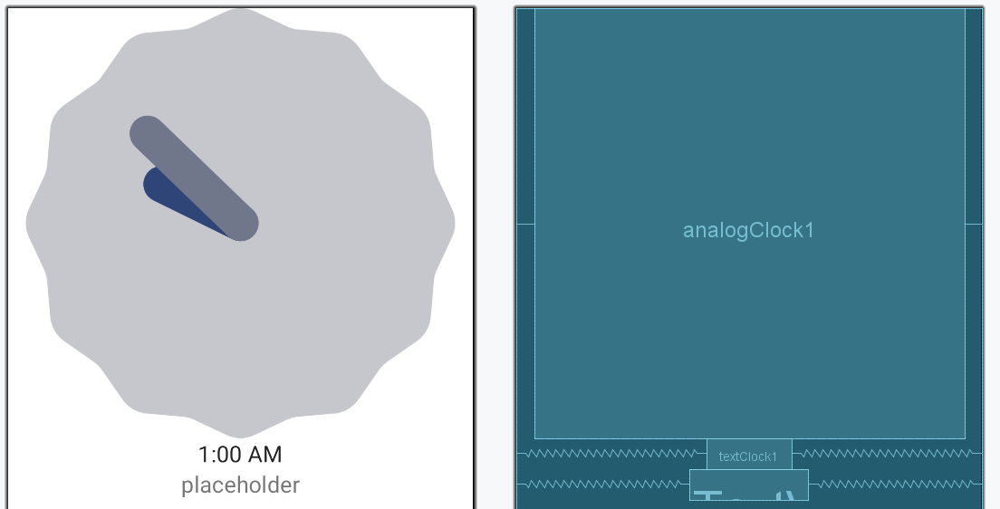
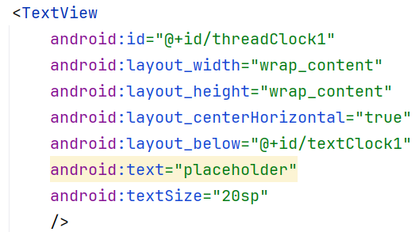
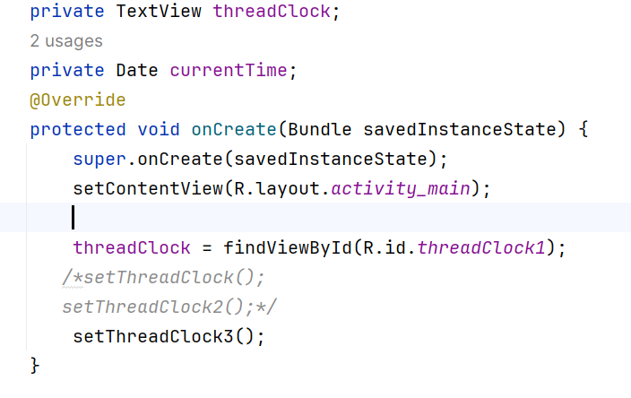

Ćwiczenia 6 -- Android studio -- AnalogClock_TextClock_Thread, Runnable
i Handler
Na koniec zajęć prześlij pliki źródłowe (\*.xml, \*.java)+ obrazek do
zasobu w teams.
1.  Utwórz nowy projekt o nazwie Zegary na podstawie Empty Activity
    (dobrać odpowiednie API ).
2.  Otworzyć dokumentację:
<https://developer.android.com/reference/android/widget/TextClock#attr_android:format24Hour>
<https://developer.android.com/reference/android/text/format/DateFormat>
<https://www.unicode.org/reports/tr35/tr35-dates.html#Date_Format_Patterns>
3.  Pamiętaj, aby w pliku values\\strings.xml i values\\colors.xml
    umieścić kolory i teksty.
4.  Efekt końcowy, ostatni zegar wyświetla zmieniające się sekundy:
> 
5.  Wyświetl dwa zegary z użyciem komponentów:
AnalogClock
TextClock

6.  Użyj format24Hour dla TextClock.
7.  Dla TextClock wyświetl, także datę w formacie dd MM yyyy.
8.  Na urządzeniu wirtualnym ustaw odpowiednią strefę czasową i format
    daty, czasu.
9.  Utwórz trzeci zegar z użyciem klasy Thread lub klas
    Runnable,Handler.
10. Utwórz TextView dla trzeciego zegara:
> 
11. Otwórz dokumentację:
> <https://developer.android.com/reference/java/lang/Thread>
>
> <https://developer.android.com/guide/components/processes-and-threads#java>
>
> <https://developer.android.com/reference/android/os/Handler>
>
> <https://developer.android.com/reference/java/lang/Runnable>
>
> <https://developer.android.com/reference/android/icu/util/Calendar>
>
> <https://developer.android.com/reference/android/app/Activity#runOnUiThread(java.lang.Runnable)>
>
> <https://developer.android.com/reference/android/view/View#postDelayed(java.lang.Runnable,%20long)>
12. Utwórz trzy metody do testowania zegara:
> 
13. Wskazówki:
Calendar calendar = Calendar.*getInstance*();\
**new** Thread()\
\@Override\
**public void** run()\
**while**(!isInterrupted())\
Thread.*sleep*(1000);\
runOnUiThread(() -\> \
textView.setText();\
);\
\
\
.start();
lub
Handler handler = **new** Handler();\
Runnable runnable = **new** Runnable() \
**public void** run() \
textView.setText();\
handler.postDelayed(**this**, 1000);\
\
;\
runnable.run();
14. Prześlij pliki źródłowe (\*.xml, \*.java)+ obrazek do zasobu w
    teams.
15. KONIEC.
