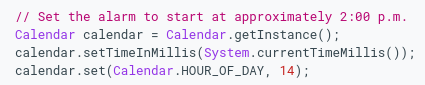
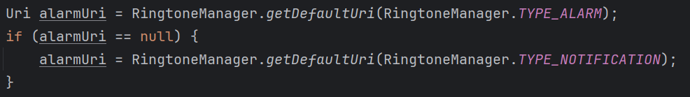
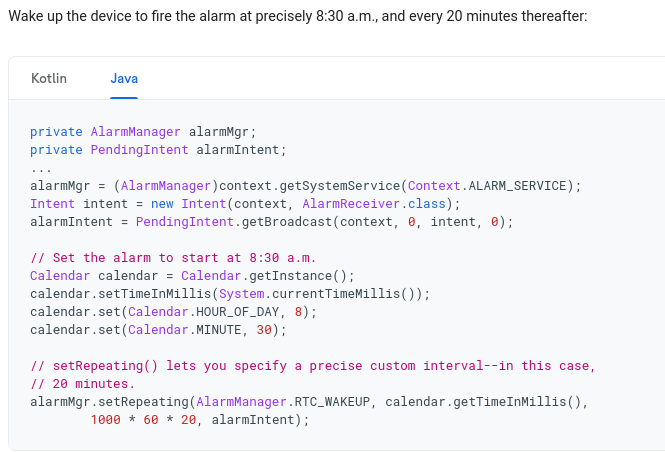
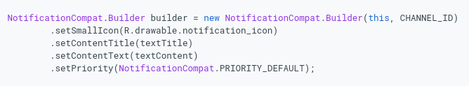
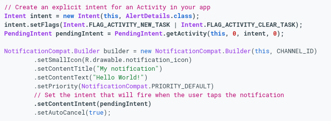
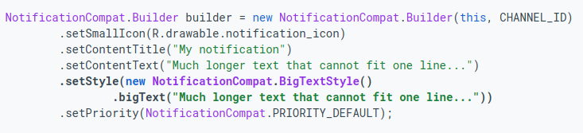
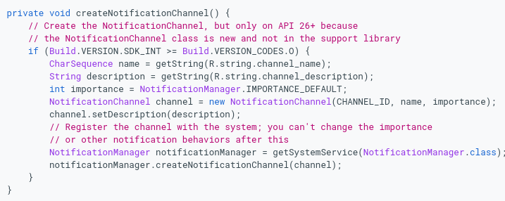
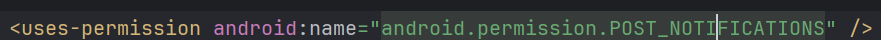
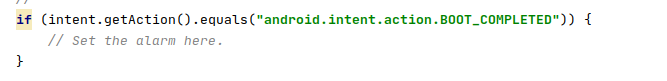

Ćwiczenia 7,8 -- Android studio -- AlarmManager, BroadcastReceiver,
Notification
Na koniec zajęć prześlij pliki źródłowe (\*.xml, \*.java)+ obrazek do
zasobu w teams.
1.  Utwórz nowy projekt o nazwie Alarm na podstawie Empty Activity
    (dobrać odpowiednie API ).
2.  Otworzyć dokumentację:
<https://developer.android.com/training/scheduling/alarms>
<https://developer.android.com/reference/android/app/AlarmManager>
<https://developer.android.com/reference/android/content/BroadcastReceiver>
<https://developer.android.com/reference/android/app/PendingIntent>
<https://developer.android.com/reference/android/os/Vibrator>
<https://m3.material.io/components/switch/overview>
3.  Pamiętaj, aby w pliku values\\strings.xml i values\\colors.xml
    umieścić kolory i teksty.
4.  Dodaj komponenty:
    a)  TimePicker, do ustawienia czasu alarmu
    b)  MaterialSwitch, do włączenia/ wyłączenia
    c)  TextView do kontrolnego wyświetlenia wybranego czasu budzika
5.  Użyj klas Log i Toast dla wyświetlenia czy alarm został
    włączony/wyłączony.
6.  Dodaj w onCreate() **alarmManager** = (AlarmManager)
    getSystemService(***ALARM_SERVICE***);
7.  Dodaj dla MaterialSwitch listener
8.  Utwórz metodę switchClicked(), którą wywołasz w onCheckedChanged
    (CompoundButton buttonView, boolean isChecked)
9.  Użyj klasy Calendar do ustawienia czasu.

10. Dodaj nową klasę o nazwie MyBroadcastReceiver, która rozszerza klasę
    BroadcastReceiver, następnie zaimplementuj metodę
\@Override\
**public void** onReceive(Context context, Intent intent)
11. Utwórz obiekt klasy VibratorManager w metodzie onReceive i przypisz
    getSystemService(context.***VIBRATOR_MANAGER_SERVICE***) dla context
12. Dla metody vibrate() dodaj
    <https://developer.android.com/reference/android/os/VibrationEffect#createOneShot(long,%20int>)
13. Zaakceptuj dodanie \<**uses-permission
    android:name=\"android.permission.VIBRATE\"** /\>
14. Dla Uri dodaj fragment kodu:

15. Utwórz obiekt klasy Ringtone,
    <https://developer.android.com/reference/android/media/Ringtone?hl=ja>
a dla RingtoneManagera
<https://developer.android.com/reference/android/media/RingtoneManager#getRingtone(android.content.Context,%20android.net.Uri>)
16. Wywołaj play().
17. W metodzie switchClicked() stwórz Intent dla MyBroadcastReceiver
    jak poniżej:

18. Dodaj do pliku AndroidManifest.xml, receiver:
    <https://developer.android.com/guide/topics/manifest/receiver-element>
19. Dodaj powiadomienie.
20. Otwórz dokumentację:
<https://developer.android.com/training/notify-user/build-notification>
<https://developer.android.com/reference/android/app/NotificationChannel>
<https://developer.android.com/training/notify-user/channels>
<https://developer.android.com/training/notify-user/expanded>
<https://developer.android.com/training/notify-user/navigation>
21. Dodaj Empty Activity o nazwie Notification do realizacji
    wyskakującego powiadomienia.
22. Dodaj Intent dla Notification.class w **public void**
    onReceive(Context context, Intent intent)
23. Dla intentu ustaw flagi Intent.***FLAG_ACTIVITY_NEW_TASK*** \|
    Intent.***FLAG_ACTIVITY_CLEAR_TASK***
24. Utwórz PendingIntent z getActive() na Intent.
25. Ustaw treść powiadomienia w metodzie **public void**
    onReceive(Context context, Intent intent)

26. Powinieneś uzyskać coś na kształt:

27. Dodaj setStyle

28. Dodaj kanał powiadomień w MainActivity.java w metodzie **private
    void** createNotificationChanel()

29. Wywołaj powyższą metodę zaraz po starcie aplikacji.( w onCreate())
30. Od wersji android 13+,tiramisu, API 33 potrzebne jest żadanie
    uprawnienia:

> <https://developer.android.com/training/permissions/requesting?hl=pl#java>
31. Przetestuj działanie aplikacji.
32. Zmodyfikuj metodę dla alarmu ( zamień setRepeating na inną, zmień
    też RTC_WAKEUP).
33. Zadania dodatkowe:
    a)  zaprojektuj uruchamianie alarmu nawet po wyłączeniu urządzenia
wskazówka. 1

wskazówka 2
\<**uses-permission
android:name=\"android.permission.RECEIVE_BOOT_COMPLETED\"**/\>
b)  dodaj obsługę wyłączenia alarmu
c)  dodaj obsługę drzemki SNOOZE

34. KONIEC.
