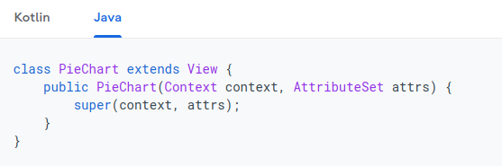
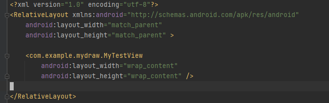
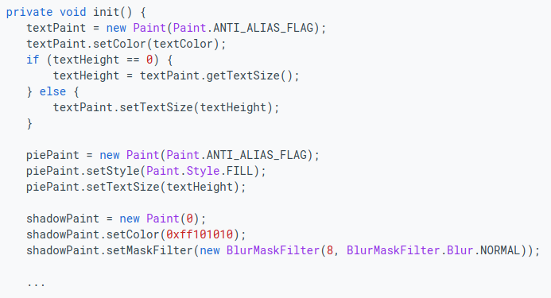
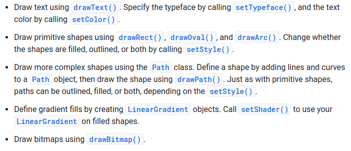
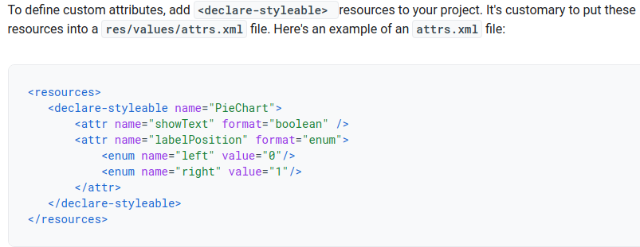

Ćwiczenia 9 -- Android studio -- Paint, Canvas
Na koniec zajęć prześlij pliki źródłowe (.xml, .java)+ obrazek do zasobu
w teams.
1.  Utwórz nowy projekt o nazwie MyDraw na podstawie Empty Activity
    (dobrać odpowiednie API ).
2.  Otworzyć dokumentację:
    <https://developer.android.com/training/custom-views/create-view>
    <https://developer.android.com/training/custom-views/custom-drawing>
    <https://www.raywenderlich.com/142-android-custom-view-tutorial#toc-anchor-007>
3.  Utwórz klasę MyTestView i rozszerzyć o klasę View (extends) na
    kształt:
    
4.  Dodaj konstruktor z dwoma parametrami (Context context, AttributeSet
    attrs)
5.  Zaimplementuj metody:
    \@Override protected void onDraw(Canvas canvas)
    \@Override protected void onMeasure(int widthMeasureSpec, int
    heightMeasureSpec)
    private void init()  - wywołaj w konstruktorze lub w onDraw()
6.  Dodaj do activity_main.xml swój widok:
    
    
7.  Narysuj koło z użyciem drawCircle(x,y,promien,redPaint) (
    redPaint.setColor(Color.rgb(255,0,0)) )
8.  Wykonaj testy na metodach:
    
9.  Przetestuj działanie.
10. Zdefiniuj własne atrybuty w **res/values/attrs.xml**
    
11. Dodaj wybrane fonty dla czcionki, a następnie przetestuj napisy po
    ścieżce, po kole.
12. Narysuj pieciokąt wykorzystując rysowanie „po ścieżce".
13. Stwórz klasę rysującą wykres funkcji sinus z układem, podziałką i
    skalą.
    Wskazówki: użyj metod drawPoint i setStrokeWidth(5).
14. Stwórz klasę rysującą wykres funkcji tangens z układem, podziałką i
    skalą.
15. Dodaj obsługę gestów (skalowanie i przesunięcie),
    [*https://developer.android.com/training/gestures/scale#scale*](https://developer.android.com/training/gestures/scale#scale)
16. Zadania dodatkowe:
    a)  zaprojektuj rysowanie gwiazdy na podstawie danych punktów ( )
    b)  dodaj obsługę rysowania przez dotyk
17. KONIEC.
